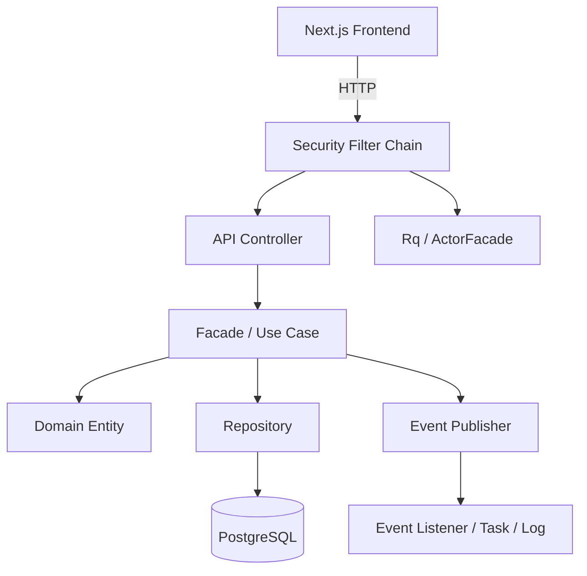
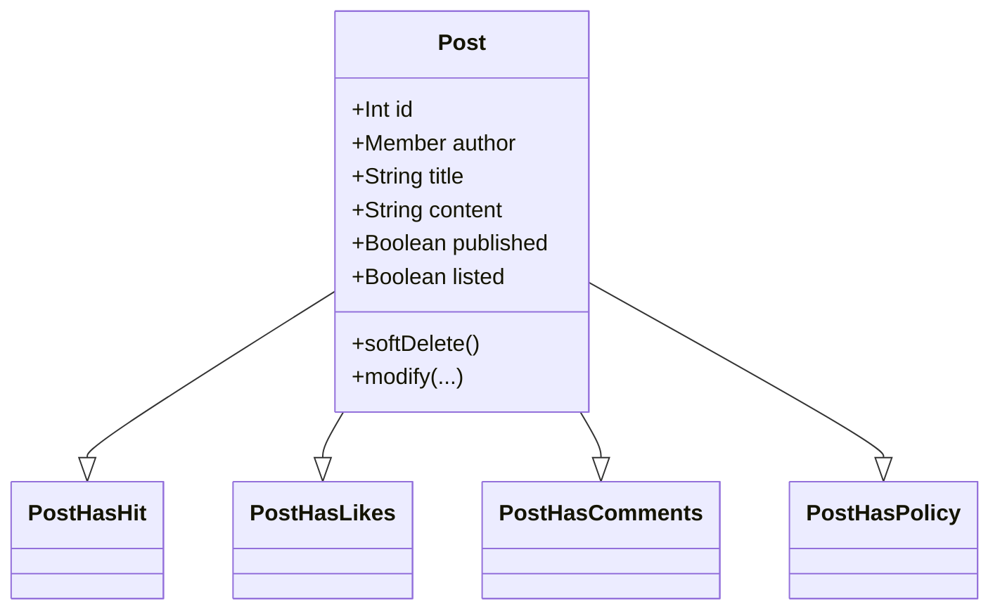
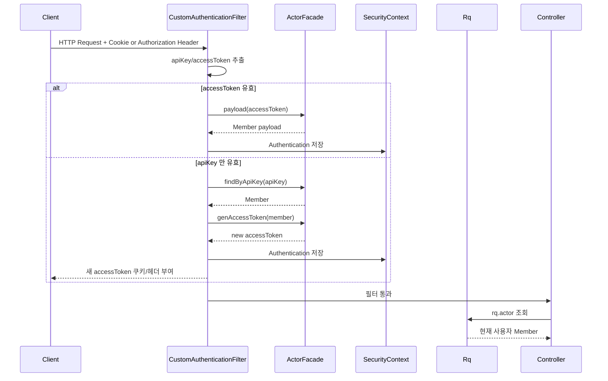
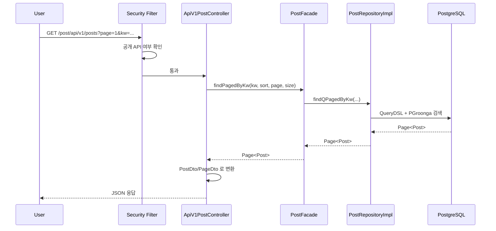
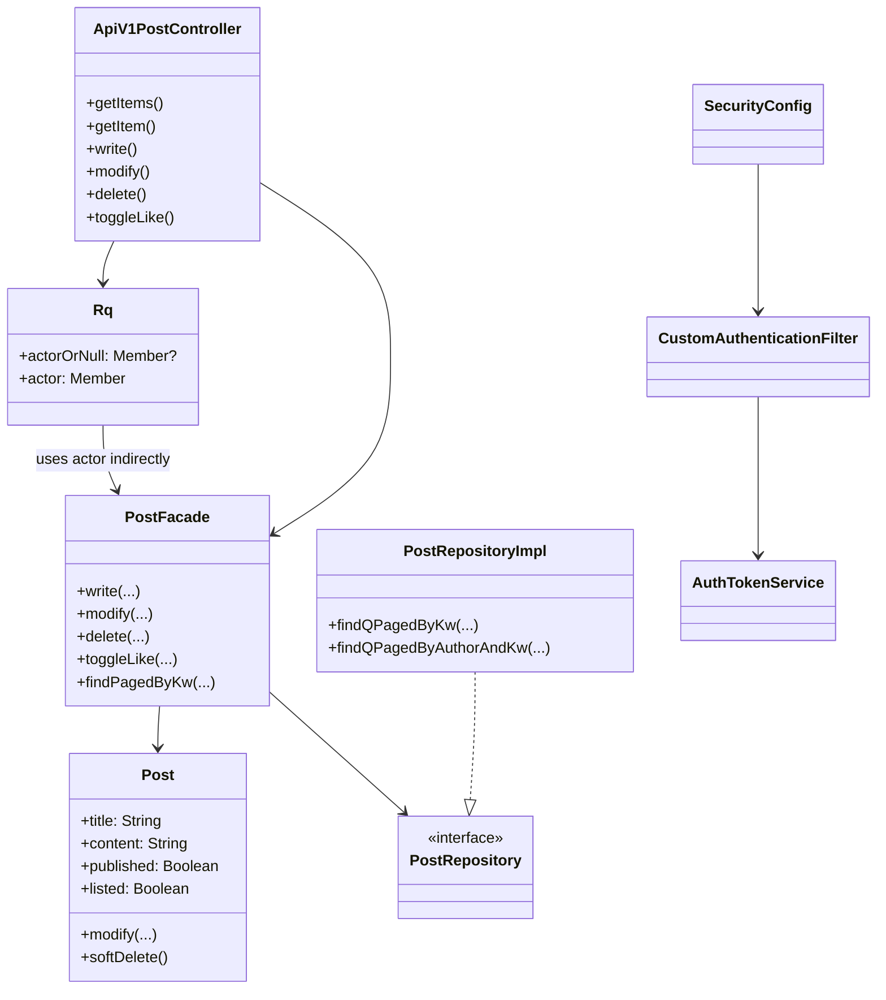
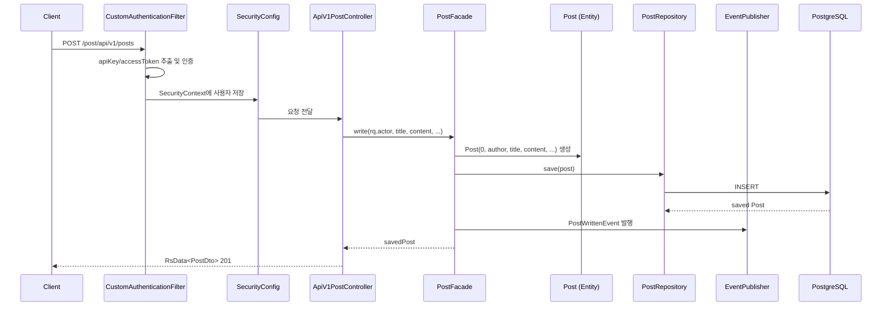
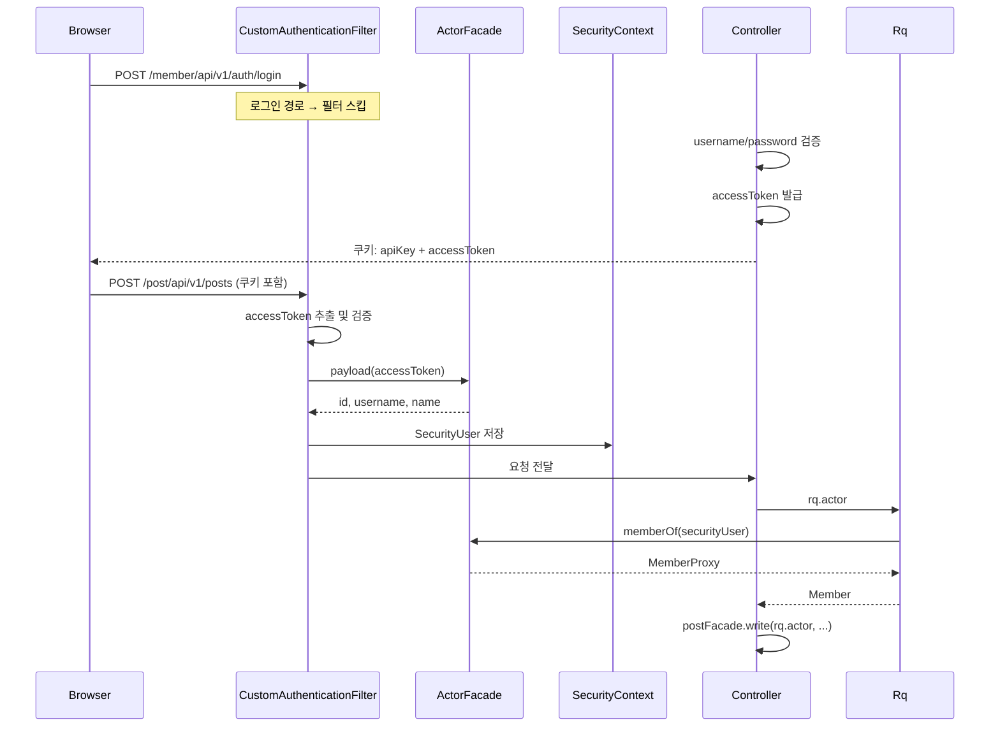

# 프로젝트 이해 강의 노트

이 문서는 이 저장소를 빠르게 이해하기 위한 강의형 README 초안이다.
설명은 실제 코드 기준으로 진행한다.

대상 독자:

- Kotlin + Spring + JPA 기본 문법을 아는 사람
- REST API, JWT, OAuth2 개념은 이미 이해한 사람
- 이 프로젝트가 "어떻게 나뉘어 있고 어디서 무엇을 처리하는지"를 빠르게 파악하고 싶은 사람

백엔드 우선 원칙:

- 설명의 중심은 당분간 `back/` 이다.
- `front/` 는 인증 계약이나 API 소비 지점 정도만 보조적으로 언급한다.
- 프론트 상세 해설은 백엔드 강의가 충분히 진행된 뒤로 미룬다.

---

## 강의 시리즈 구성

순서를 따라 읽으면 앞 강이 항상 뒷 강의 전제가 된다. 백엔드를 끝까지 읽은 뒤 프론트로 넘어간다.

**1부. 전체 지도**

1. 이 프로젝트는 어떻게 읽어야 하는가
2. Gradle 의존성 하나로 프로젝트 성격 파악하기
3. 패키지는 기술이 아니라 업무로 나눴다
4. HTTP 요청 1개가 통과하는 전체 층

**2부. 응답과 예외 규약**

5. `RsData`: 모든 응답의 공통 약속
6. `AppException`: 예외를 어떻게 전달하는가

**3부. 인증 — 이 프로젝트의 관문**

7. 왜 세션을 안 쓰는가
8. `SecurityConfig`: 보안 정책의 메인 스위치 + 공개/비공개 경로
9. `CustomAuthenticationFilter`: 인증이 실제로 일어나는 곳
10. `apiKey`와 `accessToken`: 두 토큰의 역할이 왜 다른가
11. JWT: 무엇을 담고 어떻게 검증하는가
12. `ActorFacade`와 `MemberProxy`: 토큰에서 도메인 회원으로
13. `SecurityUser`와 `Rq`: Spring Security와 컨트롤러의 연결점
14. 로그인 API: 쿠키에 두 토큰을 심는다
15. OAuth2 로그인 흐름과 `OAuth2State`

**4부. 공통 기반**

15. `BaseEntity`와 `BaseTime`: JPA 엔티티의 공통 기반
16. `EntityAttr`: 엔티티에 유연한 속성을 붙이는 방법
17. `standard` 패키지: 도메인 없는 범용 도구들

**5부. member 컨텍스트**

18. member 컨텍스트 전체 한눈에 보기
19. `Member` 엔티티: 상태와 규칙
20. `memberMixin`: 회원의 책임을 파일로 나누다
21. `MemberAttr`와 `MemberPolicy`: 집계값과 권한
22. `MemberFacade`: 회원 유스케이스 오케스트레이터
23. Member API 컨트롤러
24. `memberActionLog` 서브컨텍스트: 이벤트로 로그를 쌓다
25. `MemberApiClient`: MockMvc로 내부 서버를 호출하는 방법

**6부. post 컨텍스트 — 도메인**

26. post 컨텍스트 전체 한눈에 보기
27. `Post` 엔티티: 핵심 상태와 규칙
28. `postMixin`: 게시글의 책임을 파일로 나누다
29. `PostAttr`: 집계값(좋아요 수, 댓글 수, 조회수) 관리
30. `PostComment`와 `postCommentMixin`
31. `PostLike`와 `PostMember`
32. `published`와 `listed`: 공개 범위를 두 단계로 나눈 이유
33. Soft Delete와 `@SQLRestriction`

**7부. post 컨텍스트 — 유스케이스**

34. Facade 패턴: Controller가 직접 하지 않는 이유
35. 게시글 작성 유스케이스 전체 흐름
36. 게시글 수정/삭제 유스케이스
37. 댓글 유스케이스
38. 좋아요 토글과 임시글 유스케이스
39. Post API 컨트롤러: 얇은 컨트롤러가 하는 일

**8부. 영속 계층**

40. `RepositoryCustom` 패턴: 인터페이스와 구현을 나누는 이유
41. QueryDSL로 동적 쿼리 만들기
42. PGroonga: 전문 검색을 DB에 맡기다
43. `PGroongaCompositeMatchFunction`과 커스텀 Dialect
44. `AfterDDL`: 인덱스를 엔티티 옆에 선언하다
45. Pageable과 정렬 전략

**9부. 이벤트와 비동기**

46. `EventPublisher`: 부수효과를 이벤트로 분리하다
47. post 이벤트 종류 정리
48. Task 시스템: 무거운 처리를 비동기로 위임하다
49. `TaskProcessingScheduledJob`과 ShedLock: 분산 환경의 스케줄링

**10부. 인프라와 설정**

50. Redis의 역할: 캐시, ShedLock, 세션 보조
51. CORS 설정과 `application.yaml` 읽기
52. `schema.sql` 초기화 전략
53. SpringDoc: OpenAPI 문서 자동화

**11부. 테스트**

54. 테스트 코드로 요구사항 읽기
55. Member API 테스트
56. Post API 테스트와 댓글/좋아요 테스트
57. 통합 테스트와 슬라이스 테스트의 경계

**12부. 설계 복기**

58. `checkActorCan*` 류: 정책 메서드를 엔티티에 두는 이유
59. `author`와 `actor`의 차이
60. 리치 도메인 모델과 DTO 경계
61. DDD 관점에서 잘한 점과 어색한 점
62. 보안 점검과 성능 병목 추적
63. 신규 기능 추가 연습: 북마크
81. 이 아키텍처를 포트폴리오로 설명하는 법
82. 최종 정리: 이 프로젝트의 핵심 설계 철학

**13부. 프론트엔드**

83. 프론트 구조 개요
84. Next.js app router 구조
85. OpenAPI 타입 연동
86. 프론트 API 클라이언트와 쿠키 인증
87. 인증 훅 구조
88. 게시글 목록/상세 페이지 구조
89. 댓글 UI와 API 연결
90. 에디터와 마크다운 렌더링
91. 웹소켓/Stomp 구조
92. 프론트 상태 관리 전략
93. 백엔드-프론트 계약 안정화

---

# 1강. 이 프로젝트는 어떻게 읽어야 하는가

1강 목표는 간단하다.

- 폴더를 보고 겁먹지 않기
- 이 프로젝트를 "화면 목록"이 아니라 "문맥 단위"로 읽기
- HTTP 요청 1개가 어떤 층을 통과하는지 머릿속에 그리기
- 나중에 세부 구현을 읽을 때 길을 잃지 않도록 큰 지도를 먼저 만들기

---

## 1. 이 프로젝트를 한 문장으로 요약하면

이 프로젝트는:

> `front` 에는 Next.js 기반 클라이언트가 있고, `back` 에는 Kotlin + Spring Boot + JPA 기반 API 서버가 있으며, 백엔드는 `member`, `post`, `global` 문맥으로 나뉘고 JWT/OAuth2 인증과 QueryDSL 검색, 이벤트 기반 후처리를 결합한 구조다.

조금 더 실무적으로 말하면:

- 프론트는 API 서버를 `credentials: "include"` 로 호출한다.
- 백엔드는 stateless 보안 구성을 사용한다.
- 인증은 JWT access token + apiKey + OAuth2 로그인으로 조합되어 있다.
- 게시글과 회원 기능이 bounded context 수준으로 분리되어 있다.
- 컨트롤러는 얇고, `Facade` 가 유스케이스를 수행하며, 엔티티는 정책과 상태 변경 책임을 일부 가진다.

---

## 2. 최상위 폴더부터 읽자

루트 기준으로 가장 먼저 보이는 구조는 이렇다.

```text
p-14141-1/
├── back/
│   ├── build.gradle.kts
│   └── src/main/kotlin/com/back/
│       ├── boundedContexts/
│       │   ├── member/
│       │   └── post/
│       ├── global/
│       └── standard/
└── front/
    ├── package.json
    └── src/
```

이 구조만 봐도 중요한 힌트가 나온다.

### 첫 번째 힌트: 프론트와 백이 분리되어 있다

- `front/` 는 Next.js 프론트엔드다.
- `back/` 는 Spring Boot API 서버다.

즉, 이 저장소는 단순 백엔드 예제가 아니라 프론트와 백이 함께 있는 풀스택 저장소다.

### 두 번째 힌트: 백엔드는 기능별로 잘려 있다

`back/src/main/kotlin/com/back/` 아래를 보면 크게 2종류가 있다.

- `boundedContexts/`
- `global/`

이건 매우 중요하다.

이 프로젝트는 클래스를 "기술 기준"으로만 묶지 않고 "업무 문맥 기준"으로 먼저 나누려는 의도가 있다.

즉:

- `member` 는 회원 문맥
- `post` 는 게시글 문맥
- `global` 은 여러 문맥이 공통으로 쓰는 기반 기능
- `standard` 는 도메인에 종속되지 않는 범용 유틸리티 (`PageDto`, `getOrThrow`, 정렬 타입 등)

이걸 먼저 이해해야 한다.

---

## 3. 의존성만 봐도 프로젝트 성격이 보인다

`back/build.gradle.kts` 에서 이 프로젝트의 성격이 거의 드러난다.

```kotlin
dependencies {
    implementation("org.springframework.boot:spring-boot-starter-data-jpa")
    implementation("org.springframework.boot:spring-boot-starter-data-redis")
    implementation("org.springframework.boot:spring-boot-starter-security")
    implementation("org.springframework.boot:spring-boot-starter-security-oauth2-client")
    implementation("org.springframework.boot:spring-boot-starter-session-data-redis")
    implementation("org.springframework.boot:spring-boot-starter-validation")
    implementation("org.springframework.boot:spring-boot-starter-webmvc")

    implementation("io.jsonwebtoken:jjwt-api:0.13.0")

    implementation("io.github.openfeign.querydsl:querydsl-jpa:7.1")
    implementation("io.github.openfeign.querydsl:querydsl-kotlin:7.1")

    implementation("org.springdoc:springdoc-openapi-starter-webmvc-ui:3.0.2")

    implementation("net.javacrumbs.shedlock:shedlock-spring:7.6.0")
    implementation("net.javacrumbs.shedlock:shedlock-provider-redis-spring:7.6.0")

    runtimeOnly("org.postgresql:postgresql")
}
```

여기서 읽어야 할 포인트는 다음이다.

- `data-jpa`: 엔티티 중심의 영속성 모델을 쓴다.
- `security` + `oauth2-client`: 직접 로그인 + 소셜 로그인 둘 다 있다.
- `jjwt`: JWT access token 을 직접 발급/검증한다.
- `querydsl`: 단순 메서드 이름 쿼리만 쓰는 프로젝트가 아니다.
- `redis`: 캐시, 분산락, 세션성 데이터, 작업 처리 보조 등 확장 여지가 있다.
- `springdoc`: OpenAPI 문서화가 가능하다.
- `postgresql`: 데이터베이스는 PostgreSQL 전제다.

즉 이 프로젝트는 입문용 장난감 수준이 아니라, 실제 서비스 구조를 학습하기 좋은 재료가 꽤 들어 있다.

---

## 4. 백엔드의 큰 지도

백엔드를 아주 거칠게 그리면 다음과 같다.



여기서 핵심은:

- 모든 요청이 곧장 Controller 로 가지 않는다.
- 먼저 보안 필터 체인을 통과한다.
- 컨트롤러는 주로 요청/응답 변환만 한다.
- 진짜 업무 흐름은 `Facade` 가 잡는다.
- 도메인 엔티티는 단순 데이터 통이 아니라 정책과 상태 변경 메서드를 가진다.
- 부수효과는 이벤트로 분리하려는 흔적이 있다.

---

## 5. 패키지 구조를 DDD 스타일로 읽어보자

예를 들어 `post` 컨텍스트만 잘라 보면 대략 이렇게 보인다.

```text
post/
├── app/
│   └── PostFacade.kt
├── config/
│   ├── PostAppConfig.kt
│   └── PostSecurityConfigurer.kt
├── domain/
│   ├── Post.kt
│   ├── PostAttr.kt
│   ├── PostComment.kt
│   ├── PostLike.kt
│   ├── PostMember.kt
│   ├── postCommentMixin/
│   └── postMixin/
├── dto/
├── event/
├── in/
│   ├── ApiV1PostController.kt
│   ├── ApiV1PostCommentController.kt
│   └── ApiV1AdmPostController.kt
└── out/
    ├── PostRepository.kt
    ├── PostRepositoryImpl.kt
    └── ...
```

이 구조를 계층적으로 다시 번역하면:

- `in`: 외부에서 들어오는 요청을 받는 입구
- `app`: 유스케이스를 조합하는 응용 서비스
- `domain`: 핵심 비즈니스 상태와 규칙
- `out`: DB, 외부 시스템 등 바깥으로 나가는 출구
- `config`: 해당 문맥에만 필요한 설정
- `dto`: API 응답/이벤트 전송용 구조
- `event`: 상태 변화 이후 발생한 사건

즉, 이 프로젝트는 흔한 `controller/service/repository/entity` 4분법보다 조금 더 문맥 중심으로 정리되어 있다.

---

## 6. 첫 번째 핵심 관찰: Controller 는 얇다

`ApiV1PostController` 일부를 보자.

```kotlin
@RestController
@RequestMapping("/post/api/v1/posts")
class ApiV1PostController(
    private val postFacade: PostFacade,
    private val rq: Rq,
) {
    @PostMapping
    @ResponseStatus(HttpStatus.CREATED)
    @Transactional
    fun write(@Valid @RequestBody reqBody: PostWriteRequest): RsData<PostDto> {
        val post = postFacade.write(
            rq.actor,
            reqBody.title,
            reqBody.content,
            reqBody.published ?: false,
            reqBody.listed ?: false,
        )
        return RsData("201-1", "${post.id}번 글이 작성되었습니다.", PostDto(post))
    }
}
```

이 메서드에서 컨트롤러가 하는 일은 딱 이 정도다.

1. 요청 바디를 받는다.
2. 현재 로그인 사용자를 `rq.actor` 로 가져온다.
3. 실제 쓰기 작업은 `postFacade.write(...)` 에 위임한다.
4. 결과를 DTO 로 포장해 반환한다.

즉, 컨트롤러는 "입출력 어댑터"에 가깝다.

이 프로젝트를 읽을 때 컨트롤러에서 오래 머물면 안 된다.

실제 로직은 대부분 `Facade`, `Domain`, `RepositoryImpl` 에 있다.

---

## 7. 두 번째 핵심 관찰: Facade 가 유스케이스를 수행한다

이번에는 `PostFacade.write` 를 보자.

```kotlin
@Transactional
fun write(
    author: Member,
    title: String,
    content: String,
    published: Boolean = false,
    listed: Boolean = false,
): Post {
    val post = Post(0, author, title, content, published, listed)
    val savedPost = postRepository.save(post)
    author.incrementPostsCount()

    eventPublisher.publish(
        PostWrittenEvent(UUID.randomUUID(), PostDto(savedPost), MemberDto(author))
    )

    return savedPost
}
```

여기서 보이는 설계 포인트는 다음과 같다.

- 새 게시글 엔티티를 생성한다.
- 저장한다.
- 작성자 집계값을 갱신한다.
- 게시글 작성 이벤트를 발행한다.

이 메서드는 단순 CRUD 가 아니라 "게시글 작성"이라는 유스케이스를 묶어서 처리한다.

즉 `Facade` 는 그냥 서비스 계층이 아니라, 이 프로젝트에서는 유스케이스 오케스트레이터에 더 가깝다.

---

## 8. 세 번째 핵심 관찰: 엔티티도 생각보다 많은 책임을 가진다

`Post` 엔티티 일부를 보자.

```kotlin
class Post(
    override val id: Int = 0,
    val author: Member,
    var title: String,
    var content: String,
    var published: Boolean = false,
    var listed: Boolean = false,
) : BaseTime(id), PostHasHit, PostHasLikes, PostHasComments, PostHasPolicy {

    @field:Column
    var deletedAt: Instant? = null

    fun softDelete() {
        deletedAt = Instant.now()
    }

    fun modify(title: String, content: String, published: Boolean? = null, listed: Boolean? = null) {
        this.title = title
        this.content = content
        published?.let { this.published = it }
        listed?.let { this.listed = it }
        if (!this.published) this.listed = false
    }
}
```

눈여겨봐야 할 점:

- 엔티티가 `softDelete()` 를 스스로 수행한다.
- 엔티티가 `modify()` 규칙을 스스로 가진다.
- `published` 가 false 면 `listed` 를 강제로 false 로 만든다.

즉 중요한 비즈니스 규칙이 서비스 바깥이 아니라 엔티티 안에도 들어 있다.

이런 구조를 읽을 때는:

- "이 엔티티는 어떤 상태를 갖는가?"
- "상태 전이가 어디서 일어나는가?"
- "전이 규칙을 누가 보장하는가?"

이 세 질문을 계속 던지면 된다.

---

## 9. `post` 는 왜 mixin 으로 쪼개져 있을까

`Post` 는 `PostHasHit`, `PostHasLikes`, `PostHasComments`, `PostHasPolicy` 를 구현한다.

이건 단순 취향이 아니다.

게시글이라는 엔티티 하나 안에 책임이 많아지니까:

- 조회수 관련 로직
- 좋아요 관련 로직
- 댓글 관련 로직
- 권한 정책 관련 로직

을 파일로 분산해서 읽기 쉽게 만든 것이다.

개념적으로 그리면 이런 느낌이다.



실제로는 Kotlin interface + extension/mixin 스타일이지만, 읽는 관점에서는 "게시글 도메인의 책임 분할"로 보면 된다.

---

## 10. 인증 흐름은 이 프로젝트 이해의 핵심이다

이 프로젝트는 인증이 단순하지 않다.

### 핵심 등장인물

- `SecurityConfig`
- `CustomAuthenticationFilter`
- `AuthTokenService`
- `ActorFacade`
- `Rq`
- `ApiV1AuthController`

이들의 관계를 먼저 그림으로 보자.



이 그림이 중요한 이유는:

- 인증이 컨트롤러 안에서 되지 않는다.
- 인증이 필터에서 먼저 끝난다.
- 컨트롤러는 "이미 인증이 끝난 사용자"를 `rq.actor` 로 꺼내 쓰기만 한다.

---

## 11. `SecurityConfig` 는 전체 보안 정책의 메인 스위치다

`SecurityConfig` 의 핵심 부분을 보자.

```kotlin
http {
    authorizeHttpRequests {
        authSecurityConfigurer.configure(this)
        memberSecurityConfigurer.configure(this)
        postSecurityConfigurer.configure(this)

        authorize("/*/api/*/adm/**", hasRole("ADMIN"))
        authorize("/*/api/*/**", authenticated)
        authorize(anyRequest, permitAll)
    }

    csrf { disable() }
    formLogin { disable() }
    logout { disable() }
    httpBasic { disable() }

    sessionManagement {
        sessionCreationPolicy = SessionCreationPolicy.STATELESS
    }

    oauth2Login { ... }

    addFilterBefore<UsernamePasswordAuthenticationFilter>(customAuthenticationFilter)
}
```

이 코드 한 덩어리에서 읽어야 할 포인트:

### 1. 기본값은 보호다

- `/*/api/*/**` 는 인증 필요
- 단, 각 컨텍스트 configurer 가 공개 API 를 예외로 열어준다

즉 "일단 잠그고 필요한 것만 연다" 전략이다.

### 2. 세션 기반이 아니다

- `STATELESS`
- form login, logout, httpBasic 비활성화

즉 스프링 시큐리티 기본 로그인 페이지가 아니라, API 서버 중심 설계다.

### 3. 커스텀 인증 필터가 앞에 들어간다

이 프로젝트 인증의 실제 핵심은 스프링 기본 UsernamePassword 흐름이 아니라 `CustomAuthenticationFilter` 다.

---

## 12. `CustomAuthenticationFilter` 는 이 프로젝트 인증의 실무 핵심이다

이 필터의 알고리즘을 요약하면 다음과 같다.

```kotlin
private fun authenticateIfPossible(request: HttpServletRequest, response: HttpServletResponse) {
    val (apiKey, accessToken) = extractTokens(request)

    if (apiKey.isBlank() && accessToken.isBlank()) return

    if (apiKey == AppConfig.systemMemberApiKey && accessToken.isBlank()) {
        authenticate(MemberPolicy.SYSTEM)
        return
    }

    val payloadMember = accessToken
        .takeIf { it.isNotBlank() }
        ?.let(actorFacade::payload)
        ?.let { Member(it.id, it.username, null, it.name) }

    if (payloadMember != null) {
        authenticate(payloadMember)
        return
    }

    val member = actorFacade.findByApiKey(apiKey)
        ?: throw AppException("401-3", "API 키가 유효하지 않습니다.")

    val newAccessToken = actorFacade.genAccessToken(member)
    response.addCookie(Cookie("accessToken", newAccessToken).apply {
        path = "/"
        isHttpOnly = true
    })
    response.addHeader(HttpHeaders.AUTHORIZATION, newAccessToken)

    authenticate(member)
}
```

여기서 읽을 포인트는 4개다.

### 1. accessToken 이 있으면 payload 기반으로 바로 인증한다

즉 매 요청마다 DB 를 반드시 치는 구조가 아닐 수 있다.

### 2. accessToken 이 없거나 무효면 apiKey 로 회원을 찾고 새 토큰을 발급한다

즉:

- `apiKey`: 비교적 장기 식별 수단
- `accessToken`: 짧은 수명의 세션 대체 수단

처럼 동작한다.

### 3. 시스템 사용자도 존재한다

`systemMemberApiKey` 로 내부 시스템 호출을 허용할 수 있다.

### 4. 헤더와 쿠키 둘 다 지원한다

이건 프론트/백엔드/내부호출을 동시에 고려한 흔적으로 볼 수 있다.

---

## 13. 로그인 API 는 생각보다 단순하다

`ApiV1AuthController.login()` 을 보면:

```kotlin
@PostMapping("/login")
@Transactional(readOnly = true)
fun login(
    @RequestBody @Valid reqBody: MemberLoginRequest,
    response: HttpServletResponse,
): RsData<MemberLoginResBody> {
    val member = memberFacade.findByUsername(reqBody.username)
        ?: throw AppException("401-1", "존재하지 않는 아이디입니다.")

    memberFacade.checkPassword(member, reqBody.password)

    val accessToken = authTokenService.genAccessToken(member)

    response.addAuthCookie("apiKey", member.apiKey)
    response.addAuthCookie("accessToken", accessToken)

    return RsData(
        "200-1",
        "${member.nickname}님 환영합니다.",
        MemberLoginResBody(
            item = MemberDto(member),
            apiKey = member.apiKey,
            accessToken = accessToken,
        )
    )
}
```

로그인 성공 시 하는 일:

1. 아이디로 회원 조회
2. 비밀번호 검증
3. accessToken 발급
4. `apiKey`, `accessToken` 을 HttpOnly 쿠키로 심기
5. 응답 바디에도 필요한 정보 반환

즉 로그인 API 자체는 얇고, 토큰 정책은 `AuthTokenService` 와 필터가 담당한다.

---

## 14. JWT 는 어떤 정보를 담는가

`AuthTokenService` 는 토큰에 최소한의 식별 정보를 넣는다.

```kotlin
fun genAccessToken(member: Member): String =
    Jwts.builder()
        .claims(
            mapOf(
                "id" to member.id,
                "username" to member.username,
                "name" to member.name,
            )
        )
        .issuedAt(Date())
        .expiration(Date(System.currentTimeMillis() + accessTokenExpirationSeconds * 1000L))
        .signWith(Keys.hmacShaKeyFor(jwtSecretKey.toByteArray()))
        .compact()
```

즉 이 프로젝트의 access token 은:

- 사용자 ID
- username
- name

정도만 담는 가벼운 식별 토큰이다.

권한 전체를 토큰에 무겁게 담기보다, 최소 정보만 담고 시스템이 그것을 해석하는 방향이다.

---

## 15. `Rq` 는 컨트롤러의 현재 사용자 접근 창구다

`Rq` 는 매우 짧지만 중요하다.

```kotlin
@Component
@RequestScope
class Rq(
    private val actorFacade: ActorFacade,
) {
    val actorOrNull: Member?
        get() = (SecurityContextHolder.getContext()?.authentication?.principal as? SecurityUser)
            ?.let { actorFacade.memberOf(it) }

    val actor: Member
        get() = actorOrNull ?: throw AppException("401-1", "로그인 후 이용해주세요.")
}
```

해석하면:

- 인증 정보는 `SecurityContext` 에 있다.
- 하지만 컨트롤러가 시큐리티 구현 세부사항을 직접 다루지 않게 하려고 `Rq` 를 둔다.
- 그래서 컨트롤러는 그냥 `rq.actor` 만 쓰면 된다.

즉 `Rq` 는 HTTP 요청 문맥에서 "현재 사용자"를 꺼내는 편의 객체다.

---

## 16. 게시글 조회 흐름을 한 번 끝까지 따라가 보자

`GET /post/api/v1/posts` 요청이 들어오면 어떤 일이 일어날까?



여기서 중요한 점:

- 공개 조회 API 는 인증이 필요 없다.
- 하지만 컨트롤러 안에서는 `rq.actorOrNull` 을 읽어 현재 사용자의 좋아요 상태를 섞어 넣을 수 있다.
- 즉 비로그인 사용자도 조회 가능하지만, 로그인 사용자라면 응답이 조금 더 풍부해질 수 있다.

이건 API UX 관점에서 꽤 좋은 패턴이다.

---

## 17. QueryDSL + PGroonga 로 검색한다

`PostRepositoryImpl` 을 보면 검색 방식이 드러난다.

```kotlin
override fun findQPagedByKw(kw: String, pageable: Pageable): Page<Post> =
    findPosts(null, kw, pageable, publicOnly = true)

private fun buildKwPredicate(kw: String): BooleanExpression =
    Expressions.booleanTemplate(
        "function('pgroonga_post_match', {0}, {1}, {2}) = true",
        post.title,
        post.content,
        Expressions.constant(kw),
    )
```

즉 이 프로젝트는:

- 단순 `title like %kw%`
- 단순 메서드 이름 쿼리

수준이 아니라,

- QueryDSL 로 동적 쿼리를 만들고
- PostgreSQL 의 PGroonga 인덱스를 활용한 검색

을 의도하고 있다.

그리고 `Post` 엔티티의 `@AfterDDL` 에서 검색 인덱스를 직접 선언한다.

```kotlin
@AfterDDL(
    """
    CREATE INDEX IF NOT EXISTS idx_post_title_content_pgroonga
    ON post USING pgroonga ((ARRAY["title"::text, "content"::text])
    pgroonga_text_array_full_text_search_ops_v2) WITH (tokenizer = 'TokenBigram')
    """
)
```

즉 이 프로젝트는 "DB 는 그냥 저장소"가 아니라 "검색 엔진 역할도 일부 맡긴다"는 설계를 가진다.

---

## 18. 엔티티 공통 기반도 읽어야 한다

모든 엔티티가 어떤 기반을 상속받는지 보면 프로젝트 철학이 더 잘 보인다.

### `BaseEntity`

```kotlin
@MappedSuperclass
abstract class BaseEntity : Persistable<Int> {
    abstract val id: Int

    @Transient
    private var _isNew: Boolean = true

    @Transient
    private val attrCache: MutableMap<String, Any> = mutableMapOf()

    override fun getId(): Int = id
    override fun isNew(): Boolean = _isNew
}
```

여기서는:

- JPA 저장 시점 제어를 위해 `Persistable` 을 쓴다.
- 엔티티 내부에 속성 캐시 개념이 있다.

### `BaseTime`

```kotlin
@MappedSuperclass
@EntityListeners(AuditingEntityListener::class)
abstract class BaseTime(
    id: Int = 0
) : BaseEntity() {
    @CreatedDate
    lateinit var createdAt: Instant

    @LastModifiedDate
    lateinit var modifiedAt: Instant
}
```

즉 대부분 엔티티는:

- ID
- 생성일시
- 수정일시

를 공통 기반으로 갖는다.

그래서 2강 이후부터 엔티티를 읽을 때는 매번 "얘는 BaseTime 을 상속한다"를 전제하고 보면 된다.

---

## 19. 프론트는 백엔드를 어떻게 부르는가

프론트 API 클라이언트도 짧지만 의미가 크다.

```ts
import type { paths } from "@/global/backend/apiV1/schema";
import createClient from "openapi-fetch";

const client = createClient<paths>({
  baseUrl: NEXT_PUBLIC_API_BASE_URL,
  credentials: "include",
});
```

이 코드가 의미하는 것:

- 프론트는 OpenAPI 타입 기반 클라이언트를 쓴다.
- `credentials: "include"` 로 쿠키를 함께 보낸다.

즉 백엔드가 로그인 성공 시 `HttpOnly` 쿠키에 `apiKey`, `accessToken` 을 심는 설계와 맞물린다.

프론트-백엔드 인증 계약을 한 줄로 요약하면:

> 프론트는 쿠키를 포함해서 API 를 호출하고, 백엔드 필터는 쿠키나 헤더에서 인증 토큰을 읽어 현재 사용자를 복원한다.

---

## 20. 1강에서 반드시 잡아야 하는 핵심 UML

이 강의의 최종 요약 그림은 이거 하나면 된다.



이 UML 을 읽을 수 있으면 최소한 다음은 보이기 시작한다.

- 요청은 컨트롤러부터 시작하지만, 설계의 중심은 컨트롤러가 아니다.
- 인증은 모든 API 앞단에서 선행된다.
- 유스케이스는 `Facade` 가 조립한다.
- 엔티티는 상태와 규칙을 가진다.
- DB 접근은 repository 와 custom repository 구현으로 분리된다.

---

## 21. 이 프로젝트를 처음 읽는 사람에게 추천하는 코드 탐색 순서

아무 파일이나 열면 금방 길을 잃는다.

추천 순서는 다음이다.

1. `back/build.gradle.kts`
2. `back/src/main/resources/application.yaml`
3. `back/src/main/kotlin/com/back/BackApplication.kt`
4. `back/src/main/kotlin/com/back/global/security/config/SecurityConfig.kt`
5. `back/src/main/kotlin/com/back/global/security/config/CustomAuthenticationFilter.kt`
6. `back/src/main/kotlin/com/back/global/web/app/Rq.kt`
7. `back/src/main/kotlin/com/back/boundedContexts/member/in/shared/ApiV1AuthController.kt`
8. `back/src/main/kotlin/com/back/boundedContexts/post/in/ApiV1PostController.kt`
9. `back/src/main/kotlin/com/back/boundedContexts/post/app/PostFacade.kt`
10. `back/src/main/kotlin/com/back/boundedContexts/post/domain/Post.kt`
11. `back/src/main/kotlin/com/back/boundedContexts/post/out/PostRepositoryImpl.kt`
12. 그다음에 테스트 코드

이 순서의 장점은:

- 먼저 큰 규칙을 읽고
- 다음에 요청 흐름을 읽고
- 마지막에 구현 세부를 읽게 된다는 점이다.

---

## 22. 1강 체크포인트

1강을 다 읽고 나면 다음 질문에 답할 수 있어야 한다.

1. 이 프로젝트는 프론트/백엔드가 어떻게 나뉘어 있는가?
2. 백엔드의 핵심 bounded context 는 무엇인가?
3. `global` 패키지는 어떤 역할을 하는가?
4. 인증은 컨트롤러에서 하는가, 필터에서 하는가?
5. 컨트롤러와 `Facade` 의 책임 차이는 무엇인가?
6. `Rq` 는 왜 필요한가?
7. `Post` 엔티티는 왜 단순 DTO 가 아닌가?
8. 검색은 왜 QueryDSL + PGroonga 를 쓰는가?
9. 프론트는 왜 `credentials: "include"` 를 쓰는가?
10. 이 프로젝트를 읽을 때 가장 먼저 따라가야 하는 요청은 무엇인가?

이 10개가 머리에 들어오면 2강부터는 각 주제를 깊게 파고들 수 있다.

---

## 23. 1강 숙제

다음 파일을 직접 열고, 아래 질문에 대해 스스로 답해보면 좋다.

### 숙제 A

`ApiV1PostController.write()` 에서 게시글 작성 요청이 들어왔을 때:

- 인증은 어디서 끝나는가?
- 현재 사용자는 어디서 가져오는가?
- 게시글 저장은 누가 하는가?
- 이벤트는 누가 발행하는가?

### 숙제 B

`CustomAuthenticationFilter` 를 읽고 다음을 설명해보라.

- 쿠키 인증과 헤더 인증 중 무엇을 지원하는가?
- `apiKey` 와 `accessToken` 의 역할은 어떻게 다른가?
- access token 이 없으면 어떤 보완 동작을 하는가?

### 숙제 C

`Post.modify()` 를 읽고 다음을 설명해보라.

- 왜 `published` 와 `listed` 를 분리했을까?
- 왜 `published == false` 이면 `listed = false` 로 강제할까?

---

## 24. 1강 한 줄 결론

이 프로젝트는 "회원/게시글 문맥을 중심으로 구성된 Kotlin Spring API 서버"이며, 읽는 핵심 축은 다음 네 개다.

- 보안 필터
- Facade 유스케이스
- 리치 도메인 엔티티
- QueryDSL 기반 영속 계층

이 네 축만 잡으면 나머지 파일은 훨씬 덜 복잡해 보인다.

---

## 다음 강의 예고

2강에서는 `build.gradle.kts` 를 읽는다. 의존성 목록 하나만 봐도 이 프로젝트가 어떤 문제를 풀려는 프로젝트인지 거의 다 나온다.

---

# 2강. Gradle 의존성 하나로 프로젝트 성격 파악하기

2강 목표는 하나다.

> `build.gradle.kts` 를 읽고 "이 프로젝트는 어떤 기술을 쓰는 프로젝트인가"를 스스로 말할 수 있게 되기.

---

## 1. 파일 위치

`back/build.gradle.kts`

Spring Boot 프로젝트의 의존성은 다 여기에 있다. 이 파일만 봐도 코드 한 줄 안 읽고 프로젝트의 큰 그림을 잡을 수 있다.

---

## 2. 플러그인부터 보자

```kotlin
plugins {
    kotlin("jvm") version "2.2.21"
    kotlin("plugin.spring") version "2.2.21"
    id("org.springframework.boot") version "4.0.3"
    id("io.spring.dependency-management") version "1.1.7"
    kotlin("plugin.jpa") version "2.2.21"
    kotlin("kapt") version "2.2.21"
}
```

플러그인이 벌써 많은 걸 말해준다.

- `kotlin("plugin.spring")`: Spring이 요구하는 클래스 개방(open)을 Kotlin에서 자동으로 처리한다. 이게 없으면 Kotlin의 기본 `final` 때문에 Spring AOP나 JPA 프록시가 안 붙는다.
- `kotlin("plugin.jpa")`: JPA 엔티티에 필요한 기본 생성자를 자동으로 만들어준다.
- `kotlin("kapt")`: 어노테이션 프로세서를 쓴다는 뜻이다. QueryDSL의 Q클래스 자동 생성이 여기서 일어난다.

그리고 `allOpen` 블록도 함께 있다.

```kotlin
allOpen {
    annotation("jakarta.persistence.Entity")
    annotation("jakarta.persistence.MappedSuperclass")
    annotation("jakarta.persistence.Embeddable")
}
```

JPA 관련 어노테이션이 붙은 클래스는 자동으로 `open` 이 된다. Kotlin에서 JPA를 쓰려면 반드시 필요하다.

---

## 3. 의존성을 묶어서 읽으면 이렇게 된다

```kotlin
// Spring
implementation("org.springframework.boot:spring-boot-starter-data-jpa")
implementation("org.springframework.boot:spring-boot-starter-data-redis")
implementation("org.springframework.boot:spring-boot-starter-security")
implementation("org.springframework.boot:spring-boot-starter-security-oauth2-client")
implementation("org.springframework.boot:spring-boot-starter-session-data-redis")
implementation("org.springframework.boot:spring-boot-starter-validation")
implementation("org.springframework.boot:spring-boot-starter-webmvc")

// Auth
implementation("io.jsonwebtoken:jjwt-api:0.13.0")

// QueryDSL
implementation("io.github.openfeign.querydsl:querydsl-jpa:7.1")
implementation("io.github.openfeign.querydsl:querydsl-kotlin:7.1")
kapt("io.github.openfeign.querydsl:querydsl-apt:7.1:jpa")

// SpringDoc
implementation("org.springdoc:springdoc-openapi-starter-webmvc-ui:3.0.2")

// ShedLock
implementation("net.javacrumbs.shedlock:shedlock-spring:7.6.0")
implementation("net.javacrumbs.shedlock:shedlock-provider-redis-spring:7.6.0")

// Database
runtimeOnly("org.postgresql:postgresql")
```

---

## 4. 의존성 하나씩 해석하면

### `data-jpa`

엔티티 중심의 ORM을 쓴다. JPA + Hibernate 조합이다.

### `data-redis`

Redis 클라이언트가 들어간다. 캐시, 세션, 분산 락 등에 쓸 수 있다.

### `security` + `oauth2-client`

Spring Security를 쓰고, 소셜 로그인(카카오, 구글, 네이버)도 지원한다. 인증이 단순하지 않다는 뜻이다.

### `session-data-redis`

세션 저장소를 Redis로 한다. 그런데 이 프로젝트는 실제로 세션을 Stateless로 설정한다. "왜 세션 의존성이 있는데 안 쓰나"는 나중에 별도로 다룬다.

### `validation`

`@Valid`, `@NotBlank`, `@Size` 같은 입력 검증 어노테이션을 쓴다.

### `jjwt`

JWT를 직접 발급하고 검증한다. Spring Security의 OAuth2 자원 서버 기능이 아니라, 직접 만든 필터에서 처리한다.

### `querydsl-jpa` + `querydsl-kotlin` + `kapt`

QueryDSL로 타입 안전한 동적 쿼리를 만든다. `kapt` 는 컴파일 시점에 Q클래스(`QPost`, `QMember` 등)를 자동 생성하기 위해 필요하다.

### `springdoc`

OpenAPI 3.0 문서를 자동으로 만들어준다. Swagger UI가 붙는다.

### `shedlock`

분산 환경에서 스케줄러가 여러 인스턴스에서 동시에 실행되지 않도록 잠금을 건다. Redis 기반으로 동작한다.

### `postgresql`

DB는 PostgreSQL 전제다. `runtimeOnly` 이므로 컴파일에는 영향 없이 실행 시점에만 드라이버가 필요하다.

---

## 5. Java 버전도 눈에 띈다

```kotlin
java {
    toolchain {
        languageVersion = JavaLanguageVersion.of(24)
    }
}
```

Java 24다. 가상 스레드(`virtual threads`)도 `application.yaml` 에서 켜져 있다.

```yaml
spring:
  threads:
    virtual:
      enabled: true
```

즉 이 프로젝트는 Kotlin + Spring Boot 4 + Java 24 + 가상 스레드 조합이다.

---

## 6. 2강 정리

의존성 목록 하나로 이미 이런 것들을 알 수 있었다.

| 의존성 | 알 수 있는 것 |
|---|---|
| `security` + `oauth2-client` | 인증이 복잡하다 |
| `jjwt` | JWT를 직접 다룬다 |
| `querydsl` + `kapt` | 동적 쿼리와 Q클래스가 있다 |
| `data-redis` + `shedlock` | Redis를 여러 용도로 쓴다 |
| `postgresql` | DB는 PostgreSQL |
| Java 24 + 가상 스레드 | 최신 스택을 쓴다 |

코드를 한 줄도 읽지 않았는데 이미 이 프로젝트의 기술 스택이 머릿속에 들어왔다. 앞으로 각 의존성이 실제로 어디서 어떻게 쓰이는지를 강의마다 하나씩 열어본다.

---

## 다음 강의 예고

3강에서는 패키지 구조를 본다. `boundedContexts`, `global`, `standard` 가 어떻게 나뉘는지, 그리고 왜 `controller/service/repository` 4분법이 아닌 다른 방식을 쓰는지를 다룬다.

---

# 3강. 패키지는 기술이 아니라 업무로 나눴다

3강 목표는 이것이다.

> 파일 트리를 보고 "이 폴더는 왜 여기 있는가"를 설명할 수 있게 되기.

---

## 1. 흔한 구조와의 차이

Spring 프로젝트를 처음 배우면 보통 이런 구조가 익숙하다.

```text
com.example/
├── controller/
├── service/
├── repository/
└── entity/
```

기술 계층별로 나눈 구조다. 간단한 프로젝트에는 문제없다. 그런데 기능이 늘어나면 문제가 생긴다.

`MemberController`, `PostController`, `CommentController` 가 전부 `controller/` 안에 있고, `MemberService`, `PostService` 가 전부 `service/` 안에 있으면, "회원 기능 전체를 한 번에 보고 싶다"는 요구에 답하기가 힘들다. 파일이 여러 폴더에 흩어져 있기 때문이다.

이 프로젝트는 다른 방향을 택했다.

---

## 2. 이 프로젝트의 패키지 구조

```text
com.back/
├── boundedContexts/
│   ├── member/
│   └── post/
├── global/
└── standard/
```

세 덩어리다.

---

## 3. `boundedContexts/`: 업무 문맥

`boundedContexts` 는 DDD(도메인 주도 설계)에서 나온 용어다. 쉽게 말하면 "이 기능은 이 문맥 안에서만 산다"는 경계를 긋는 것이다.

`member/` 는 회원에 관한 모든 것이다. 컨트롤러, 서비스, 엔티티, 레포지토리, DTO, 이벤트가 전부 여기 있다.

`post/` 는 게시글에 관한 모든 것이다. 마찬가지로 게시글과 관련된 파일은 전부 여기 있다.

```text
member/
├── app/          ← 유스케이스 (Facade)
├── config/       ← 이 문맥 전용 설정
├── domain/       ← 엔티티, 도메인 정책
├── dto/          ← 데이터 전송 객체
├── in/           ← 외부 요청을 받는 컨트롤러
├── out/          ← DB, 외부 시스템으로 나가는 레포지토리
└── subContexts/  ← 더 작은 하위 문맥
```

`in` 과 `out` 이라는 이름이 낯설 수 있다. 이건 육각형 아키텍처(Hexagonal Architecture)에서 빌려온 개념이다.

- `in`: 바깥 세상이 이 문맥 안으로 들어오는 입구. HTTP 요청을 받는 컨트롤러가 여기 있다.
- `out`: 이 문맥이 바깥 세상으로 나가는 출구. DB를 읽고 쓰는 레포지토리가 여기 있다.

즉 데이터 흐름을 보면 `외부 → in → app → domain → out → DB` 방향이다.

---

## 4. `global/`: 문맥을 가리지 않는 기반 기능

`global/` 에는 어느 문맥에도 속하지 않는 공통 기반이 들어있다.

```text
global/
├── app/       ← AppConfig, AppFacade
├── event/     ← EventPublisher
├── exception/ ← AppException, ExceptionHandler
├── jpa/       ← BaseEntity, BaseTime, AfterDDL
├── pGroonga/  ← 전문 검색 함수 등록
├── redisCache/← 캐시 설정
├── rsData/    ← RsData (응답 포맷)
├── security/  ← SecurityConfig, 필터, OAuth2
├── session/   ← 세션 설정
├── shedLock/  ← 분산 락 설정
├── springDoc/ ← OpenAPI 설정
├── task/      ← 비동기 Task 시스템
└── web/       ← Rq (현재 요청 사용자)
```

`member`, `post` 같은 문맥이 아니라, 이 프로젝트 전체가 의존하는 기반이다.

---

## 5. `standard/`: 도메인도 아니고 인프라도 아닌 것들

```text
standard/
├── dto/        ← PageDto, EventPayload, TaskPayload
├── extensions/ ← getOrThrow, base64, toCamelCase
├── lib/        ← InternalRestClient
└── util/       ← QueryDslUtil, Ut
```

`standard/` 는 특정 도메인에 종속되지 않으면서 `global/` 에 들어가기엔 너무 범용적인 것들이 모여 있다.

예를 들어 `getOrThrow` 는 Kotlin의 Optional 확장이다. 어떤 도메인이든 쓸 수 있다. `QueryDslUtil` 은 QueryDSL 쿼리를 만들 때 쓰는 정렬 유틸이다. 이런 것들을 `global/` 에 두기엔 인프라스트럭처 성격이 약하고, 특정 문맥에 두기엔 범용적이다. 그래서 `standard/` 라는 별도 공간을 만들었다.

---

## 6. 정리: 이 구조로 코드를 읽는 법

파일을 찾을 때 이 질문을 순서대로 하면 된다.

1. 회원 관련이면 → `boundedContexts/member/`
2. 게시글 관련이면 → `boundedContexts/post/`
3. 보안, 응답 포맷, 예외, DB 기반이면 → `global/`
4. 유틸, 확장 함수, 범용 DTO이면 → `standard/`

나머지는 위치만 알면 자연스럽게 읽힌다.

---

## 다음 강의 예고

4강에서는 HTTP 요청 1개가 이 구조를 어떻게 통과하는지를 따라간다. 필터, 컨트롤러, Facade, 레포지토리까지 한 흐름으로 연결해서 보면 3강의 폴더 구조가 완성된다.

---

# 4강. HTTP 요청 1개가 통과하는 전체 층

4강 목표는 이것이다.

> `POST /post/api/v1/posts` 요청 1개가 코드를 어떻게 통과하는지 머릿속에 그릴 수 있게 되기.

실제 코드를 따라가면서 층마다 무슨 일이 일어나는지 확인한다.

---

## 1. 요청이 들어오면 가장 먼저 만나는 것

Spring Boot 서버에 HTTP 요청이 오면 제일 먼저 **서블릿 필터 체인**을 통과한다. Spring Security도 이 필터 안에서 동작한다.

이 프로젝트에서 가장 먼저 실행되는 커스텀 필터는 `CustomAuthenticationFilter` 다.

```
[HTTP 요청]
    ↓
[CustomAuthenticationFilter]
  - 쿠키나 헤더에서 apiKey, accessToken 추출
  - 유효하면 SecurityContext에 인증 정보 저장
    ↓
[Spring Security 권한 체크]
  - 이 URL은 로그인이 필요한가?
  - 로그인이 필요하면 SecurityContext에 인증 정보가 있는가?
    ↓
[Controller]
```

즉 컨트롤러에 닿기 전에 인증과 권한 확인이 이미 끝난다.

---

## 2. 컨트롤러: 요청을 받고 응답을 내보낸다

```kotlin
@PostMapping
@ResponseStatus(HttpStatus.CREATED)
@Transactional
fun write(@Valid @RequestBody reqBody: PostWriteRequest): RsData<PostDto> {
    val post = postFacade.write(
        rq.actor,
        reqBody.title,
        reqBody.content,
        reqBody.published ?: false,
        reqBody.listed ?: false,
    )
    return RsData("201-1", "${post.id}번 글이 작성되었습니다.", PostDto(post))
}
```

컨트롤러가 하는 일은 딱 세 가지다.

1. 요청 바디(`PostWriteRequest`)를 받아서 검증한다.
2. 현재 로그인 사용자(`rq.actor`)와 함께 `Facade` 에 위임한다.
3. 결과를 `RsData<PostDto>` 로 포장해 반환한다.

비즈니스 로직은 없다. 그냥 입출력 어댑터다.

---

## 3. Facade: 유스케이스를 조립한다

```kotlin
@Transactional
fun write(author: Member, title: String, content: String, published: Boolean, listed: Boolean): Post {
    val post = Post(0, author, title, content, published, listed)
    val savedPost = postRepository.save(post)
    author.incrementPostsCount()
    eventPublisher.publish(PostWrittenEvent(...))
    return savedPost
}
```

Facade가 하는 일은 이렇다.

1. 엔티티를 만든다.
2. 저장한다.
3. 작성자 집계값을 업데이트한다.
4. 이벤트를 발행한다.

이게 "게시글 작성"이라는 유스케이스의 전체 흐름이다. 컨트롤러보다 여기가 실질적인 핵심이다.

---

## 4. 도메인 엔티티: 상태와 규칙을 가진다

```kotlin
class Post(
    override val id: Int = 0,
    val author: Member,
    var title: String,
    var content: String,
    var published: Boolean = false,
    var listed: Boolean = false,
) : BaseTime(id), PostHasHit, PostHasLikes, PostHasComments, PostHasPolicy {
    fun modify(title: String, content: String, published: Boolean?, listed: Boolean?) { ... }
    fun softDelete() { deletedAt = Instant.now() }
}
```

`Post` 는 단순 데이터 보관함이 아니다. `softDelete()`, `modify()` 같은 메서드로 스스로의 상태를 바꾼다. 규칙도 직접 가진다. `published` 가 false 면 `listed` 도 강제로 false 가 된다.

---

## 5. Repository: DB와 통신한다

```kotlin
val savedPost = postRepository.save(post)
```

JPA를 통해 DB에 저장한다. 복잡한 조회는 `PostRepositoryImpl` 에서 QueryDSL로 처리한다.

---

## 6. 이벤트: 부수효과를 분리한다

```kotlin
eventPublisher.publish(PostWrittenEvent(...))
```

게시글 저장 이후 일어나야 하는 부수효과(로그 기록, 알림 발송 등)는 이벤트로 분리한다. Facade가 직접 그 일을 하지 않는다. 이벤트 리스너가 받아서 처리한다.

---

## 7. 전체 흐름을 한 장으로



---

## 8. 4강 정리

각 층의 책임을 한 줄로 요약하면:

| 층 | 책임 |
|---|---|
| `CustomAuthenticationFilter` | 인증: 누구인가? |
| `SecurityConfig` | 권한: 접근 가능한가? |
| `Controller` | 입출력: 요청을 받고 응답을 낸다 |
| `Facade` | 유스케이스: 무슨 일을 할 것인가 |
| `Entity` | 도메인: 어떤 상태이고 어떤 규칙인가 |
| `Repository` | 영속: DB에 저장하고 가져온다 |
| `EventPublisher` | 부수효과: 저장 이후 일어나는 일들 |

이 7개 층이 이 프로젝트의 뼈대다. 앞으로 어떤 파일을 열든 "이 파일은 어느 층인가"를 먼저 생각하면 훨씬 빠르게 읽힌다.

---

## 다음 강의 예고

5강에서는 모든 API 응답에 공통으로 쓰이는 `RsData` 를 본다. 컨트롤러가 반환하는 `RsData<PostDto>` 가 정확히 어떻게 생겼고 왜 이런 구조를 선택했는지를 다룬다.

---

# 5강. `RsData`: 모든 응답의 공통 약속

5강 목표는 이것이다.

> 이 프로젝트에서 API 응답이 어떤 형태로 오는지 완전히 이해하기.

---

## 1. 먼저 실제 응답을 보자

게시글을 작성하면 이런 응답이 온다.

```json
{
  "resultCode": "201-1",
  "msg": "1번 글이 작성되었습니다.",
  "data": {
    "id": 1,
    "title": "첫 번째 글",
    "published": true,
    "listed": true
  }
}
```

실패하면 이렇다.

```json
{
  "resultCode": "401-1",
  "msg": "로그인 후 이용해주세요."
}
```

이 형태가 `RsData` 다.

---

## 2. 코드를 보자

```kotlin
data class RsData<T>(
    val resultCode: String,
    @field:JsonIgnore val statusCode: Int,
    val msg: String,
    val data: T
) {
    constructor(resultCode: String, msg: String, data: T = null as T) : this(
        resultCode,
        resultCode.split("-", limit = 2)[0].toInt(),
        msg,
        data
    )

    @get:JsonIgnore
    val isSuccess: Boolean
        get() = statusCode in 200..399

    @get:JsonIgnore
    val isFail: Boolean
        get() = !isSuccess
}
```

짧지만 설계 포인트가 몇 가지 있다.

---

## 3. `resultCode` 가 `statusCode` 를 만든다

```kotlin
resultCode.split("-", limit = 2)[0].toInt()
```

`"201-1"` 을 `-` 로 쪼개면 `["201", "1"]` 이 된다. 첫 번째가 HTTP 상태 코드다.

즉 `RsData("201-1", "글이 작성되었습니다.", PostDto(post))` 라고 쓰면:
- `resultCode` = `"201-1"`
- `statusCode` = `201`
- HTTP 응답 코드도 `201`

코드에 문자열 하나만 넣으면 상태 코드가 자동으로 결정된다. 그리고 `-` 뒤의 숫자는 같은 상태 코드 안에서 경우를 구분하는 번호다. `401-1` 은 "아이디 없음", `401-2` 는 "토큰 형식 오류", `401-3` 은 "apiKey 무효" 식으로 쓴다.

---

## 4. `statusCode` 는 응답 JSON 에 안 나온다

```kotlin
@field:JsonIgnore val statusCode: Int,
```

`@JsonIgnore` 가 붙어 있다. 클라이언트에게는 `resultCode` 만 보낸다. `statusCode` 는 내부 처리용이다.

`isSuccess`, `isFail` 도 JSON에 노출되지 않는다. 코드 내부에서 `rsData.isSuccess` 식으로 상태를 판단할 때 쓴다.

---

## 5. `data` 가 없으면 그냥 null 이다

```kotlin
constructor(resultCode: String, msg: String, data: T = null as T)
```

`data` 를 생략하면 기본값으로 null 이 들어간다. 삭제 API나 로그아웃 같이 반환할 데이터가 없을 때는 `RsData<Void>` 로 선언하고 data 없이 만든다.

```kotlin
return RsData("200-1", "로그아웃 되었습니다.")
```

---

## 6. 이게 왜 좋은가

API 응답 형태가 통일되면 프론트는 항상 같은 구조를 기대할 수 있다. `resultCode` 앞자리만 보면 성공/실패를 알 수 있고, `-` 뒷자리로 구체적인 원인을 구분할 수 있다. 별도의 에러 응답 형태를 만들 필요가 없다.

---

## 7. 컨트롤러에서 어떻게 쓰는가

```kotlin
return RsData("201-1", "${post.id}번 글이 작성되었습니다.", PostDto(post))
```

딱 이 한 줄이다. 상태 코드, 메시지, 데이터를 한 번에 담는다.

---

## 다음 강의 예고

6강에서는 `AppException` 을 본다. 오류가 생겼을 때 이 프로젝트가 어떻게 클라이언트에게 전달하는지, 그리고 `RsData` 와 어떻게 연결되는지를 다룬다.

---

# 6강. `AppException`: 예외를 어떻게 전달하는가

6강 목표는 이것이다.

> 오류가 발생했을 때 코드가 어떤 경로로 클라이언트에게 에러 응답을 보내는지 이해하기.

---

## 1. 예외를 던지는 쪽

코드 곳곳에 이런 패턴이 있다.

```kotlin
val member = memberFacade.findByUsername(reqBody.username)
    ?: throw AppException("401-1", "존재하지 않는 아이디입니다.")
```

`AppException` 은 단순하다.

```kotlin
class AppException(private val resultCode: String, private val msg: String) : RuntimeException(
    "$resultCode : $msg"
) {
    val rsData: RsData<Void>
        get() = RsData(resultCode, msg)
}
```

두 가지만 가진다.

- `resultCode`: `"401-1"` 같은 형태
- `msg`: 사람이 읽을 수 있는 설명

그리고 `rsData` 프로퍼티가 이걸 `RsData` 로 변환해준다.

---

## 2. 예외를 잡는 쪽

`@RestControllerAdvice` 를 쓴 `ExceptionHandler` 가 전역으로 예외를 잡는다.

```kotlin
@ExceptionHandler(AppException::class)
fun handleAppException(ex: AppException): ResponseEntity<RsData<Void>> =
    ResponseEntity
        .status(ex.rsData.statusCode)
        .body(ex.rsData)
```

`AppException` 이 발생하면:
1. `ex.rsData` 로 `RsData` 를 만든다.
2. `statusCode` 를 HTTP 응답 코드로 쓴다.
3. `RsData` 를 응답 바디로 내보낸다.

클라이언트는 이렇게 받는다.

```json
{
  "resultCode": "401-1",
  "msg": "존재하지 않는 아이디입니다."
}
```

---

## 3. 다른 예외들도 같은 형태로 정리한다

`ExceptionHandler` 는 `AppException` 말고도 여러 예외를 처리한다.

```kotlin
@ExceptionHandler(MethodArgumentNotValidException::class)
fun handleMethodArgumentNotValidException(e: MethodArgumentNotValidException): ResponseEntity<RsData<Void>> {
    val message = e.bindingResult.allErrors
        .asSequence()
        .filterIsInstance<FieldError>()
        .map { err -> "${err.field}-${err.code}-${err.defaultMessage}" }
        .sorted()
        .joinToString("\n")

    return ResponseEntity.status(HttpStatus.BAD_REQUEST).body(RsData("400-1", message))
}
```

`@Valid` 검증 실패 시 `MethodArgumentNotValidException` 이 발생한다. 이걸 잡아서 어떤 필드가 왜 실패했는지를 메시지로 만들어 `400-1` 응답으로 내보낸다.

이 외에도:

- `NoSuchElementException` → `404-1`
- `ConstraintViolationException` → `400-1`
- `HttpMessageNotReadableException` → `400-1` (요청 바디가 잘못된 경우)
- `MissingRequestHeaderException` → `400-1`

전부 `RsData` 형태로 통일된다.

---

## 4. 필터에서 발생한 예외는 다르다

`CustomAuthenticationFilter` 는 컨트롤러 앞에서 동작한다. `@RestControllerAdvice` 는 컨트롤러 이후에 동작하므로, 필터에서 던진 예외는 거기까지 전달되지 않는다.

그래서 필터 안에서는 직접 처리한다.

```kotlin
} catch (e: AppException) {
    val rsData: RsData<Void> = e.rsData
    response.contentType = "$APPLICATION_JSON_VALUE; charset=UTF-8"
    response.status = rsData.statusCode
    response.writer.write(objectMapper.writeValueAsString(rsData))
}
```

같은 `RsData` 형태를 직접 JSON으로 써서 응답한다. 클라이언트 입장에서는 필터에서 난 오류든 컨트롤러에서 난 오류든 항상 같은 형태다.

---

## 5. 6강 정리

이 프로젝트의 오류 처리 흐름은 이렇다.

```
AppException 발생
    ↓
(필터 안에서) → 직접 response에 RsData 작성
(컨트롤러 이후) → ExceptionHandler가 잡아서 RsData 반환

결과: 항상 { resultCode, msg } 형태
```

설계의 핵심은 하나다. **오류든 성공이든 항상 같은 형태로 응답한다.** 프론트 입장에서는 `resultCode` 앞자리로 성공/실패를 구분하면 그만이다.

---

## 다음 강의 예고

7강부터는 인증 파트다. "왜 세션을 안 쓰는가"부터 시작해서 이 프로젝트가 어떻게 로그인 상태를 유지하는지를 단계별로 풀어낸다.

---

# 7강. 왜 세션을 안 쓰는가

7강 목표는 이것이다.

> 세션 기반 인증과 토큰 기반 인증의 차이를 이해하고, 이 프로젝트가 왜 후자를 선택했는지 설명할 수 있게 되기.

---

## 1. 세션 기반 인증이란

전통적인 웹 서버는 로그인하면 서버 메모리에 세션을 만든다.

```
[로그인 요청]
    ↓
서버: 세션 생성 (session_id = "abc123", userId = 1)
    ↓
클라이언트: 쿠키에 session_id = "abc123" 저장
    ↓
[다음 요청]
클라이언트: 쿠키에 session_id = "abc123" 포함해서 전송
    ↓
서버: "abc123" 세션 찾기 → userId = 1 → 로그인 상태 확인
```

이 방식은 서버가 **상태를 가진다(Stateful)**. 세션 데이터가 서버 메모리에 있어야 하므로, 서버가 여러 대로 늘어나면 문제가 생긴다. 어떤 서버에 세션이 있는지 알 수 없기 때문이다.

---

## 2. 이 프로젝트의 선택

`SecurityConfig` 에 딱 한 줄이 있다.

```kotlin
sessionManagement {
    sessionCreationPolicy = SessionCreationPolicy.STATELESS
}
```

`STATELESS` 는 Spring Security에게 "세션을 만들지 말고 세션에 의존하지 말라"는 선언이다.

이 한 줄이 "이 프로젝트는 세션으로 인증 상태를 유지하지 않는다"는 것을 명시한다.

---

## 3. 그러면 어떻게 로그인 상태를 유지하는가

세션 대신 두 가지 토큰을 쓴다.

- `apiKey`: 회원을 식별하는 고정 키. 로그인 API가 성공했을 때 `HttpOnly` 쿠키로 심어준다.
- `accessToken`: 짧은 유효기간을 가진 JWT. 매 요청마다 인증에 쓴다.

매 요청마다 `CustomAuthenticationFilter` 가 이 토큰들을 읽어서 "현재 요청자가 누구인가"를 판단한다. 서버에는 상태가 없다. 요청 자체에 신분증이 담겨 있다.

---

## 4. 그런데 왜 Redis 세션 의존성이 있는가

`build.gradle.kts` 에 `session-data-redis` 가 있고, `SessionConfig` 도 있다.

```kotlin
class SessionConfig {
    private val sessionPathsPrefixes = listOf(
        "/oauth2/",
        "/login/oauth2/"
    )

    @Bean
    fun httpSessionIdResolver(): HttpSessionIdResolver {
        // ...
        private fun shouldUseSession(uri: String): Boolean =
            sessionPathsPrefixes.any { uri.startsWith(it) }
    }
}
```

세션은 단 두 경로에서만 쓴다. `/oauth2/` 와 `/login/oauth2/` 다.

OAuth2 소셜 로그인은 흐름이 복잡하다. 카카오 로그인 버튼을 누르면 카카오 서버로 갔다가 돌아오는 리다이렉트 과정이 있는데, 이 사이에 "요청이 어디서 시작됐는가"를 잠깐 기억해야 한다. 그 목적으로만 세션을 쓴다. 일반 API에서는 세션이 완전히 꺼져 있다.

---

## 5. 정리

이 프로젝트의 인증 전략은 이렇다.

| 구분 | 방식 |
|---|---|
| 일반 API | 세션 없음. `apiKey` + `accessToken` 으로 인증 |
| OAuth2 흐름 | 리다이렉트 상태 보존을 위해 Redis 세션 사용 |

"세션 없이 어떻게 로그인 상태를 유지하는가"의 답은 8강에서 `SecurityConfig` 와 `CustomAuthenticationFilter` 를 보면 완전히 나온다.

---

## 다음 강의 예고

8강에서는 `SecurityConfig` 를 읽는다. 이 파일 하나가 이 프로젝트의 보안 정책 전체를 제어한다.

---

# 8강. `SecurityConfig`: 보안 정책의 메인 스위치 + 공개/비공개 경로

8강 목표는 이것이다.

> `SecurityConfig` 를 읽고 "이 프로젝트에서 어떤 API가 로그인 없이 호출 가능한가"를 설명할 수 있게 되기.

---

## 1. `SecurityConfig` 는 보안의 총괄 설정이다

```kotlin
@Configuration
class SecurityConfig(
    private val customAuthenticationFilter: CustomAuthenticationFilter,
    private val authSecurityConfigurer: AuthSecurityConfigurer,
    private val memberSecurityConfigurer: MemberSecurityConfigurer,
    private val postSecurityConfigurer: PostSecurityConfigurer,
    // ...
) {
    @Bean
    fun filterChain(http: HttpSecurity): SecurityFilterChain {
        http {
            authorizeHttpRequests {
                authSecurityConfigurer.configure(this)
                memberSecurityConfigurer.configure(this)
                postSecurityConfigurer.configure(this)

                authorize("/*/api/*/adm/**", hasRole("ADMIN"))
                authorize("/*/api/*/**", authenticated)
                authorize(anyRequest, permitAll)
            }

            csrf { disable() }
            formLogin { disable() }
            logout { disable() }
            httpBasic { disable() }

            sessionManagement {
                sessionCreationPolicy = SessionCreationPolicy.STATELESS
            }

            oauth2Login { ... }

            addFilterBefore<UsernamePasswordAuthenticationFilter>(customAuthenticationFilter)
        }
    }
}
```

---

## 2. 스프링 기본 기능을 다 끈다

```kotlin
csrf { disable() }
formLogin { disable() }
logout { disable() }
httpBasic { disable() }
```

Spring Security 기본값은 폼 로그인 페이지, CSRF 보호, 세션 기반 로그인 등이 켜져 있다. 이 프로젝트는 REST API 서버이므로 전부 끈다.

---

## 3. 접근 제어 규칙: 일단 잠그고 필요한 것만 연다

```kotlin
authorizeHttpRequests {
    authSecurityConfigurer.configure(this)    // 로그인/로그아웃 공개
    memberSecurityConfigurer.configure(this)  // 회원가입, 프로필 이미지 공개
    postSecurityConfigurer.configure(this)    // 게시글 조회 공개

    authorize("/*/api/*/adm/**", hasRole("ADMIN"))  // 관리자 전용
    authorize("/*/api/*/**", authenticated)          // 나머지 API는 인증 필요
    authorize(anyRequest, permitAll)                 // 그 외 모두 허용
}
```

규칙은 위에서 아래로 순서대로 적용된다. 먼저 매칭된 규칙이 우선이다.

순서를 풀어서 읽으면:

1. `authSecurityConfigurer` 가 로그인, 로그아웃 경로를 공개로 연다.
2. `memberSecurityConfigurer` 가 회원가입, 프로필 이미지 경로를 공개로 연다.
3. `postSecurityConfigurer` 가 게시글/댓글 조회 경로를 공개로 연다.
4. `/*/api/*/adm/**` 는 ADMIN 권한 필요.
5. `/*/api/*/**` 는 인증 필요.
6. 나머지(예: `/swagger-ui`, OAuth2 경로)는 모두 허용.

---

## 4. 공개 경로를 각 문맥이 직접 선언한다

각 Configurer 를 보면 이렇다.

`AuthSecurityConfigurer` (로그인/로그아웃):
```kotlin
authorize("/member/api/*/auth/login", permitAll)
authorize("/member/api/*/auth/logout", permitAll)
```

`MemberSecurityConfigurer` (회원):
```kotlin
authorize(HttpMethod.POST, "/member/api/*/members", permitAll)   // 회원가입
authorize(HttpMethod.GET, "/member/api/*/members/{id:\\d+}/redirectToProfileImg", permitAll)
```

`PostSecurityConfigurer` (게시글):
```kotlin
authorize(HttpMethod.GET, "/post/api/*/posts", permitAll)         // 목록 조회
authorize(HttpMethod.GET, "/post/api/*/posts/{id:\\d+}", permitAll) // 상세 조회
authorize(HttpMethod.POST, "/post/api/*/posts/{id:\\d+}/hit", permitAll) // 조회수
authorize(HttpMethod.GET, "/post/api/*/posts/{postId:\\d+}/comments", permitAll) // 댓글 목록
authorize(HttpMethod.GET, "/post/api/*/posts/{postId:\\d+}/comments/{id:\\d+}", permitAll)
```

설계 포인트가 하나 있다. 공개 경로를 `SecurityConfig` 한 곳에 다 모아놓지 않았다. **각 문맥이 자신의 공개 경로를 자신이 선언한다.**

`post/` 에 새 공개 API가 추가되면 `PostSecurityConfigurer` 만 수정하면 된다. `SecurityConfig` 는 건드리지 않아도 된다. 문맥 경계가 보안 설정까지 이어진다.

---

## 5. 커스텀 필터가 Spring Security 앞에 들어간다

```kotlin
addFilterBefore<UsernamePasswordAuthenticationFilter>(customAuthenticationFilter)
```

Spring Security의 기본 `UsernamePasswordAuthenticationFilter` 보다 앞에 `CustomAuthenticationFilter` 를 넣는다.

즉 Spring Security가 권한 체크를 하기 전에, 먼저 `CustomAuthenticationFilter` 가 토큰을 읽고 `SecurityContext` 에 인증 정보를 저장한다. 그 다음 Spring Security가 "이 사람은 인증됐는가?"를 확인하면 이미 인증 정보가 있으므로 통과한다.

---

## 6. 에러 응답도 `SecurityConfig` 에서 설정한다

```kotlin
exceptionHandling {
    authenticationEntryPoint = AuthenticationEntryPoint { _, response, _ ->
        response.status = 401
        response.writer.write(objectMapper.writeValueAsString(RsData<Void>("401-1", "로그인 후 이용해주세요.")))
    }

    accessDeniedHandler = AccessDeniedHandler { _, response, _ ->
        response.status = 403
        response.writer.write(objectMapper.writeValueAsString(RsData<Void>("403-1", "권한이 없습니다.")))
    }
}
```

인증 실패(401)와 권한 부족(403)도 `RsData` 형태로 내보낸다. 이 프로젝트는 어떤 오류든 항상 같은 응답 형태를 유지한다.

---

## 7. 정리

`SecurityConfig` 에서 이 프로젝트 보안의 핵심 결정들이 다 이루어진다.

- 세션 없음
- 폼 로그인 없음
- 커스텀 필터로 토큰 인증
- "일단 잠그고 필요한 것만 여는" 접근 제어
- 각 문맥이 자신의 공개 경로를 직접 선언

---

## 다음 강의 예고

9강에서는 실제 인증이 일어나는 `CustomAuthenticationFilter` 를 상세하게 본다. 이 필터가 `apiKey`, `accessToken` 을 어떻게 읽고, 어떤 순서로 처리하는지 전체 알고리즘을 따라간다.

---

# 9강. `CustomAuthenticationFilter`: 인증이 실제로 일어나는 곳

9강 목표는 이것이다.

> 요청이 들어왔을 때 필터 안에서 어떤 순서로 "이 사람이 누구인가"를 결정하는지 알고리즘 수준으로 이해하기.

---

## 1. 이 필터의 역할

Spring Security는 인증 처리를 `UsernamePasswordAuthenticationFilter` 로 한다. 이건 폼 로그인 전용이라 API 서버에는 맞지 않는다.

이 프로젝트는 그 앞에 `CustomAuthenticationFilter` 를 넣어서 토큰 기반 인증을 처리한다.

---

## 2. 필터가 적용되는 범위

```kotlin
private val filteredPrefixes = listOf("/member/api/", "/post/api/", "/ws/", "/sse/")

override fun shouldNotFilter(request: HttpServletRequest): Boolean {
    val uri = request.requestURI
    if (filteredPrefixes.none { uri.startsWith(it) }) return true  // API 경로가 아니면 필터 안 탐
    if (uri in publicApiPaths) return true                          // 공개 경로면 필터 안 탐
    if (publicApiPatterns.any { it.matches(uri) }) return true     // 공개 패턴이면 필터 안 탐
    return false
}
```

`shouldNotFilter` 가 `true` 를 반환하면 이 필터를 건너뛴다.

즉 이 필터는 API 경로 중 공개 경로가 아닌 경우에만 실행된다. Swagger UI나 OAuth2 흐름 경로에는 이 필터가 관여하지 않는다.

---

## 3. 토큰 추출: 헤더 우선, 없으면 쿠키

```kotlin
private fun extractTokens(request: HttpServletRequest): Pair<String, String> {
    val headerAuthorization = request.getHeader(HttpHeaders.AUTHORIZATION).orEmpty()

    return if (headerAuthorization.isNotBlank()) {
        // 헤더가 있으면 헤더에서 읽는다
        // Authorization: Bearer {apiKey} {accessToken}
        val bits = headerAuthorization.split(" ", limit = 3)
        bits.getOrNull(1).orEmpty() to bits.getOrNull(2).orEmpty()
    } else {
        // 헤더가 없으면 쿠키에서 읽는다
        request.cookies?.firstOrNull { it.name == "apiKey" }?.value.orEmpty() to
        request.cookies?.firstOrNull { it.name == "accessToken" }?.value.orEmpty()
    }
}
```

헤더 형태는 `Authorization: Bearer {apiKey} {accessToken}` 다.

쿠키는 `apiKey`, `accessToken` 두 개를 각각 읽는다.

헤더와 쿠키 중 헤더가 있으면 헤더만 쓴다. 이 덕분에 브라우저(쿠키)와 서버간 통신, CLI 클라이언트(헤더) 모두 지원한다.

---

## 4. 인증 알고리즘

```kotlin
private fun authenticateIfPossible(request: HttpServletRequest, response: HttpServletResponse) {
    val (apiKey, accessToken) = extractTokens(request)

    // 1. 둘 다 없으면 인증 시도 안 함
    if (apiKey.isBlank() && accessToken.isBlank()) return

    // 2. 시스템 apiKey면 시스템 사용자로 인증
    if (apiKey == AppConfig.systemMemberApiKey && accessToken.isBlank()) {
        authenticate(MemberPolicy.SYSTEM)
        return
    }

    // 3. accessToken 이 유효하면 payload에서 바로 Member 만들어 인증
    val payloadMember = accessToken
        .takeIf { it.isNotBlank() }
        ?.let(actorFacade::payload)
        ?.let { Member(it.id, it.username, null, it.name) }

    if (payloadMember != null) {
        authenticate(payloadMember)
        return
    }

    // 4. accessToken이 없거나 만료됐으면 apiKey로 DB에서 회원 조회
    val member = actorFacade.findByApiKey(apiKey)
        ?: throw AppException("401-3", "API 키가 유효하지 않습니다.")

    // 5. 새 accessToken 발급해서 쿠키와 헤더에 심어준다
    val newAccessToken = actorFacade.genAccessToken(member)
    response.addCookie(Cookie("accessToken", newAccessToken).apply {
        path = "/"
        isHttpOnly = true
    })
    response.addHeader(HttpHeaders.AUTHORIZATION, newAccessToken)

    authenticate(member)
}
```

단계를 순서대로 읽으면:

**① 토큰이 아예 없으면**: 인증 시도 자체를 하지 않는다. 공개 API라면 그냥 통과한다. 비공개 API라면 SecurityConfig 에서 401을 내보낸다.

**② 시스템 apiKey**: 내부 서버 간 통신을 위한 특별 경로다. 시스템 회원으로 인증한다.

**③ accessToken 이 유효하면**: JWT 파싱만 하면 된다. DB를 조회하지 않는다. 빠르다.

**④ accessToken 이 없거나 만료됐으면**: `apiKey` 로 DB에서 회원을 찾는다. 이 경로는 DB 조회가 일어난다.

**⑤ DB 조회로 찾으면**: 새 `accessToken` 을 발급해서 응답에 심어준다. 클라이언트는 다음 요청부터 새 토큰을 쓴다.

---

## 5. 인증 결과를 SecurityContext 에 저장한다

```kotlin
private fun authenticate(member: Member) {
    val user: UserDetails = SecurityUser(
        member.id,
        member.username,
        "",
        member.name,
        member.authorities,
    )
    val authentication = UsernamePasswordAuthenticationToken(user, user.password, user.authorities)
    SecurityContextHolder.getContext().authentication = authentication
}
```

`SecurityContext` 에 `Authentication` 을 저장한다. Spring Security의 나머지 흐름은 이걸 보고 "이미 인증됐다"고 판단한다.

---

## 6. 정리: 이 필터 하나가 이 프로젝트 인증의 전부다

| 상황 | 동작 |
|---|---|
| 토큰 없음 | 인증 안 함 (공개 API는 통과, 비공개는 401) |
| accessToken 유효 | JWT 파싱 → DB 조회 없이 인증 |
| accessToken 만료 | apiKey로 DB 조회 → 새 accessToken 발급 |
| 시스템 apiKey | 시스템 회원으로 인증 |

---

## 다음 강의 예고

10강에서는 `apiKey` 와 `accessToken` 이 왜 둘 다 필요한지, 각각의 역할이 어떻게 다른지를 다룬다.

---

# 10강. `apiKey`와 `accessToken`: 두 토큰의 역할이 왜 다른가

10강 목표는 이것이다.

> 두 토큰이 존재하는 설계 이유를 이해하고, 각각이 언제 어디서 쓰이는지 설명할 수 있게 되기.

---

## 1. 두 토큰의 특성

| | `apiKey` | `accessToken` |
|---|---|---|
| 형태 | UUID 같은 고정 문자열 | JWT (서명된 토큰) |
| 수명 | 변경 전까지 영구 | 1200초 (20분) |
| 저장 위치 | DB (`member.apiKey` 컬럼) | 서버에 저장 안 함 |
| 검증 방식 | DB 조회 | JWT 서명 검증 (DB 불필요) |
| 용도 | 회원 식별 + 토큰 재발급 | 매 요청 인증 |

---

## 2. `accessToken` 만 쓰면 안 되는가

JWT는 수명이 짧다. 만료되면 다시 로그인해야 한다. 사용자 경험이 나쁘다.

그렇다고 수명을 길게 하면 토큰이 탈취됐을 때 위험하다.

이 프로젝트의 해법은 이렇다:

- `accessToken` 은 짧게 (20분) 유지한다.
- `apiKey` 는 `HttpOnly` 쿠키에 심어두고, `accessToken` 이 만료되면 `apiKey` 로 새 `accessToken` 을 자동 발급한다.

클라이언트는 만료를 신경 쓰지 않아도 된다. 필터가 알아서 갱신해준다.

---

## 3. `apiKey` 만 쓰면 안 되는가

`apiKey` 는 DB를 조회해야 한다. 매 요청마다 DB를 치면 부하가 생긴다.

`accessToken` (JWT) 은 DB 조회 없이 서명 검증만으로 인증된다. 훨씬 빠르다.

평상시엔 `accessToken` 으로 빠르게 처리하고, 만료됐을 때만 `apiKey` 로 DB를 한 번 조회해서 갱신한다.

---

## 4. 실제 흐름

첫 로그인 이후 일반적인 요청 흐름은 이렇다.

```
[로그인]
  → apiKey 쿠키 저장
  → accessToken 쿠키 저장

[요청 A] (accessToken 유효)
  → 필터: accessToken 파싱 → 인증 완료 (DB 조회 없음)

[요청 B] (accessToken 만료)
  → 필터: accessToken 파싱 실패
  → apiKey로 DB 조회 → 회원 확인
  → 새 accessToken 발급 → 쿠키/헤더에 심기
  → 인증 완료

[요청 C] (새 accessToken 유효)
  → 필터: accessToken 파싱 → 인증 완료 (DB 조회 없음)
```

DB는 최소한으로만 조회한다.

---

## 5. 두 토큰의 분업

```
apiKey  = 장기 신분증 (갱신 트리거)
accessToken = 단기 통행증 (매 요청 인증)
```

이 둘의 조합은 refresh token 패턴과 비슷하다. 차이는 서버에서 refresh token 저장소를 별도로 관리하지 않아도 된다는 점이다. `apiKey` 는 이미 `member` 테이블에 있다.

---

## 다음 강의 예고

11강에서는 `accessToken` 의 실체인 JWT를 들여다본다. 무엇을 담고, 어떻게 서명하고, 어떻게 검증하는지를 `AuthTokenService` 코드와 함께 본다.

---

# 11강. JWT: 무엇을 담고 어떻게 검증하는가

11강 목표는 이것이다.

> `AuthTokenService` 를 읽고 이 프로젝트의 JWT가 어떻게 만들어지고 어떻게 검증되는지 설명할 수 있게 되기.

---

## 1. JWT 가 뭔지 한 줄로

JWT(JSON Web Token)는 서버가 서명한 JSON 덩어리다. 클라이언트가 가지고 있다가 요청마다 보내면, 서버는 서명만 확인해서 내용을 믿는다. DB 조회 없이 신뢰할 수 있다는 게 핵심이다.

---

## 2. 토큰 발급

```kotlin
fun genAccessToken(member: Member): String =
    Jwts.builder()
        .claims(
            mapOf(
                "id" to member.id,
                "username" to member.username,
                "name" to member.name,
            )
        )
        .issuedAt(Date())
        .expiration(Date(System.currentTimeMillis() + accessTokenExpirationSeconds * 1000L))
        .signWith(Keys.hmacShaKeyFor(jwtSecretKey.toByteArray()))
        .compact()
```

JWT 에 담는 정보:

- `id`: 회원 PK
- `username`: 로그인 아이디
- `name`: 표시 이름

수명은 `application.yaml` 에 설정된 `expirationSeconds` (기본 1200초, 20분).

서명은 HMAC-SHA 방식이다. `jwtSecretKey` 는 yaml 에서 읽는다.

```yaml
custom:
  jwt:
    secretKey: "${CUSTOM__JWT__SECRET_KEY:12345678901234567890123456789012}"
  accessToken:
    expirationSeconds: 1200
```

개발 환경에서는 기본값을 쓰고, 운영에서는 환경변수로 교체한다.

---

## 3. 토큰 검증

```kotlin
fun payload(accessToken: String): AccessTokenPayload? {
    val payload = runCatching {
        Jwts.parser()
            .verifyWith(Keys.hmacShaKeyFor(jwtSecretKey.toByteArray()))
            .build()
            .parse(accessToken)
            .payload as Map<String, Any>
    }.getOrNull() ?: return null

    return AccessTokenPayload(
        id = (payload["id"] as? Number)?.toInt() ?: return null,
        username = payload["username"] as? String ?: return null,
        name = payload["name"] as? String ?: return null,
    )
}
```

검증 실패(만료, 서명 불일치, 형식 오류)면 `runCatching` 이 잡아서 `null` 을 반환한다.

성공하면 `AccessTokenPayload` 를 반환한다.

```kotlin
data class AccessTokenPayload(
    val id: Int,
    val username: String,
    val name: String,
)
```

---

## 4. 필터에서 이걸 어떻게 쓰는가

9강에서 본 필터 코드를 다시 보면:

```kotlin
val payloadMember = accessToken
    .takeIf { it.isNotBlank() }
    ?.let(actorFacade::payload)          // AuthTokenService.payload() 호출
    ?.let { Member(it.id, it.username, null, it.name) }
```

`actorFacade.payload(accessToken)` 가 `AuthTokenService.payload()` 를 호출한다. 결과가 null 이면 토큰이 만료됐거나 위조된 것이다. 결과가 있으면 DB 조회 없이 `Member` 객체를 만들어 인증한다.

---

## 5. JWT에 권한(Role)을 안 담는 이유

이 프로젝트의 JWT는 `id`, `username`, `name` 만 담는다. 권한은 없다.

권한은 회원의 상태가 바뀌면 즉시 반영돼야 한다. JWT에 담으면 토큰 수명 동안 구식 권한이 유지된다. 그래서 권한은 인증 후 `Member` 엔티티에서 직접 읽는다.

최소한의 정보만 토큰에 담고, 나머지는 필요할 때 DB에서 가져온다. 이 방향이 이 프로젝트의 선택이다.

---

## 다음 강의 예고

12강에서는 `ActorFacade` 와 `MemberProxy` 를 본다. 필터에서 인증된 뒤, 컨트롤러에서 `rq.actor` 를 꺼낼 때까지 어떤 경로를 거치는지를 다룬다.

---

# 12강. `ActorFacade`와 `MemberProxy`: 토큰에서 도메인 회원으로

12강 목표는 이것이다.

> 필터에서 토큰을 검증한 뒤, 컨트롤러가 `rq.actor` 로 `Member` 를 꺼낼 때까지 코드가 어떤 경로를 거치는지 완전히 따라가기.

---

## 1. 흐름을 먼저 그려보자

```
[CustomAuthenticationFilter]
  accessToken 검증 → payload(id, username, name) 획득
    ↓
  SecurityUser 생성 → SecurityContext 에 저장
    ↓
[Controller]
  rq.actor 호출
    ↓
[Rq]
  SecurityContext 에서 SecurityUser 꺼냄
    ↓
[ActorFacade.memberOf(securityUser)]
  MemberProxy 반환
    ↓
  컨트롤러가 Member 로 사용
```

---

## 2. `SecurityUser`: Spring Security가 아는 사용자

필터에서 인증이 끝나면 `SecurityUser` 를 만들어 `SecurityContext` 에 저장한다.

```kotlin
class SecurityUser(
    val id: Int,
    username: String,
    password: String,
    val nickname: String,
    authorities: Collection<GrantedAuthority>,
) : User(username, password, authorities), OAuth2User {
    override fun getAttributes(): Map<String, Any> = emptyMap()
    override fun getName(): String = username
}
```

`User` 는 Spring Security 의 `UserDetails` 구현체다. `OAuth2User` 도 같이 구현한다. 소셜 로그인 성공 후에도 `SecurityContext` 에 `SecurityUser` 가 들어가도록 일관성을 맞추기 위해서다.

이 객체에는 `id`, `username`, `nickname`, `authorities` 가 있다. 하지만 이건 Spring Security 영역의 객체다. 도메인 코드는 `SecurityUser` 를 직접 다루면 안 된다.

---

## 3. `ActorFacade.memberOf()`: SecurityUser → Member

```kotlin
fun memberOf(securityUser: SecurityUser): Member =
    MemberProxy(getReferenceById(securityUser.id), securityUser.id, securityUser.username, securityUser.nickname)
```

`SecurityUser` 를 받아서 `MemberProxy` 를 반환한다.

`getReferenceById` 는 JPA의 프록시 참조다. 실제 DB 조회 없이 참조 객체만 만들어준다. 실제로 `Member` 의 필드를 읽을 때 DB 조회가 일어난다.

---

## 4. `MemberProxy`: 진짜처럼 보이는 가짜

`MemberProxy` 는 `Member` 를 상속한다. 그래서 타입 자체는 `Member` 다. 하지만 실제 구현이 살짝 다르다.

```kotlin
class MemberProxy(
    private val real: Member,
    id: Int,
    username: String,
    nickname: String,
) : Member(id, username, null, nickname) {

    override var nickname: String
        get() = super.nickname
        set(value) {
            super.nickname = value
            real.nickname = value   // 진짜 엔티티에도 반영
        }

    override var apiKey
        get() = real.apiKey         // 조회는 진짜 엔티티에서
        set(value) { real.apiKey = value }

    // createdAt, modifiedAt, profileImgUrl 도 real에서 위임
}
```

`MemberProxy` 가 하는 일은 두 가지다.

**① 토큰에서 얻은 기본 정보(id, username, nickname)는 그대로 쓴다.**

JWT 파싱으로 얻은 `id`, `username`, `name` 은 이미 신뢰할 수 있다. DB를 안 봐도 된다.

**② 토큰에 없는 정보(apiKey, profileImgUrl, createdAt 등)는 `real` 에 위임한다.**

`real` 은 `getReferenceById` 로 얻은 JPA 프록시다. 실제로 `real.apiKey` 를 처음 읽을 때 DB 조회가 일어난다.

결과적으로 대부분의 요청에서 `rq.actor.id` 나 `rq.actor.username` 만 쓰면 DB 조회가 전혀 없다.

---

## 5. `Rq`: 컨트롤러의 현재 사용자 창구

```kotlin
@Component
@RequestScope
class Rq(private val actorFacade: ActorFacade) {
    val actorOrNull: Member?
        get() = (SecurityContextHolder.getContext()?.authentication?.principal as? SecurityUser)
            ?.let { actorFacade.memberOf(it) }

    val actor: Member
        get() = actorOrNull ?: throw AppException("401-1", "로그인 후 이용해주세요.")
}
```

`@RequestScope` 다. HTTP 요청 1개당 하나의 `Rq` 인스턴스가 만들어진다.

`actorOrNull` 은 로그인하지 않은 사용자도 접근 가능한 API에서 쓴다. 게시글 목록 조회 같은 경우, 비로그인 사용자는 `null` 이고 로그인 사용자는 `Member` 를 반환한다.

`actor` 는 로그인이 반드시 필요한 API에서 쓴다. 로그인이 안 돼 있으면 바로 `AppException("401-1", ...)` 을 던진다.

컨트롤러는 이것만 안다.

```kotlin
val post = postFacade.write(rq.actor, ...)
```

Spring Security가 어떻게 구성됐는지, `SecurityContext` 가 뭔지 컨트롤러는 알 필요가 없다.

---

## 6. 전체 경로 정리

```
토큰 검증 완료
    ↓
SecurityUser → SecurityContext 저장
    ↓
rq.actor 호출
    ↓
SecurityContext에서 SecurityUser 꺼냄
    ↓
actorFacade.memberOf(securityUser)
    ↓
MemberProxy(real = JPA 프록시, id, username, nickname)
    ↓
컨트롤러에게 Member 타입으로 전달
```

DB 조회는 필요한 순간에만 일어난다. `rq.actor.id` 를 쓰는 한 DB는 안 탄다.

---

## 다음 강의 예고

13강에서는 로그인 API를 본다. `apiKey` 와 `accessToken` 이 어떻게 쿠키에 심어지는지, 로그인 이후 모든 흐름이 어디서 시작되는지를 본다.

---

# 13강. 로그인 API: 쿠키에 두 토큰을 심는다

13강 목표는 이것이다.

> 로그인 API가 하는 일 전체를 코드로 따라가고, 로그인 이후 인증 흐름이 어떻게 시작되는지 연결하기.

---

## 1. 로그인 API 위치

`ApiV1AuthController` 는 `back/src/main/kotlin/com/back/boundedContexts/member/in/shared/` 에 있다.

URL 은 `POST /member/api/v1/auth/login` 이다.

이 경로는 `AuthSecurityConfigurer` 에서 `permitAll` 로 열려 있어서 인증 없이 호출할 수 있다.

---

## 2. 로그인 요청

```kotlin
data class MemberLoginRequest(
    @field:NotBlank @field:Size(min = 2, max = 30) val username: String,
    @field:NotBlank @field:Size(min = 2, max = 30) val password: String,
)
```

아이디와 비밀번호를 JSON으로 받는다.

---

## 3. 로그인 처리

```kotlin
@PostMapping("/login")
@Transactional(readOnly = true)
fun login(@RequestBody @Valid reqBody: MemberLoginRequest, response: HttpServletResponse): RsData<MemberLoginResBody> {

    val member = memberFacade.findByUsername(reqBody.username)
        ?: throw AppException("401-1", "존재하지 않는 아이디입니다.")

    memberFacade.checkPassword(member, reqBody.password)

    val accessToken = authTokenService.genAccessToken(member)

    response.addAuthCookie("apiKey", member.apiKey)
    response.addAuthCookie("accessToken", accessToken)

    return RsData(
        "200-1",
        "${member.nickname}님 환영합니다.",
        MemberLoginResBody(item = MemberDto(member), apiKey = member.apiKey, accessToken = accessToken)
    )
}
```

순서대로 보면:

1. `username` 으로 회원을 찾는다. 없으면 `401-1`.
2. 비밀번호를 검증한다. 틀리면 예외.
3. `accessToken` 을 발급한다.
4. `apiKey` 와 `accessToken` 을 `HttpOnly` 쿠키에 심는다.
5. 응답 바디에도 같이 내보낸다.

---

## 4. `HttpOnly` 쿠키

```kotlin
private fun HttpServletResponse.addAuthCookie(name: String, value: String) {
    addCookie(Cookie(name, value).apply {
        path = "/"
        isHttpOnly = true
    })
}
```

`isHttpOnly = true` 는 JavaScript에서 이 쿠키를 읽지 못하게 한다. XSS 공격으로 토큰을 탈취하는 걸 막는다.

---

## 5. 로그인 이후의 흐름

로그인이 성공하면 브라우저 쿠키에 두 토큰이 생긴다.

다음 요청부터 브라우저는 자동으로 쿠키를 포함해서 보낸다. `CustomAuthenticationFilter` 가 쿠키에서 `accessToken` 을 읽고, 유효하면 DB 조회 없이 인증한다.

로그아웃은 쿠키를 지우는 것으로 끝난다.

```kotlin
@DeleteMapping("/logout")
fun logout(response: HttpServletResponse): RsData<Void> {
    response.expireAuthCookie("apiKey")
    response.expireAuthCookie("accessToken")
    return RsData("200-1", "로그아웃 되었습니다.")
}
```

쿠키의 `maxAge` 를 0으로 설정해 브라우저가 즉시 삭제하게 한다. 서버에는 세션도 없고 블랙리스트도 없다. 순수하게 클라이언트 쿠키만 지운다.

---

## 6. 프론트는 어떻게 이 쿠키를 쓰는가

프론트 API 클라이언트는 이렇게 설정되어 있다.

```ts
const client = createClient<paths>({
  baseUrl: NEXT_PUBLIC_API_BASE_URL,
  credentials: "include",
});
```

`credentials: "include"` 는 "크로스 도메인 요청에도 쿠키를 포함해서 보내라"는 설정이다. 이 한 줄이 있어야 로그인 후 발급된 쿠키가 API 요청에 자동으로 실린다.

백엔드 `SecurityConfig` 의 CORS 설정에서 `allowCredentials = true` 가 켜져 있는 이유도 이 때문이다.

---

## 7. 인증 파트 전체 정리

3부를 마무리하면서 인증 흐름을 한 번에 그려보자.



---

## 다음 강의 예고

14강에서는 OAuth2 로그인 흐름과 `OAuth2State` 를 본다. 소셜 로그인이 어떤 경로로 내부 회원과 연결되는지를 다룬다.

---

# 14강. OAuth2 로그인 흐름과 `OAuth2State`

14강 목표는 이것이다.

> 카카오/구글/네이버 로그인 버튼을 눌렀을 때 코드가 어떤 경로를 타는지 처음부터 끝까지 따라가기.

---

## 1. 전체 흐름 먼저

```
[프론트] 카카오 로그인 버튼 클릭
    ↓
GET /oauth2/authorization/kakao?redirectUrl=/dashboard
    ↓
[CustomOAuth2AuthorizationRequestResolver]
  redirectUrl을 state에 인코딩해서 카카오 인증 URL에 포함
    ↓
[카카오 서버] 사용자 로그인
    ↓
[카카오] 콜백: GET /login/oauth2/code/kakao?code=...&state=...
    ↓
[CustomOAuth2UserService] 카카오 사용자 정보 받기
  → 내부 username 생성 (KAKAO__12345678)
  → 기존 회원이면 업데이트, 신규면 가입
  → SecurityUser 반환
    ↓
[CustomOAuth2LoginSuccessHandler]
  → apiKey, accessToken 쿠키 심기
  → state에서 redirectUrl 복원
  → 해당 URL로 리다이렉트
    ↓
[프론트] /dashboard 페이지 도착 (쿠키 포함)
```

---

## 2. `OAuth2State`: 리다이렉트 URL을 안전하게 전달하기

OAuth2 흐름의 문제점이 있다. 소셜 로그인 버튼을 누르면 카카오 서버로 갔다가 콜백으로 돌아온다. 이 과정에서 "원래 어디 페이지에 있었는지"를 기억해야 한다.

세션을 쓰면 간단하지만, 이 프로젝트는 Stateless다. 그래서 URL 자체에 담는다.

```kotlin
data class OAuth2State(
    val redirectUrl: String = "/",
    val originState: String = UUID.randomUUID().toString()
) {
    fun encode(): String = "$redirectUrl#$originState".base64Encode()

    companion object {
        fun decode(encoded: String): OAuth2State { ... }
    }
}
```

`redirectUrl` (어디로 돌아갈지) 과 `originState` (CSRF 방지용 난수) 를 합쳐서 Base64로 인코딩한다. 이걸 OAuth2의 `state` 파라미터에 실어서 소셜 서버로 보낸다.

콜백이 돌아오면 `state` 를 디코딩해서 `redirectUrl` 을 꺼낸다.

---

## 3. 요청 출발 시점: `CustomOAuth2AuthorizationRequestResolver`

```kotlin
private fun customizeState(req: OAuth2AuthorizationRequest, request: HttpServletRequest): OAuth2AuthorizationRequest {
    val state = OAuth2State.of(request.getParameter("redirectUrl") ?: "")

    return OAuth2AuthorizationRequest.from(req)
        .state(state.encode())
        .build()
}
```

프론트가 `/oauth2/authorization/kakao?redirectUrl=/dashboard` 로 요청을 보내면, `redirectUrl=/dashboard` 를 `OAuth2State` 로 인코딩해서 카카오 인증 URL의 `state` 파라미터에 심는다.

---

## 4. 사용자 정보 수신: `CustomOAuth2UserService`

카카오에서 인증이 끝나면 콜백으로 돌아온다. Spring Security가 카카오 서버에서 사용자 정보를 받아온 뒤 `CustomOAuth2UserService.loadUser()` 를 호출한다.

```kotlin
val username = "${provider.name}__$oauthUserId"  // e.g. "KAKAO__12345678"
val member = memberFacade.modifyOrJoin(username, password, nickname, profileImgUrl).data
return SecurityUser(member.id, member.username, member.password ?: "", member.name, member.authorities)
```

소셜 provider 이름과 소셜 사용자 ID를 합쳐서 내부 `username` 을 만든다. `KAKAO__12345678` 같은 형태다.

`modifyOrJoin` 은 이 username의 회원이 이미 있으면 닉네임/프로필 이미지를 업데이트하고, 없으면 새로 가입시킨다. 소셜 로그인 첫 번째는 가입, 이후에는 로그인이 된다.

결과로 `SecurityUser` 를 반환한다. 일반 로그인과 동일한 타입이다.

---

## 5. 성공 처리: `CustomOAuth2LoginSuccessHandler`

```kotlin
override fun onAuthenticationSuccess(...) {
    val securityUser = authentication.principal as SecurityUser
    val actor = actorFacade.memberOf(securityUser)
    val accessToken = actorFacade.genAccessToken(actor)

    response.addAuthCookie("apiKey", actor.apiKey)
    response.addAuthCookie("accessToken", accessToken)

    val state = OAuth2State.decode(request.getParameter("state") ?: throw ...)
    response.sendRedirect(state.redirectUrl)
}
```

일반 로그인 성공과 같은 방식으로 쿠키에 토큰을 심는다. 그리고 `state` 에서 꺼낸 `redirectUrl` 로 리다이렉트한다. 프론트는 `/dashboard` 로 돌아오고, 쿠키에는 이미 토큰이 있다.

---

## 6. 세션은 딱 이 구간에서만

7강에서 봤던 `SessionConfig` 가 세션을 `/oauth2/` 와 `/login/oauth2/` 에서만 허용하는 이유가 여기 있다.

OAuth2 흐름 중에 Spring Security 내부적으로 `state` 값을 세션에 잠깐 저장한다. 콜백이 돌아왔을 때 `state` 위조 여부를 확인하기 위해서다. 이 구간에만 세션이 필요하다. 일반 API 요청에는 전혀 세션이 없다.

---

## 7. 인증 파트 완전 정리

여기까지 3부 인증 파트가 끝났다. 이 프로젝트의 인증은 세 갈래다.

| 방식 | 경로 | 특징 |
|---|---|---|
| 일반 로그인 | `POST /member/api/v1/auth/login` | username/password → 쿠키 발급 |
| OAuth2 로그인 | `/oauth2/authorization/{provider}` | 소셜 서버 → 콜백 → 쿠키 발급 |
| 토큰 갱신 | 자동 (필터에서) | accessToken 만료 → apiKey로 재발급 |

모두 끝나는 지점은 같다. `apiKey` + `accessToken` 쿠키가 브라우저에 있고, 이후 요청부터 `CustomAuthenticationFilter` 가 이 쿠키를 읽어서 `SecurityContext` 에 사용자를 복원한다.

---

## 다음 강의 예고

15강부터는 공통 기반 파트다. 모든 엔티티가 상속하는 `BaseEntity` 와 `BaseTime` 을 본다.


---

# 15강. `BaseEntity`와 `BaseTime`: JPA 엔티티의 공통 기반

15강 목표는 이것이다.

> 모든 엔티티가 공통으로 상속하는 두 클래스를 이해하고, 왜 직접 구현했는지 알기.

---

## 1. 상속 구조

```
BaseEntity (Persistable<Int>)
    └── BaseTime (AuditingEntityListener)
            ├── Member
            ├── Post
            ├── PostComment
            ├── PostLike
            └── ...
```

모든 도메인 엔티티는 `BaseTime` 을 상속한다. `BaseTime` 은 `BaseEntity` 를 상속한다.

---

## 2. `BaseEntity`: JPA 저장 시점을 직접 제어한다

```kotlin
@MappedSuperclass
abstract class BaseEntity : Persistable<Int> {
    abstract val id: Int

    @Transient
    private var _isNew: Boolean = true

    override fun getId(): Int = id
    override fun isNew(): Boolean = _isNew

    @PostPersist
    @PostLoad
    private fun markNotNew() {
        _isNew = false
    }

    fun <T : Any> getOrPutAttr(key: String, defaultValue: () -> T): T =
        attrCache.getOrPut(key, defaultValue) as T
}
```

`Persistable<Int>` 를 구현하는 이유가 핵심이다.

JPA는 `save()` 를 호출할 때 "이게 새 엔티티인가 기존 엔티티인가"를 판단해야 한다. 기본 동작은 `id` 가 `null` 이면 새 엔티티, 있으면 기존 엔티티다. 그런데 이 프로젝트는 `id` 타입이 `Int` (primitive)다. `Int` 는 `null` 이 없고 기본값이 `0` 이다. JPA 기본 로직으로는 `id = 0` 인 새 엔티티를 기존 엔티티로 오해한다.

`Persistable` 을 구현해서 `isNew()` 를 직접 제어한다. 처음엔 `_isNew = true` 다. 저장(`@PostPersist`) 또는 로드(`@PostLoad`) 시점에 `false` 로 바꾼다. 이렇게 하면 `id = 0` 인 새 엔티티를 정확히 INSERT 한다.

---

## 3. `attrCache`: 요청 안에서 재계산을 막는 캐시

```kotlin
@Transient
private val attrCache: MutableMap<String, Any> = mutableMapOf()

fun <T : Any> getOrPutAttr(key: String, defaultValue: () -> T): T =
    attrCache.getOrPut(key, defaultValue) as T
```

`@Transient` 라 DB에는 저장되지 않는다. 같은 요청 안에서 같은 계산을 두 번 하지 않게 엔티티에 인메모리 캐시를 붙여두는 방식이다.

예를 들어 `post.likesCount` 를 여러 번 호출하면 첫 번째만 DB를 보고 이후엔 캐시에서 꺼낸다.

---

## 4. `BaseTime`: 생성일시와 수정일시를 자동으로 채운다

```kotlin
@MappedSuperclass
@EntityListeners(AuditingEntityListener::class)
abstract class BaseTime(id: Int = 0) : BaseEntity() {
    @CreatedDate
    lateinit var createdAt: Instant

    @LastModifiedDate
    lateinit var modifiedAt: Instant

    fun updateModifiedAt() {
        this.modifiedAt = Instant.now()
    }
}
```

`@EnableJpaAuditing` 이 `BackApplication` 에 붙어 있어서 이 기능이 활성화된다.

`@CreatedDate` 는 저장 시 자동으로 채운다. `@LastModifiedDate` 는 수정 시 자동으로 갱신한다. 이걸 상속하면 모든 엔티티가 `createdAt`, `modifiedAt` 을 자동으로 관리한다.

`Instant` 를 쓰는 이유는 타임존에 무관한 UTC 기준 타임스탬프이기 때문이다. 서버 어디에 배포되든 일관된 시간을 기록한다.

---

## 5. `equals` / `hashCode`

```kotlin
override fun equals(other: Any?): Boolean {
    if (other === this) return true
    if (other !is BaseEntity) return false
    return id == other.id
}

override fun hashCode(): Int = id.hashCode()
```

JPA 엔티티의 동등성은 `id` 로 판단한다. `id` 가 같으면 같은 엔티티다. 이 규칙이 없으면 컬렉션에서 같은 엔티티가 중복 처리될 수 있다.

---

## 다음 강의 예고

16강에서는 `EntityAttr` 패턴을 본다. `PostAttr`, `MemberAttr` 처럼 엔티티에 동적 속성을 붙이는 이유와 구조를 다룬다.

---

# 16강. `EntityAttr`: 엔티티에 유연한 속성을 붙이는 방법

16강 목표는 이것이다.

> `PostAttr` 가 왜 있는지, 좋아요 수나 댓글 수를 왜 `Post` 에 직접 컬럼으로 두지 않았는지 이해하기.

---

## 1. 문제: 집계값을 어디에 두나

게시글에는 좋아요 수, 댓글 수, 조회수가 있다. 이걸 저장하는 방법은 여러 가지다.

**방법 A: `Post` 에 컬럼으로 둔다**
```kotlin
class Post(
    ...
    var likesCount: Int = 0,
    var commentsCount: Int = 0,
    var hitCount: Int = 0,
)
```
간단하다. 하지만 새로운 집계 항목이 생길 때마다 `Post` 테이블에 컬럼을 추가해야 한다. 마이그레이션이 필요하고, 컬럼이 점점 늘어난다.

**방법 B: 별도 테이블에 키-값으로 둔다 → `PostAttr`**

이 프로젝트의 선택이다.

---

## 2. `EntityAttr` 인터페이스

```kotlin
interface EntityAttr {
    var intValue: Int?
    var strValue: String?

    var value: Any?
        get() = intValue ?: strValue
        set(value) {
            when (value) {
                is Int -> intValue = value
                is String -> strValue = value
            }
        }
}
```

정수값이나 문자열값 중 하나를 저장하는 공통 구조다. `value` 프로퍼티로 통일해서 읽고 쓴다.

---

## 3. `PostAttr` 엔티티

```kotlin
@Entity
@Table(uniqueConstraints = [UniqueConstraint(columnNames = ["subject_id", "name"])])
class PostAttr private constructor(
    override val id: Int = 0,
    val subject: Post,     // 어떤 게시글의
    val name: String,      // 어떤 속성인가 (e.g. "likesCount")
    override var intValue: Int? = null,
    override var strValue: String? = null,
) : BaseTime(), EntityAttr
```

`(subject_id, name)` 의 유니크 제약이 있다. 게시글 1개당 이름이 같은 속성은 1개만 존재한다.

즉 `Post(id=1)` 에 대해:
- `name="likesCount"`, `intValue=10`
- `name="commentsCount"`, `intValue=3`
- `name="hitCount"`, `intValue=100`

이런 행들이 `post_attr` 테이블에 저장된다.

---

## 4. `Post` 에서 어떻게 쓰는가

`PostHasHit` mixin 을 보면:

```kotlin
// PostHasHit 인터페이스 구현에서
val hitCount: Int
    get() = post.hitCountAttr?.intValue ?: 0

fun incrementHitCount() {
    val attr = post.hitCountAttr
        ?: PostAttr(0, post, "hitCount", 0).also {
            Post.attrRepository.save(it)
            post.hitCountAttr = it
        }
    attr.intValue = (attr.intValue ?: 0) + 1
}
```

처음 조회수가 발생할 때 `PostAttr` 행을 만들고, 이후엔 그 행의 `intValue` 를 증가시킨다.

---

## 5. 이 패턴의 장단점

**장점:**
- 새 집계 항목을 추가할 때 테이블 마이그레이션이 없다.
- `EntityAttr` 인터페이스로 `PostAttr`, `MemberAttr` 를 동일한 구조로 관리한다.

**단점:**
- 집계값을 읽을 때 JOIN 이 필요하다. `Post` 하나를 읽으면서 `PostAttr` 도 같이 읽어야 한다.
- `likesCount` 같은 단순 숫자 하나를 위해 별도 테이블 행이 필요하다.

`Post` 에 `@OneToOne` 으로 `likesCountAttr`, `commentsCountAttr`, `hitCountAttr` 가 각각 연결되어 있다. 실제로 이 패턴이 득인지 실인지는 70강(count attr 패턴의 장단점)에서 다시 평가한다.

---

## 다음 강의 예고

17강에서는 `standard` 패키지를 훑는다. 도메인에 속하지 않는 유틸들이 어디에 있고, 어떤 식으로 쓰이는지를 본다.

---

# 17강. `standard` 패키지: 도메인 없는 범용 도구들

17강 목표는 이것이다.

> `standard/` 에 뭐가 있는지 알고, 코드를 읽다가 이 패키지의 무언가를 마주쳤을 때 당황하지 않기.

---

## 1. `standard/` 의 구조

```text
standard/
├── dto/
│   ├── page/       ← PageDto, PageableDto
│   ├── member/     ← MemberSearchSortType1
│   ├── post/       ← PostSearchSortType1
│   ├── EventPayload.kt
│   ├── Payload.kt
│   └── TaskPayload.kt
├── extensions/
│   ├── optionals.kt    ← getOrThrow
│   ├── base64.kt       ← base64Encode, base64Decode
│   └── toCamelCase.kt
├── lib/
│   └── InternalRestClient.kt
└── util/
    ├── QueryDslUtil.kt
    └── Ut.kt
```

---

## 2. `getOrThrow`: null을 예외로 바꾸는 한 줄

```kotlin
fun <T> T?.getOrThrow(): T = this ?: throw NoSuchElementException()
```

컨트롤러에서 이렇게 쓰인다.

```kotlin
val post = postFacade.findById(id).getOrThrow()
```

`findById` 는 `Post?` 를 반환한다. null 이면 `NoSuchElementException` 이 발생하고, `ExceptionHandler` 가 이걸 잡아서 `404-1` 응답으로 내보낸다.

`?: throw NoSuchElementException()` 을 매번 쓰는 대신 `.getOrThrow()` 로 축약한다.

---

## 3. `PageDto`: 페이지 응답 포맷

```kotlin
data class PageDto<T : Any>(
    val content: List<T>,
    val pageable: PageableDto,
) {
    constructor(page: Page<T>) : this(
        content = page.content,
        pageable = PageableDto(
            pageNumber = page.pageable.pageNumber + 1,  // 0-based → 1-based
            pageSize = page.pageable.pageSize,
            totalElements = page.totalElements,
            totalPages = page.totalPages,
            ...
        )
    )
}
```

Spring의 `Page<T>` 를 받아서 클라이언트에게 보낼 JSON 구조로 변환한다.

주목할 점이 하나 있다. `pageNumber + 1` 이다. Spring의 `Pageable` 은 0-based다. 0이 첫 번째 페이지다. 프론트와 사람에게는 1이 첫 번째 페이지가 자연스럽다. 변환할 때 + 1 한다.

---

## 4. `PostSearchSortType1`: 정렬 타입

```kotlin
// PostSearchSortType1.kt
enum class PostSearchSortType1(val sortBy: Sort) {
    CREATED_AT(Sort.by(Sort.Direction.DESC, "createdAt")),
    MODIFIED_AT(Sort.by(Sort.Direction.DESC, "modifiedAt")),
}
```

컨트롤러에서 `@RequestParam` 으로 받는다.

```kotlin
@GetMapping
fun getItems(
    @RequestParam(defaultValue = "CREATED_AT") sort: PostSearchSortType1,
): PageDto<PostDto>
```

문자열 `"CREATED_AT"` 이 자동으로 enum으로 변환되고, enum이 `Sort` 객체를 제공한다. `Pageable` 에 그대로 넘긴다.

---

## 5. `QueryDslUtil`: QueryDSL 정렬 적용 유틸

```kotlin
object QueryDslUtil {
    fun <T> applySorting(
        query: JPAQuery<T>,
        pageable: Pageable,
        pathProvider: (String) -> Path<out Comparable<*>>?
    ) {
        pageable.sort.forEach { order ->
            val path = pathProvider(order.property) ?: return@forEach
            query.orderBy(OrderSpecifier(...))
        }
    }
}
```

QueryDSL 쿼리에 `Pageable` 의 정렬 조건을 적용하는 반복 코드를 추출했다. `pathProvider` 에 "이 프로퍼티 이름에 해당하는 QueryDSL path는 뭐냐"를 알려주면 알아서 정렬을 추가한다.

---

## 6. `base64` 확장 함수

```kotlin
// base64.kt
fun String.base64Encode(): String = Base64.getEncoder().encodeToString(toByteArray())
fun String.base64Decode(): String = String(Base64.getDecoder().decode(this))
```

`OAuth2State` 가 리다이렉트 URL을 인코딩할 때 쓴다. 14강에서 본 그 코드다.

---

## 7. 정리

`standard/` 는 "프로젝트 어디서든 쓸 수 있는 작은 도구 모음"이다. 코드를 읽다가 `getOrThrow()`, `PageDto`, `PostSearchSortType1` 같은 것을 마주치면 여기서 왔다고 보면 된다.

---

## 다음 강의 예고

18강부터는 `member` 컨텍스트 파트다. `Member` 엔티티 전체를 읽고, `memberMixin` 이 어떻게 책임을 나누는지를 본다.

---

# 18강. member 컨텍스트 전체 한눈에 보기

18강 목표는 이것이다.

> `member/` 폴더를 열었을 때 파일들이 왜 이렇게 나뉘어 있는지 설명할 수 있게 되기.

---

## 1. 구조

```text
member/
├── app/
│   ├── MemberFacade.kt
│   └── shared/
│       ├── ActorFacade.kt
│       └── AuthTokenService.kt
├── config/
│   ├── MemberSecurityConfigurer.kt
│   └── shared/
│       ├── AuthAppConfig.kt
│       └── AuthSecurityConfigurer.kt
├── domain/
│   └── shared/
│       ├── Member.kt
│       ├── MemberAttr.kt
│       ├── MemberPolicy.kt
│       ├── MemberProxy.kt
│       └── memberMixin/
│           ├── MemberAware.kt
│           ├── MemberHasProfileImgUrl.kt
│           └── MemberHasSecurity.kt
├── dto/
│   ├── MemberDto.kt
│   ├── MemberWithUsernameDto.kt
│   └── shared/
│       └── AccessTokenPayload.kt
├── in/
│   ├── ApiV1MemberController.kt
│   ├── ApiV1AdmMemberController.kt
│   ├── MemberNotProdInitData.kt
│   └── shared/
│       └── ApiV1AuthController.kt
├── out/
│   └── shared/
│       ├── MemberApiClient.kt
│       ├── MemberAttrRepository.kt
│       ├── MemberRepository.kt
│       └── MemberRepositoryImpl.kt
└── subContexts/
    └── memberActionLog/
        ├── app/MemberActionLogFacade.kt
        ├── domain/MemberActionLog.kt
        ├── dto/MemberCreateActionLogPayload.kt
        ├── in/MemberActionLogEventListener.kt
        └── out/MemberActionLogRepository.kt
```

---

## 2. `shared/` 가 붙은 이유

`member` 문맥 아래 많은 경로에 `shared/` 가 있다. 이건 "이 안의 것들은 `member` 문맥 외부에서도 참조할 수 있다"는 표시다.

예를 들어 `post` 문맥이 `Member` 엔티티를 참조하거나 `ActorFacade` 를 쓸 때, `member/domain/shared/Member.kt` 에서 가져온다. `shared` 가 없는 경로는 해당 문맥 내부에서만 쓴다.

---

## 3. 각 레이어의 역할

| 폴더 | 역할 |
|---|---|
| `in/` | HTTP 요청을 받는 컨트롤러. 외부 → 내부 입구 |
| `app/` | 유스케이스를 실행하는 Facade |
| `domain/` | 엔티티, 정책, mixin |
| `out/` | DB 레포지토리, 외부 API 클라이언트 |
| `config/` | 이 문맥 전용 보안/설정 |
| `dto/` | 응답/이벤트용 데이터 구조 |
| `subContexts/` | 더 작은 하위 문맥 (memberActionLog) |

---

## 4. `app/shared/` 의 의미

`ActorFacade` 와 `AuthTokenService` 가 `app/shared/` 에 있다. 이것들은 인증 필터(`CustomAuthenticationFilter`) 와 OAuth2 성공 핸들러에서 쓰인다. 즉 `member` 문맥 바깥에서 참조한다. 그래서 `shared` 에 뒀다.

`MemberFacade` 는 `app/` 바로 아래 있다. 이건 `member` 문맥 안에서만 쓰인다.

---

## 다음 강의 예고

19강에서는 `Member` 엔티티를 읽는다.

---

# 19강. `Member` 엔티티: 상태와 규칙

19강 목표는 이것이다.

> `Member.kt` 를 읽고 이 엔티티가 어떤 상태를 가지며 어떤 규칙을 직접 담당하는지 파악하기.

---

## 1. 엔티티 선언

```kotlin
@Entity
@DynamicUpdate
@SQLRestriction("deleted_at IS NULL")
class Member(
    override val id: Int = 0,
    val username: String,
    var password: String? = null,
    var nickname: String,
    var apiKey: String,
) : BaseTime(id), PostMember, MemberHasSecurity, MemberHasProfileImgUrl
```

어노테이션부터 읽는다.

- `@DynamicUpdate`: 변경된 컬럼만 UPDATE 쿼리에 포함한다. 전체 컬럼을 업데이트하지 않는다.
- `@SQLRestriction("deleted_at IS NULL")`: 쿼리할 때 자동으로 `deleted_at IS NULL` 조건이 붙는다. Soft Delete 된 회원은 기본적으로 조회 결과에서 제외된다.

---

## 2. 필드

| 필드 | 특징 |
|---|---|
| `id` | 시퀀스 생성, `@NaturalId` 아님 |
| `username` | `@NaturalId` + `unique`. 한 번 정해지면 변경 불가 |
| `password` | nullable. 소셜 로그인 회원은 비밀번호 없음 |
| `nickname` | 변경 가능 |
| `apiKey` | UUID. 발급 후 변경 가능 (`modifyApiKey`) |

`username` 이 `@NaturalId` 인 것이 중요하다. Hibernate가 이 값으로 1차 캐시를 확인한다. `findByUsername` 으로 조회 시 같은 요청 내에서 중복 쿼리가 안 난다.

---

## 3. 생성자

```kotlin
constructor(id: Int, username: String, password: String?, nickname: String) : this(
    id, username, password, nickname,
    MemberPolicy.genApiKey(),   // apiKey 자동 생성
)
```

기본 생성자는 `apiKey` 까지 받지만, 외부에서는 이 보조 생성자를 쓴다. `apiKey` 는 `Member` 가 직접 생성하지 않고 `MemberPolicy.genApiKey()` 에 위임한다.

---

## 4. 상태 변경 메서드

```kotlin
fun modify(nickname: String, profileImgUrl: String?) {
    this.nickname = nickname
    profileImgUrl?.let { this.profileImgUrl = it }
}

fun modifyApiKey(apiKey: String) {
    this.apiKey = apiKey
}

fun softDelete() {
    deletedAt = Instant.now()
}
```

상태를 바꾸는 메서드가 엔티티 안에 있다. Facade나 컨트롤러가 `member.nickname = "..."` 로 직접 필드를 건드리지 않는다.

---

## 5. 권한 판단

```kotlin
val isAdmin: Boolean
    get() = username in setOf("system", "admin")
```

이 프로젝트는 ADMIN 권한을 DB 컬럼이나 별도 테이블로 관리하지 않는다. `username` 이 `"system"` 이나 `"admin"` 이면 관리자다. 단순하지만 고정된 관리자가 있는 소규모 시스템에서 충분한 방식이다.

---

## 6. Mixin 구현

`Member` 는 `PostMember`, `MemberHasSecurity`, `MemberHasProfileImgUrl` 을 구현한다. 이 세 인터페이스의 메서드들이 `Member` 에 자동으로 붙는다. 각각은 20강에서 본다.

---

## 다음 강의 예고

20강에서는 `memberMixin` 을 본다. `Member` 의 책임을 세 파일로 나눈 이유와 각 mixin 이 뭘 하는지를 다룬다.

---

# 20강. `memberMixin`: 회원의 책임을 파일로 나누다

20강 목표는 이것이다.

> `Member` 가 왜 세 개의 인터페이스를 구현하는지, 각 mixin 이 무엇을 담당하는지 이해하기.

---

## 1. 왜 mixin 을 쓰는가

`Member` 는 여러 책임을 가진다. 보안(권한, 비밀번호), 프로필 이미지, 포스트 집계값, Soft Delete 등. 이걸 한 파일에 다 쓰면 파일이 길고 읽기 어려워진다.

인터페이스로 책임을 나누면 각 파일이 하나의 주제만 다룬다.

```
Member.kt             ← 핵심 필드와 상태 변경
MemberHasSecurity.kt  ← 권한, authorities
MemberHasProfileImgUrl.kt ← 프로필 이미지 속성
```

---

## 2. `MemberAware`: 모든 mixin 의 공통 기반

```kotlin
interface MemberAware {
    val member: Member
}
```

mixin 인터페이스들이 `Member` 에 직접 접근하려면 `Member` 타입의 참조가 필요하다. `MemberAware` 가 그 참조를 제공한다.

`Member` 에서는 이렇게 구현된다.

```kotlin
override val member: Member
    get() = this
```

---

## 3. `MemberHasSecurity`: 권한 정보

```kotlin
interface MemberHasSecurity : MemberAware {
    val authoritiesAsStringList: List<String>
        get() = buildList {
            if (member.isAdmin) add("ROLE_ADMIN")
        }

    val authorities: Collection<GrantedAuthority>
        get() = authoritiesAsStringList.map(::SimpleGrantedAuthority)
}
```

`member.isAdmin` 이 `true` 이면 `ROLE_ADMIN` 권한을 반환한다. 이 `authorities` 가 `SecurityUser` 생성 시 넘겨진다. Spring Security는 이 권한으로 `/*/api/*/adm/**` 접근 여부를 판단한다.

---

## 4. `MemberHasProfileImgUrl`: 프로필 이미지

```kotlin
interface MemberHasProfileImgUrl : MemberAware {
    var profileImgUrl: String
        get() = profileImgUrlAttr.strValue ?: ""
        set(value) {
            profileImgUrlAttr.strValue = value
            Member.attrRepository.save(profileImgUrlAttr)
        }

    val profileImgUrlOrDefault: String
        get() = profileImgUrl.takeIf { it.isNotBlank() }
            ?: "https://placehold.co/600x600?text=U_U"
}
```

프로필 이미지 URL은 `MemberAttr` 에 저장된다. `Member` 테이블 컬럼이 아니다. `EntityAttr` 패턴을 회원에도 적용한 것이다. `profileImgUrl` 을 읽거나 쓸 때 `member_attr` 테이블을 조회하거나 업데이트한다.

`profileImgUrlOrDefault` 는 프로필 이미지가 없을 때 플레이스홀더를 반환한다. 컨트롤러가 null 체크를 할 필요 없다.

---

## 5. 결론: mixin 이 주는 것

| 파일 | 담당 |
|---|---|
| `Member.kt` | id, username, password, nickname, apiKey, softDelete |
| `MemberHasSecurity.kt` | authorities, ROLE_ADMIN 여부 |
| `MemberHasProfileImgUrl.kt` | 프로필 이미지 읽기/쓰기 |

파일을 열면 무엇을 볼 수 있는지 바로 예측된다. 이 예측 가능성이 mixin 패턴의 핵심 가치다.

---

## 다음 강의 예고

21강에서는 `MemberAttr` 와 `MemberPolicy` 를 간단히 정리하고, 22강에서 `MemberFacade` 로 넘어간다.

---

# 21강. `MemberAttr`와 `MemberPolicy`: 집계값과 권한

21강 목표는 이것이다.

> 두 클래스의 역할을 짧게 파악하기.

---

## 1. `MemberAttr`

`PostAttr` 와 완전히 같은 구조다. 회원에 키-값 속성을 붙인다.

현재 실제로 쓰이는 속성은 `profileImgUrl` 하나다. `MemberHasProfileImgUrl` mixin 에서 이 속성을 읽고 쓴다.

나중에 회원에 새 속성을 추가할 때 `Member` 테이블에 컬럼을 추가하지 않고 `member_attr` 테이블에 행을 추가한다.

---

## 2. `MemberPolicy`

```kotlin
object MemberPolicy {
    val SYSTEM = Member(1, "system", null, "시스템")
    fun genApiKey(): String = UUID.randomUUID().toString()
}
```

두 가지만 한다.

**`SYSTEM` 회원**: `CustomAuthenticationFilter` 에서 시스템 `apiKey` 로 요청이 오면 이 회원으로 인증한다. 내부 서버 간 통신에 쓰인다.

**`genApiKey()`**: `apiKey` 를 생성하는 로직이 여기 있다. 현재는 UUID 다. 나중에 생성 방식이 바뀌면 이 메서드만 수정하면 된다. `Member` 생성자 안에서 `apiKey` 를 `UUID.randomUUID().toString()` 으로 직접 쓰지 않고 `MemberPolicy.genApiKey()` 를 쓰는 이유가 이것이다.

---

## 다음 강의 예고

22강에서는 `MemberFacade` 를 본다. 회원 가입, 로그인 검증, 수정, `modifyOrJoin` 을 한 눈에 이해한다.

---

# 22강. `MemberFacade`: 회원 유스케이스 오케스트레이터

22강 목표는 이것이다.

> 회원과 관련된 주요 동작이 `MemberFacade` 에서 어떻게 처리되는지 파악하기.

---

## 1. 주요 메서드 한 눈에 보기

| 메서드 | 역할 |
|---|---|
| `join` | 회원가입. 중복 확인 + 비밀번호 암호화 + 저장 |
| `findByUsername` | username 으로 회원 조회 |
| `checkPassword` | 비밀번호 검증. 실패 시 `AppException` |
| `modify` | 닉네임/프로필 이미지 수정 |
| `modifyOrJoin` | 있으면 수정, 없으면 가입. OAuth2 로그인에서 씀 |
| `findPagedByKw` | 키워드로 회원 목록 페이징 조회 |

---

## 2. `join`: 가입

```kotlin
@Transactional
fun join(username: String, password: String?, nickname: String, profileImgUrl: String?): Member {
    memberRepository.findByUsername(username)?.let {
        throw AppException("409-1", "이미 존재하는 회원 아이디입니다.")
    }

    val encodedPassword = if (!password.isNullOrBlank())
        passwordEncoder.encode(password)
    else
        null

    val member = memberRepository.save(Member(0, username, encodedPassword, nickname))
    profileImgUrl?.let { member.profileImgUrl = it }

    return member
}
```

소셜 로그인 회원은 `password` 가 null 이다. 일반 로그인 회원은 `BCrypt` 로 암호화한다. 두 경우를 자연스럽게 처리한다.

---

## 3. `modifyOrJoin`: OAuth2 의 핵심

```kotlin
@Transactional
fun modifyOrJoin(username: String, password: String?, nickname: String, profileImgUrl: String?): RsData<Member> =
    findByUsername(username)
        ?.let {
            modify(it, nickname, profileImgUrl)
            RsData("200-1", "회원 정보가 수정되었습니다.", it)
        }
        ?: run {
            val joinedMember = join(username, password, nickname, profileImgUrl)
            RsData("201-1", "회원가입이 완료되었습니다.", joinedMember)
        }
```

카카오로 처음 로그인하면 `KAKAO__12345678` username 으로 가입된다. 두 번째 로그인부터는 닉네임/프로필을 업데이트만 한다. `CustomOAuth2UserService` 에서 이 메서드를 쓴다.

반환이 `RsData<Member>` 인 점을 눈여겨보자. Facade가 `RsData` 를 반환하는 드문 경우다. 가입인지 수정인지를 호출자(OAuth2 서비스)가 알아야 하기 때문이다.

---

## 4. `checkPassword`: 예외 기반 검증

```kotlin
@Transactional(readOnly = true)
fun checkPassword(member: Member, rawPassword: String) {
    val hashed = member.password
    if (!passwordEncoder.matches(rawPassword, hashed))
        throw AppException("401-1", "비밀번호가 일치하지 않습니다.")
}
```

`Boolean` 을 반환하지 않고 실패 시 예외를 던진다. 컨트롤러에서 `if (!memberFacade.checkPassword(...)) return error` 같은 코드가 없어도 된다.

---

## 다음 강의 예고

23강에서는 Member API 컨트롤러를 본다.

---

# 23강. Member API 컨트롤러

23강 목표는 이것이다.

> Member 관련 컨트롤러 3개의 역할을 파악하고, 컨트롤러가 얼마나 얇은지 확인하기.

---

## 1. 컨트롤러 3개

| 컨트롤러 | 경로 | 역할 |
|---|---|---|
| `ApiV1AuthController` | `/member/api/v1/auth` | 로그인/로그아웃/내 정보 |
| `ApiV1MemberController` | `/member/api/v1/members` | 회원가입/수정/조회 |
| `ApiV1AdmMemberController` | `/member/api/v1/adm/members` | 관리자용 회원 목록 |

---

## 2. `ApiV1MemberController` 간략히

```kotlin
@PostMapping
@Transactional
fun join(@Valid @RequestBody reqBody: MemberJoinRequest): RsData<MemberDto> {
    val member = memberFacade.join(reqBody.username, reqBody.password, reqBody.nickname, null)
    return RsData("201-1", "${member.nickname}님 환영합니다.", MemberDto(member))
}
```

컨트롤러가 하는 일:
1. 요청 검증 (`@Valid`)
2. Facade 호출
3. DTO로 포장해서 반환

비즈니스 로직은 없다.

---

## 3. `MemberNotProdInitData`

`in/` 폴더에 `MemberNotProdInitData.kt` 가 있다. 이건 개발 환경에서 초기 데이터를 만드는 컴포넌트다. `@Profile("!prod")` 로 운영 환경에서는 실행되지 않는다. 컨트롤러가 아니지만 같은 폴더에 있다. "외부 입력(또는 초기화)을 담당하는 층"이라는 의미에서 `in/` 에 뒀다.

---

## 다음 강의 예고

24강에서는 `memberActionLog` 서브컨텍스트를 본다. 이벤트가 어떻게 로그로 쌓이는지 흐름을 따라간다.

---

# 24강. `memberActionLog` 서브컨텍스트: 이벤트로 로그를 쌓다

24강 목표는 이것이다.

> 게시글 작성 이벤트가 어떻게 회원 액션 로그로 기록되는지 흐름 전체를 따라가기.

---

## 1. 왜 서브컨텍스트인가

액션 로그는 회원 도메인과 연관되지만, 로그 기록이라는 책임은 독립적이다. 그래서 `member/subContexts/memberActionLog/` 라는 별도 폴더로 분리했다.

완전히 독립된 bounded context 는 아니지만 그렇다고 `member/` 바로 아래에 섞기엔 책임이 다르다. 이 중간 지점이 서브컨텍스트다.

---

## 2. 흐름

```
[PostFacade.write()]
  eventPublisher.publish(PostWrittenEvent(...))
      ↓
[MemberActionLogEventListener]
  @TransactionalEventListener(BEFORE_COMMIT)
  → taskFacade.addToQueue(MemberCreateActionLogPayload(...))
      ↓
[TaskProcessingScheduledJob] (나중에 비동기로)
  → MemberActionLogEventListener.handle(payload)
      ↓
[MemberActionLogFacade.save(event)]
  → DB에 MemberActionLog 저장
```

---

## 3. 이벤트 리스너

```kotlin
@Component
class MemberActionLogEventListener(...) {
    @TransactionalEventListener(phase = TransactionPhase.BEFORE_COMMIT)
    fun handle(event: PostWrittenEvent) = addTask(event)

    @TransactionalEventListener(phase = TransactionPhase.BEFORE_COMMIT)
    fun handle(event: PostModifiedEvent) = addTask(event)

    // ... 8개 이벤트 처리

    private fun addTask(event: EventPayload) {
        taskFacade.addToQueue(MemberCreateActionLogPayload(event.uid, event.aggregateType, event.aggregateId, event))
    }

    @TaskHandler
    fun handle(payload: MemberCreateActionLogPayload) {
        memberActionLogFacade.save(payload.event)
    }
}
```

`@TransactionalEventListener(BEFORE_COMMIT)`: 트랜잭션이 커밋되기 직전에 실행된다. 트랜잭션이 롤백되면 이벤트도 처리되지 않는다. "저장이 실제로 성공할 때만 로그를 남긴다"는 보장이다.

이벤트를 받으면 바로 DB에 저장하지 않는다. Task 큐에 집어넣는다. 실제 저장은 `TaskProcessingScheduledJob` 이 나중에 처리한다. Task 시스템은 49강에서 다룬다.

---

## 4. `MemberActionLog` 엔티티

```kotlin
class MemberActionLog(
    val type: String,          // 이벤트 타입 (e.g. "POST_WRITTEN")
    val primaryType: String,   // 주 대상 타입 (e.g. "POST")
    val primaryId: Int,        // 주 대상 ID
    val primaryOwner: Member,  // 주 대상의 소유자
    val secondaryType: String, // 부 대상 타입
    val secondaryId: Int,
    val secondaryOwner: Member,
    val actor: Member,         // 액션을 수행한 회원
    val data: String,          // 이벤트 전체 데이터 (JSON)
) : BaseEntity()
```

누가, 무엇에, 어떤 행동을 했는지를 기록한다. `data` 컬럼에 이벤트 전체를 JSON으로 저장한다.

---

## 다음 강의 예고

25강에서는 `MemberApiClient` 를 본다. MockMvc 로 내부 서버를 호출하는 독특한 방식이다.

---

# 25강. `MemberApiClient`: MockMvc로 내부 서버를 호출하는 방법

25강 목표는 이것이다.

> 이 프로젝트가 내부 서버 호출을 어떻게 구현했는지 이해하고, 왜 이런 방식을 선택했는지 추측하기.

---

## 1. `InternalRestClient`

```kotlin
@Component
class InternalRestClient(
    private val webApplicationContext: WebApplicationContext,
    private val customAuthenticationFilter: CustomAuthenticationFilter,
) {
    private val mockMvc: MockMvc by lazy {
        MockMvcBuilders
            .webAppContextSetup(webApplicationContext)
            .addFilters<DefaultMockMvcBuilder>(customAuthenticationFilter)
            .build()
    }

    fun get(uri: String, headers: Map<String, String> = emptyMap()): Response { ... }
}
```

`spring-test` 의 `MockMvc` 를 프로덕션 코드에서 쓴다. 실제 HTTP 요청을 보내지 않고, Spring MVC의 처리 레이어를 직접 통과시킨다.

---

## 2. `MemberApiClient`

```kotlin
@Service
class MemberApiClient(private val internalRestClient: InternalRestClient) {
    private val authHeaders get() = mapOf(
        HttpHeaders.AUTHORIZATION to "Bearer ${AppFacade.systemMemberApiKey}"
    )

    val randomSecureTip: String
        get() {
            val response = internalRestClient.get("/member/api/v1/members/randomSecureTip", authHeaders)
            return response.body
        }
}
```

시스템 `apiKey` 를 헤더에 담아서 내부 API 를 호출한다. `Bearer {systemApiKey}` 형태로 보내면 `CustomAuthenticationFilter` 가 시스템 회원으로 인증한다.

---

## 3. 왜 MockMvc인가

실제 `RestTemplate` 이나 `WebClient` 를 쓰면 실제 TCP 연결을 열고 HTTP 요청을 보낸다. 자기 서버에 자기가 HTTP 요청을 보내는 셈이다.

`MockMvc` 는 서블릿 레이어를 직접 통과시켜서 HTTP 없이 처리한다. 같은 JVM 프로세스 안에서 동작하므로 네트워크 오버헤드가 없다. 그리고 `build.gradle.kts` 에 보면 `implementation("org.springframework:spring-test")` 가 있는 이유가 바로 이것이다. 테스트 의존성이 아니라 프로덕션 의존성으로 추가돼 있다.

단점은 테스트용 클래스를 프로덕션에서 쓴다는 점이다. 설계적으로 약간 이질적인 선택이다. 추후 서비스가 분리된다면 실제 HTTP 클라이언트로 교체될 가능성이 높다.

---

## 다음 강의 예고

26강부터는 `post` 컨텍스트 파트다. `member` 에서 배운 패턴이 `post` 에서도 그대로 반복되는 걸 확인할 수 있다.

---

# 26강 — Post 엔티티 구조

`Post` 는 이 프로젝트의 핵심 도메인 객체다. `Member` 와 구조적으로 닮아 있으면서도 더 많은 Mixin 을 품는다.

---

## 1. 클래스 선언

```kotlin
@Entity
@DynamicUpdate
@SQLRestriction("deleted_at IS NULL")
@AfterDDL("CREATE INDEX IF NOT EXISTS post_idx_listed_created_at_desc ON post (listed, created_at DESC)")
// ... 4개의 복합 인덱스 + PGroonga 전문 검색 인덱스
class Post(
    override val id: Int = 0,
    val author: Member,         // LAZY ManyToOne
    var title: String,
    var content: String,        // LAZY Basic
    var published: Boolean = false,
    var listed: Boolean = false,
) : BaseTime(id), PostHasHit, PostHasLikes, PostHasComments, PostHasPolicy
```

`BaseTime` 에서 `createdAt`, `modifiedAt` 을 얻고, 4개의 Mixin 인터페이스에서 기능을 얻는다. `@DynamicUpdate` 로 변경된 컬럼만 UPDATE 되고, `@SQLRestriction` 으로 삭제된 글은 쿼리에서 자동 제외된다.

`content` 는 `@Basic(fetch = FetchType.LAZY)` 다. 목록 조회 시 본문 전체를 불러오지 않는다.

---

## 2. AttrRepository 패턴 — companion object

```kotlin
companion object {
    lateinit var attrRepository_: PostAttrRepository
    val attrRepository by lazy { attrRepository_ }

    lateinit var commentRepository_: PostCommentRepository
    val commentRepository by lazy { commentRepository_ }

    lateinit var likeRepository_: PostLikeRepository
    val likeRepository by lazy { likeRepository_ }
}
```

`Member.attrRepository_` 와 동일한 패턴이다. `PostAppConfig` 에서 Spring 빈을 주입해 정적 필드로 넣어준다. Mixin 인터페이스들은 `Post.attrRepository`, `Post.commentRepository`, `Post.likeRepository` 를 통해 DB에 접근한다.

---

## 3. @AfterDDL 인덱스

```kotlin
@AfterDDL("""
    CREATE INDEX IF NOT EXISTS idx_post_title_content_pgroonga
    ON post USING pgroonga ((ARRAY["title"::text, "content"::text])
    pgroonga_text_array_full_text_search_ops_v2) WITH (tokenizer = 'TokenBigram')
""")
```

총 5개의 `@AfterDDL` 이 붙어 있다. `(listed, created_at DESC)`, `(listed, modified_at DESC)`, `(author_id, created_at DESC)`, `(author_id, modified_at DESC)` 복합 인덱스와 PGroonga 전문 검색 인덱스다. 목록 조회와 검색 쿼리 성능을 위한 인프라 설정이다.

---

## 4. modify

```kotlin
fun modify(title: String, content: String, published: Boolean? = null, listed: Boolean? = null) {
    this.title = title
    this.content = content
    published?.let { this.published = it }
    listed?.let { this.listed = it }
    if (!this.published) this.listed = false
}
```

`published` 가 `false` 면 `listed` 도 강제로 `false` 가 된다. 비공개 글은 목록에 노출될 수 없다는 불변 규칙이 도메인 레이어에서 직접 강제된다.

---

## 5. softDelete

```kotlin
var deletedAt: Instant? = null

fun softDelete() {
    deletedAt = Instant.now()
}
```

`@SQLRestriction("deleted_at IS NULL")` 덕분에 `deletedAt` 이 채워진 순간, 이 엔티티는 모든 JPA 쿼리에서 사라진다.

---

# 27강 — PostHasHit / PostHasLikes — AttrCache 기반 카운터

`hitCount`, `likesCount` 는 Post 본체에 직접 컬럼으로 저장하지 않는다. `PostAttr` 라는 EAV 레코드로 분리돼 있다. 이 두 Mixin 이 그 접근 방식을 정의한다.

---

## 1. PostHasHit

```kotlin
interface PostHasHit : PostAware {
    val hitCount: Int
        get() = post.hitCountAttr?.intValue ?: 0

    fun incrementHitCount() {
        val attr = post.hitCountAttr
            ?: Post.attrRepository.findBySubjectAndName(post, "hitCount")?.also { post.hitCountAttr = it }
            ?: PostAttr(0, post, "hitCount", 0).also { post.hitCountAttr = it }
        attr.intValue = hitCount + 1
        Post.attrRepository.save(attr)
    }
}
```

`hitCountAttr` 가 이미 메모리에 있으면 그냥 쓴다. 없으면 DB를 한 번 조회하고, 그래도 없으면 새로 만든다. 조회 결과는 `post.hitCountAttr` 에 캐싱된다. 다음 번엔 DB를 다시 치지 않는다.

---

## 2. PostHasLikes

```kotlin
interface PostHasLikes : PostAware {
    var likesCount: Int
        get() = post.likesCountAttr?.intValue ?: 0
        set(value) {
            val attr = post.likesCountAttr
                ?: Post.attrRepository.findBySubjectAndName(post, "likesCount")?.also { post.likesCountAttr = it }
                ?: PostAttr(0, post, "likesCount", value).also { post.likesCountAttr = it }
            attr.intValue = value
            Post.attrRepository.save(attr)
        }

    fun isLikedBy(liker: Member?): Boolean {
        if (liker == null) return false
        return Post.likeRepository.findByLikerAndPost(liker, post) != null
    }

    fun toggleLike(liker: Member): PostLikeToggleResult {
        val existingLike = Post.likeRepository.findByLikerAndPost(liker, post)
        return if (existingLike != null) {
            Post.likeRepository.delete(existingLike)
            likesCount--
            PostLikeToggleResult(false, existingLike.id)
        } else {
            val newLike = PostLike(0, liker, post)
            val savedLike = Post.likeRepository.save(newLike)
            likesCount++
            PostLikeToggleResult(true, savedLike.id)
        }
    }
}
```

`likesCount` 는 getter/setter 둘 다 있다. `toggleLike` 는 `PostLike` 레코드를 추가하거나 삭제하면서, 동시에 `likesCount` 카운터를 직접 증감시킨다. `PostLikeToggleResult` 는 `data class` 라 `isLiked`, `likeId` 를 깔끔하게 반환한다.

---

## 3. PostAware

모든 postMixin 의 기반 인터페이스다.

```kotlin
interface PostAware {
    val post: Post
}
```

`Post` 는 `override val post: Post get() = this` 로 구현한다. Mixin 메서드들은 `post` 를 통해 `Post` 의 다른 필드와 companion object 의 repository 에 접근한다.

---

# 28강 — PostHasComments

댓글은 단순히 저장·삭제가 아니다. 댓글 수(`commentsCount`) 카운터를 함께 관리한다.

```kotlin
interface PostHasComments : PostAware {
    var commentsCount: Int
        get() = post.commentsCountAttr?.intValue ?: 0
        set(value) { /* PostAttr 업데이트 */ }

    fun getComments(): List<PostComment> =
        Post.commentRepository.findByPostOrderByIdDesc(post)

    fun findCommentById(id: Int): PostComment? =
        Post.commentRepository.findByPostAndId(post, id)

    fun addComment(author: Member, content: String): PostComment {
        val postComment = PostComment(0, author, post, content)
        Post.commentRepository.save(postComment)
        commentsCount++
        return postComment
    }

    fun deleteComment(postComment: PostComment) {
        commentsCount--
        Post.commentRepository.delete(postComment)
    }
}
```

`addComment` 는 댓글을 저장하고 카운터를 증가시킨다. `deleteComment` 는 반대. 카운터 관리 로직이 도메인 Mixin 안에 있어서, 유스케이스 레이어에서 `post.addComment(...)` 한 줄이면 댓글 저장과 카운터 증가가 원자적으로 처리된다.

`getComments` 는 ID 역순(`orderByIdDesc`) 으로 반환한다. 최신 댓글이 위에 온다.

---

# 29강 — PostHasPolicy — 권한 체계

접근 제어는 도메인이 직접 책임진다. 컨트롤러가 아니다.

```kotlin
interface PostHasPolicy : PostAware {
    fun canRead(actor: Member?): Boolean {
        if (!post.published) return actor?.id == post.author.id || actor?.isAdmin == true
        return true
    }

    fun getCheckActorCanModifyRs(actor: Member?): RsData<Void> {
        if (actor == null) return RsData.fail("401-1", "로그인 후 이용해주세요.")
        if (actor == post.author) return RsData.OK
        return RsData.fail("403-1", "작성자만 글을 수정할 수 있습니다.")
    }

    fun checkActorCanModify(actor: Member?) {
        val rs = getCheckActorCanModifyRs(actor)
        if (rs.isFail) throw AppException(rs.resultCode, rs.msg)
    }

    fun getCheckActorCanDeleteRs(actor: Member?): RsData<Void> {
        if (actor == null) return RsData.fail("401-1", "로그인 후 이용해주세요.")
        if (actor.isAdmin) return RsData.OK
        if (actor == post.author) return RsData.OK
        return RsData.fail("403-2", "작성자만 글을 삭제할 수 있습니다.")
    }
}
```

`getCheck*Rs` 와 `check*` 가 쌍으로 존재한다.

- `getCheck*Rs` : 예외를 던지지 않고 `RsData<Void>` 를 반환한다. 컨트롤러에서 "이 버튼을 보여줄 수 있나?" 를 사전에 물어볼 때 쓴다.
- `check*` : 내부적으로 `getCheck*Rs` 를 호출하고, `isFail` 이면 `AppException` 을 던진다. 실제 동작을 수행하기 전에 호출한다.

수정은 **작성자만**, 삭제는 **작성자 또는 관리자**. 이 규칙이 도메인 메서드 안에 명시적으로 코딩돼 있다.

`canRead` : `published` 가 `false` 이면 작성자와 관리자만 조회 가능. `published` 가 `true` 이면 누구나 읽을 수 있다.

---

# 30강 — PostComment, PostCommentHasPolicy

댓글 엔티티와 그 정책 Mixin 이다.

## 1. PostComment

```kotlin
@Entity
@DynamicUpdate
class PostComment(
    override val id: Int = 0,
    val author: Member,
    val post: Post,
    var content: String,
) : BaseTime(id), PostCommentHasPolicy {
    override val postComment get() = this

    fun modify(content: String) {
        this.content = content
    }
}
```

`Post` 와 구조가 거의 같다. 다만 `@SQLRestriction` 이 없다 — 댓글은 물리 삭제된다. `deletedAt` 도 없다.

`BaseTime` 을 상속하므로 `createdAt`, `modifiedAt` 이 자동으로 관리된다.

---

## 2. PostCommentHasPolicy

```kotlin
interface PostCommentHasPolicy : PostCommentAware {
    fun getCheckActorCanModifyRs(actor: Member?): RsData<Void> {
        if (actor == null) return RsData.fail("401-1", "로그인 후 이용해주세요.")
        if (actor == postComment.author) return RsData.OK
        return RsData.fail("403-1", "작성자만 댓글을 수정할 수 있습니다.")
    }

    fun getCheckActorCanDeleteRs(actor: Member?): RsData<Void> {
        if (actor == null) return RsData.fail("401-1", "로그인 후 이용해주세요.")
        if (actor.isAdmin) return RsData.OK
        if (actor == postComment.author) return RsData.OK
        return RsData.fail("403-2", "작성자만 댓글을 삭제할 수 있습니다.")
    }

    fun checkActorCanModify(actor: Member?) { ... }
    fun checkActorCanDelete(actor: Member?) { ... }
}
```

`PostHasPolicy` 와 구조가 동일하다. 삭제는 작성자 또는 관리자, 수정은 작성자만. `PostCommentAware` 는 `val postComment: PostComment` 를 선언하는 인터페이스다.

---

# 31강 — PostLike, PostMember

좋아요 엔티티와, 회원 측에서 관리되는 카운터 인터페이스다.

## 1. PostLike

```kotlin
@Entity
@DynamicUpdate
@Table(uniqueConstraints = [UniqueConstraint(columnNames = ["liker_id", "post_id"])])
class PostLike(
    override val id: Int = 0,
    val liker: Member,
    val post: Post,
) : BaseTime(id)
```

`(liker_id, post_id)` 유니크 제약이 있다. 한 사람이 같은 글에 좋아요를 중복으로 누를 수 없다. `toggleLike` 에서 `save` 와 `delete` 로 제어하지만, DB 레벨에서도 중복이 막혀 있다.

---

## 2. PostMember

```kotlin
interface PostMember : MemberAware {
    var postsCount: Int
        get() = postsCountAttr.intValue ?: 0
        set(value) { postsCountAttr.value = value; attrRepository.save(postsCountAttr) }

    var postCommentsCount: Int
        get() = postCommentsCountAttr.intValue ?: 0
        set(value) { postCommentsCountAttr.value = value; attrRepository.save(postCommentsCountAttr) }

    fun incrementPostsCount() { postsCount++ }
    fun decrementPostsCount() { postsCount-- }
    fun incrementPostCommentsCount() { postCommentsCount++ }
    fun decrementPostCommentsCount() { postCommentsCount-- }
}
```

`PostMember` 는 `post` 패키지에 있지만 `Member` 를 확장하는 인터페이스다. `Member` 는 `PostMember` 를 구현하지 않지만, `MemberProxy` 가 이를 위임 형태로 활용한다.

잠깐 — 실제로 `Member` 가 직접 `PostMember` 를 구현하지 않으면 `author.incrementPostsCount()` 가 어떻게 컴파일되는가? `PostFacade.write` 코드를 보면 `author.incrementPostsCount()` 를 호출한다. `Member` 가 `PostMember` 를 구현해야만 이 호출이 가능하다. 실제 코드에서 `Member` 는 `PostMember` 를 구현하고 있다.

구현 선언은 `Member.kt` 에 있고, 실제 구현 내용은 `PostMember.kt` 인터페이스의 디폴트 메서드로 제공된다. Kotlin의 인터페이스 디폴트 메서드 덕분에, `Member` 는 선언만 해도 모든 메서드를 갖게 된다.

---

## 3. Member의 postsCount vs Post 내 카운터의 차이

| 카운터 | 위치 | 관리 주체 |
|--------|------|-----------|
| `Post.hitCount` | `PostAttr` (Post 쪽 EAV) | `PostHasHit` |
| `Post.likesCount` | `PostAttr` (Post 쪽 EAV) | `PostHasLikes` |
| `Post.commentsCount` | `PostAttr` (Post 쪽 EAV) | `PostHasComments` |
| `Member.postsCount` | `MemberAttr` (Member 쪽 EAV) | `PostMember` |
| `Member.postCommentsCount` | `MemberAttr` (Member 쪽 EAV) | `PostMember` |

Post에 관한 카운터지만, 회원 프로필용으로 필요한 것들은 `MemberAttr` 에 저장된다. 어디에 무엇을 저장하는지가 명확하게 분리돼 있다.

---

# 32강 — published / listed — 공개 상태 제어

`Post` 에는 `published`, `listed` 두 개의 `Boolean` 필드가 있다. 공개 상태를 두 단계로 분리한 설계다.

```
published = false → 비공개 (작성자/관리자만 접근)
published = true, listed = false → 공개이지만 목록에서 숨김
published = true, listed = true  → 완전 공개 (목록에서 검색·노출 가능)
```

---

## 왜 두 개인가

블로그나 CMS 서비스를 생각해보면 이해가 쉽다. "링크를 아는 사람만 접근 가능한 글" 이 필요한 경우가 있다. 공개(`published=true`) 이지만 목록에는 노출하지 않는(`listed=false`) 상태다.

반대로 `published=false` 인데 `listed=true` 는 의미가 없다. 그래서 `modify` 에 이 불변 규칙이 들어가 있다:

```kotlin
if (!this.published) this.listed = false
```

---

## 인덱스 설계와의 연결

`@AfterDDL` 로 생성하는 인덱스가 `(listed, created_at DESC)` 인 이유가 여기 있다. 목록 조회 쿼리는 항상 `listed = true AND published = true` 조건을 포함하므로, `listed` 로 인덱스를 타면 빠르게 필터링된다.

---

# 33강 — PostFacade — 유스케이스 오케스트레이터

`PostFacade` 는 `post` 컨텍스트의 유일한 서비스 빈이다. 모든 글·댓글·좋아요 관련 유스케이스가 여기서 처리된다.

---

## 1. write

```kotlin
@Transactional
fun write(author: Member, title: String, content: String, published: Boolean, listed: Boolean): Post {
    val post = Post(0, author, title, content, published, listed)
    val savedPost = postRepository.save(post)
    author.incrementPostsCount()

    eventPublisher.publish(
        PostWrittenEvent(UUID.randomUUID(), PostDto(savedPost), MemberDto(author))
    )

    return savedPost
}
```

순서가 중요하다:
1. `Post` 엔티티 생성 후 저장
2. 작성자의 `postsCount` 증가 (MemberAttr 업데이트)
3. `PostWrittenEvent` 발행

모두 같은 트랜잭션 안에서 처리된다. 이벤트는 트랜잭션이 커밋되기 직전(`BEFORE_COMMIT`) 또는 커밋 후(`AFTER_COMMIT`) 에 소비된다 — 구독자가 결정한다.

---

## 2. modify / delete

```kotlin
@Transactional
fun modify(actor: Member, post: Post, title: String, content: String, ...): Unit {
    post.modify(title, content, published, listed)
    postRepository.flush()   // ← flush 후 이벤트 발행
    eventPublisher.publish(PostModifiedEvent(...))
}

@Transactional
fun delete(post: Post, actor: Member): Unit {
    val postDto = PostDto(post)   // ← 삭제 전에 DTO 스냅샷
    eventPublisher.publish(PostDeletedEvent(...))
    post.author.decrementPostsCount()
    post.softDelete()
}
```

`modify` 에서 `flush()` 를 먼저 호출하는 건 이벤트 리스너가 DB에서 최신 상태를 읽을 수 있도록 하기 위해서다.

`delete` 에서는 `post.softDelete()` 전에 `PostDto` 스냅샷을 만든다. `softDelete` 가 호출된 뒤에는 `@SQLRestriction` 때문에 이 엔티티를 다시 읽을 수 없기 때문이다.

---

## 3. writeComment / modifyComment / deleteComment

```kotlin
@Transactional
fun writeComment(author: Member, post: Post, content: String): PostComment {
    val comment = post.addComment(author, content)   // Post 도메인 메서드
    author.incrementPostCommentsCount()
    postRepository.flush()
    eventPublisher.publish(PostCommentWrittenEvent(...))
    return comment
}

@Transactional
fun deleteComment(post: Post, postComment: PostComment, actor: Member) {
    val postCommentDto = PostCommentDto(postComment)   // 스냅샷
    val postDto = PostDto(post)
    postComment.author.decrementPostCommentsCount()
    post.deleteComment(postComment)   // Post 도메인 메서드 (카운터 감소 포함)
    eventPublisher.publish(PostCommentDeletedEvent(...))
}
```

`post.addComment(...)` 는 댓글 저장 + `commentsCount` 증가를 한 번에 처리한다 (28강). `author.incrementPostCommentsCount()` 는 회원의 총 댓글 수도 같이 올린다.

---

## 4. toggleLike

```kotlin
@Transactional
fun toggleLike(post: Post, actor: Member): PostLikeToggleResult {
    val likeResult = post.toggleLike(actor)
    postRepository.flush()
    eventPublisher.publish(
        if (likeResult.isLiked)
            PostLikedEvent(...)
        else
            PostUnlikedEvent(...)
    )
    return likeResult
}
```

`post.toggleLike(actor)` 는 `PostLike` 레코드 생성/삭제 + `likesCount` 증감을 한 번에 처리한다 (27강). 결과에 따라 두 종류의 이벤트 중 하나를 발행한다.

---

## 5. getOrCreateTemp — 임시글

```kotlin
@Transactional
fun getOrCreateTemp(author: Member): Pair<Post, Boolean> {
    val existingTemp = findTemp(author)
    if (existingTemp != null) return existingTemp to false

    val newPost = Post(0, author, "임시글", "임시글 입니다.")
    return postRepository.save(newPost) to true
}
```

`findTemp` 는 `author` 의 `title = "임시글"`, `published = false` 인 첫 번째 글을 찾는다. 이미 있으면 반환, 없으면 생성한다. 반환값의 두 번째 `Boolean` 은 새로 생성됐는지 여부다 — 컨트롤러에서 201 vs 200 응답 코드를 결정하는 데 쓰인다.

---

# 34강 — ApiV1PostController

컨트롤러는 얇다. 검증과 권한 확인 후 Facade 에 위임하고, 응답 DTO 를 만들어 반환하는 역할만 한다.

---

## 1. makePostDtoPage / makePostWithContentDto — 헬퍼

```kotlin
private fun makePostDtoPage(postPage: Page<Post>): PageDto<PostDto> {
    val actor = rq.actorOrNull
    val likedPostIds = postFacade.findLikedPostIds(actor, postPage.content)
    return PageDto(postPage.map { post ->
        PostDto(post).apply { actorHasLiked = post.id in likedPostIds }
    })
}

private fun makePostWithContentDto(post: Post): PostWithContentDto {
    val actor = rq.actorOrNull
    return PostWithContentDto(post).apply {
        actorHasLiked = post.isLikedBy(actor)
        actorCanModify = post.getCheckActorCanModifyRs(actor).isSuccess
        actorCanDelete = post.getCheckActorCanDeleteRs(actor).isSuccess
    }
}
```

목록 조회와 단건 조회 모두에서 "현재 요청자가 좋아요를 눌렀는지", "수정/삭제 버튼을 보여줄 수 있는지" 를 응답에 포함시킨다.

`findLikedPostIds` 는 목록 전체에 대해 IN 쿼리 한 번으로 좋아요 여부를 일괄 조회한다. N+1 이 없다.

`getCheckActorCanModifyRs`, `getCheckActorCanDeleteRs` 는 예외를 던지지 않고 `RsData` 를 반환하는 메서드다 (29강). 여기서는 `isSuccess` 를 `Boolean` 으로 꺼내서 DTO 에 담는다.

---

## 2. 주요 엔드포인트

| 메서드 | 경로 | 설명 |
|--------|------|------|
| `GET` | `/post/api/v1/posts` | 목록 조회 (페이지, kw, sort) |
| `GET` | `/post/api/v1/posts/{id}` | 단건 조회 |
| `POST` | `/post/api/v1/posts` | 글 작성 |
| `PUT` | `/post/api/v1/posts/{id}` | 글 수정 |
| `DELETE` | `/post/api/v1/posts/{id}` | 글 삭제 |
| `POST` | `/post/api/v1/posts/{id}/hit` | 조회수 증가 |
| `POST` | `/post/api/v1/posts/{id}/like` | 좋아요 토글 |
| `GET` | `/post/api/v1/posts/mine` | 내 글 목록 |
| `POST` | `/post/api/v1/posts/temp` | 임시저장 글 가져오기/만들기 |

---

## 3. 권한 확인 패턴

```kotlin
@GetMapping("/{id}")
@Transactional(readOnly = true)
fun getItem(@PathVariable @Positive id: Int): PostWithContentDto {
    val post = postFacade.findById(id).getOrThrow()
    post.checkActorCanRead(rq.actorOrNull)
    return makePostWithContentDto(post)
}

@PutMapping("/{id}")
@Transactional
fun modify(@PathVariable @Positive id: Int, @Valid @RequestBody reqBody: PostModifyRequest): RsData<PostDto> {
    val post = postFacade.findById(id).getOrThrow()
    post.checkActorCanModify(rq.actor)   // actor 없으면 예외
    postFacade.modify(rq.actor, post, reqBody.title, reqBody.content, reqBody.published, reqBody.listed)
    return RsData("200-1", "${post.id}번 글이 수정되었습니다.", PostDto(post))
}
```

패턴이 일관적이다:
1. `findById(...).getOrThrow()` 로 글 조회 (없으면 404)
2. `post.check*` 로 권한 확인 (실패 시 예외 → `ExceptionHandler` 가 처리)
3. Facade 에 위임

---

## 4. 임시저장 응답 코드

```kotlin
@PostMapping("/temp")
@Transactional
fun getOrCreateTemp(response: HttpServletResponse): RsData<PostWithContentDto> {
    val (post, isNew) = postFacade.getOrCreateTemp(rq.actor)
    return if (isNew) {
        response.status = 201
        RsData("201-1", "임시저장 글이 생성되었습니다.", makePostWithContentDto(post))
    } else {
        RsData("200-1", "기존 임시저장 글을 불러옵니다.", makePostWithContentDto(post))
    }
}
```

새로 만들어진 경우 201, 기존에 있던 것을 가져온 경우 200. `Pair<Post, Boolean>` 의 두 번째 값으로 분기한다.

---

# 35강 — PostRepositoryImpl — QueryDSL + PGroonga

`Post` 의 목록 조회는 동적 쿼리다. `kw` (검색어), `author`, `publicOnly` (목록 공개 여부 필터) 에 따라 WHERE 절이 달라진다.

---

## 1. 전체 구조

```kotlin
class PostRepositoryImpl(private val queryFactory: JPAQueryFactory) : PostRepositoryCustom {

    override fun findQPagedByKw(kw: String, pageable: Pageable): Page<Post> =
        findPosts(null, kw, pageable, publicOnly = true)

    override fun findQPagedByAuthorAndKw(author: Member, kw: String, pageable: Pageable): Page<Post> =
        findPosts(author, kw, pageable, publicOnly = false)

    private fun findPosts(author: Member?, kw: String, pageable: Pageable, publicOnly: Boolean): Page<Post> {
        val builder = BooleanBuilder()
        if (publicOnly) {
            builder.and(post.published.isTrue)
            builder.and(post.listed.isTrue)
        }
        author?.let { builder.and(post.author.eq(it)) }
        if (kw.isNotBlank()) builder.and(buildKwPredicate(kw))

        val postsQuery = createPostsQuery(builder, pageable)
        val countQuery = createCountQuery(builder)

        return PageableExecutionUtils.getPage(
            postsQuery.fetch(),
            pageable,
        ) { countQuery.fetchOne() ?: 0L }
    }
}
```

`BooleanBuilder` 로 조건을 쌓는다. `publicOnly = true` 이면 `published + listed` 조건을 추가하고, `author` 가 있으면 그 조건을 추가하고, `kw` 가 있으면 PGroonga 검색 조건을 추가한다.

`PageableExecutionUtils.getPage` 는 마지막 페이지이거나 총 개수가 이미 계산 가능한 경우 카운트 쿼리를 실행하지 않는 최적화를 해준다.

---

## 2. PGroonga 검색 predicate

```kotlin
private fun buildKwPredicate(kw: String): BooleanExpression =
    Expressions.booleanTemplate(
        "function('pgroonga_post_match', {0}, {1}, {2}) = true",
        post.title,
        post.content,
        Expressions.constant(kw),
    )
```

`pgroonga_post_match` 는 PostgreSQL 에 등록된 커스텀 함수다 (`CustomPostgreSQLDialect` + `schema.sql` 에서 정의). QueryDSL 이 이 함수를 모르므로 `booleanTemplate` 으로 직접 표현한다.

PGroonga 는 한국어·일본어 형태소 분석을 지원하는 PostgreSQL 풀텍스트 검색 확장이다. TokenBigram 토크나이저를 쓰면 2글자 단위로 인덱싱해서 자소 검색도 가능하다.

---

## 3. 정렬 처리

```kotlin
QueryDslUtil.applySorting(query, pageable) { property ->
    when (property) {
        "createdAt" -> post.createdAt
        "modifiedAt" -> post.modifiedAt
        "authorName" -> post.author.nickname
        else -> null
    }
}

if (pageable.sort.isEmpty) query.orderBy(post.id.desc())
```

`QueryDslUtil.applySorting` (17강) 에 정렬 기준 매핑을 전달한다. `pageable.sort` 가 비어 있으면 `id DESC` 를 기본 정렬로 쓴다.

`PostSearchSortType1` 은 `CREATED_AT`, `MODIFIED_AT`, `AUTHOR_NAME` 같은 enum 이고, 각 값은 `Sort` 객체를 가지고 있다. 컨트롤러에서 `@RequestParam sort: PostSearchSortType1` 으로 받아서 `sort.sortBy` 를 `PageRequest.of(...)` 에 넘긴다.

---

## 4. PostAttrRepositoryImpl

`PostAttrRepository` 도 custom 구현이 있다.

```kotlin
// PostAttrRepositoryCustom
interface PostAttrRepositoryCustom {
    fun findBySubjectAndName(subject: Post, name: String): PostAttr?
}
```

`PostHasHit`, `PostHasLikes`, `PostHasComments` 가 모두 이 `findBySubjectAndName` 을 통해 기존 Attr 레코드를 조회한다. subject + name 의 복합 유니크 조건으로 데이터를 찾는다.


---

# 36강 — 이벤트 시스템 — EventPublisher + EventPayload

`PostFacade` 에서 글을 저장하면 이벤트를 발행한다. 이 강의는 그 이벤트 시스템이 어떻게 구성되는지를 설명한다.

---

## 1. EventPublisher

```kotlin
@Service
class EventPublisher(private val applicationEventPublisher: ApplicationEventPublisher) {
    fun publish(event: EventPayload) {
        applicationEventPublisher.publishEvent(event)
    }
}
```

Spring 의 `ApplicationEventPublisher` 를 얇게 감싼 래퍼다. 직접 `ApplicationEventPublisher` 를 쓰지 않고 이 클래스를 거치는 이유는 타입을 `EventPayload` 로 제한하기 위해서다.

---

## 2. EventPayload

```kotlin
@JsonTypeInfo(use = JsonTypeInfo.Id.CLASS, property = "@class")
interface EventPayload : Payload
```

`@JsonTypeInfo` 가 붙어 있다. 이 이벤트 객체가 JSON 으로 직렬화될 때 `@class` 필드에 클래스 경로가 함께 저장된다. 나중에 `Task.payload` 에서 역직렬화할 때 어떤 타입으로 복원해야 할지 알 수 있다.

---

## 3. PostWrittenEvent

```kotlin
data class PostWrittenEvent @JsonCreator constructor(
    override val uid: UUID,
    override val aggregateType: String,
    override val aggregateId: Int,
    @JsonIgnore @JsonProperty("postDto") val postDto: PostDto,
    val actorDto: MemberDto,
) : EventPayload {

    @JsonGetter("postDto")
    fun getPostDtoForJson() = postDto.forEventLog()

    constructor(uid: UUID, postDto: PostDto, actorDto: MemberDto) : this(
        uid, postDto::class.simpleName!!, postDto.id, postDto, actorDto
    )
}
```

`aggregateType` 은 `"PostDto"` (클래스 심플 이름), `aggregateId` 는 `postDto.id` 다. 이 두 필드는 `Task` 엔티티에도 저장되어, 어떤 엔티티에 관한 Task 인지 빠르게 파악할 수 있게 해준다.

`postDto` 는 `@JsonIgnore` 이지만 `@JsonGetter` 로 `forEventLog()` 결과를 반환한다. 로그 저장에 필요한 최소 정보만 직렬화하는 것이다.

---

## 4. @TransactionalEventListener

이벤트 리스너 쪽에서는:

```kotlin
@TransactionalEventListener(phase = TransactionPhase.BEFORE_COMMIT)
fun handle(event: PostWrittenEvent) = addTask(event)
```

`BEFORE_COMMIT` 이다. 트랜잭션이 커밋되기 **직전**에 호출된다. 이 시점에 Task 를 DB 에 저장하므로, 트랜잭션이 롤백되면 Task 도 같이 롤백된다. 이벤트가 발행됐는데 원래 작업이 실패한 경우 Task 가 고아로 남는 일이 없다.

---

# 37강 — Task 시스템 — 비동기 처리 큐

이벤트가 발행되면 즉시 처리하지 않는다. `Task` 라는 엔티티로 큐에 넣고, 스케줄러가 꺼내서 처리한다.

---

## 1. Task 엔티티

```kotlin
@Entity
@DynamicUpdate
class Task(
    val uid: UUID,
    val aggregateType: String,
    val aggregateId: Int,
    val taskType: String,
    val payload: String,            // JSON 직렬화된 TaskPayload
    var status: TaskStatus = PENDING,
    var retryCount: Int = 0,
    var maxRetries: Int = 10,
    var nextRetryAt: Instant = Instant.now(),
    var errorMessage: String? = null,
) : BaseTime(id)
```

`payload` 는 `TaskPayload` 를 JSON으로 직렬화한 텍스트다. `status` 는 `PENDING → PROCESSING → COMPLETED / FAILED` 로 흐른다.

---

## 2. 지수 백오프 재시도

```kotlin
fun scheduleRetry() {
    retryCount++
    if (retryCount >= maxRetries) {
        status = TaskStatus.FAILED
    } else {
        status = TaskStatus.PENDING
        val delaySeconds = 60 * 3.0.pow(retryCount.toDouble()).toLong()
        nextRetryAt = Instant.now().plusSeconds(delaySeconds)
    }
}
```

실패 시 `3^retryCount * 60` 초 후에 재시도한다. 첫 번째 실패 후 3분, 두 번째는 9분, 세 번째는 27분… 10번 실패하면 `FAILED` 로 확정된다.

---

## 3. TaskFacade.addToQueue

```kotlin
fun addToQueue(payload: TaskPayload) {
    val type = taskHandlerRegistry.getType(payload.javaClass)
        ?: error("No @TaskHandler registered for ${payload.javaClass.simpleName}")

    val task = taskRepository.save(Task(UUID.randomUUID(), ...))

    if (AppFacade.isNotProd) {
        fire(payload)         // 개발 환경에서는 즉시 실행
        task.markAsCompleted()
    }
}
```

개발 환경(`isNotProd`) 에서는 Task 를 저장하고 즉시 `fire` 로 실행한다. 프로덕션에서는 `PENDING` 상태로 저장만 하고, 스케줄러가 꺼내서 처리한다.

---

## 4. TaskProcessingScheduledJob

```kotlin
@Scheduled(fixedDelayString = "\${custom.task.processor.fixedDelayMs}")
@SchedulerLock(name = "processTasks", lockAtLeastFor = "PT1M")
fun processTasks() {
    val taskIds = transactionTemplate.execute {
        val pendingTasks = taskRepository.findPendingTasksWithLock(10)
        pendingTasks.forEach { it.markAsProcessing() }
        pendingTasks.map { it.id }
    }

    taskIds?.forEach { taskId ->
        executor.submit { executeTask(taskId) }
    }
}
```

`fixedDelayMs` 는 `yaml` 에서 `#{1000*60*60*24}` — 하루 한 번 실행이다. `@SchedulerLock` 으로 분산 환경에서 중복 실행을 막는다. `findPendingTasksWithLock` 은 `SELECT FOR UPDATE SKIP LOCKED` 패턴으로 동시성 문제 없이 10개씩 가져온다.

`taskIds` 를 꺼낸 후 **가상 스레드 Executor** 로 각 Task 를 병렬 처리한다:

```kotlin
private val executor = Executors.newVirtualThreadPerTaskExecutor()
```

---

## 5. @TaskHandler 등록

```kotlin
@TaskHandler
fun handle(payload: MemberCreateActionLogPayload) {
    memberActionLogFacade.save(payload.event)
}
```

`@TaskHandler` 가 붙은 메서드는 `TaskHandlerConfigurer` 가 컨텍스트 초기화 시점에 자동으로 발견해서 `TaskHandlerRegistry` 에 등록한다. `TaskFacade` 는 `payload` 타입 → 핸들러를 매핑해 실행한다.

---

## 전체 흐름 요약

```
PostFacade.write()
  └─ eventPublisher.publish(PostWrittenEvent)
       └─ [BEFORE_COMMIT] MemberActionLogEventListener.handle(event)
            └─ taskFacade.addToQueue(MemberCreateActionLogPayload)
                 └─ Task 저장 (PENDING)
                 └─ [개발환경만] 즉시 fire → MemberActionLogFacade.save(event)

[프로덕션] TaskProcessingScheduledJob (하루 1회)
  └─ findPendingTasksWithLock → markAsProcessing
  └─ 가상 스레드로 각 Task 실행
       └─ MemberActionLogEventListener.handle(payload)
            └─ MemberActionLogFacade.save(event)
```

---

# 38강 — Redis — 캐시 + ShedLock

Redis 는 두 가지 용도로 쓰인다: 캐시, ShedLock. OAuth2 세션도 Redis 를 쓴다.

---

## 1. RedisCacheConfig

```kotlin
@Configuration
@EnableCaching
@EnableScheduling
@EnableConfigurationProperties(RedisCacheProperties::class)
class RedisCacheConfig(private val properties: RedisCacheProperties) {
    @Bean
    fun cacheManager(redisConnectionFactory: RedisConnectionFactory): CacheManager {
        val serializer = GenericJacksonJsonRedisSerializer.builder()
            .enableDefaultTyping(ptv)
            .build()

        val defaultConfig = RedisCacheConfiguration.defaultCacheConfig()
            .entryTtl(Duration.ofSeconds(properties.ttlSeconds))
            .serializeValuesWith(...)

        val perCacheConfigs = properties.ttlOverrides.mapValues { (_, seconds) ->
            defaultConfig.entryTtl(Duration.ofSeconds(seconds))
        }

        return RedisCacheManager.builder(redisConnectionFactory)
            .cacheDefaults(defaultConfig)
            .withInitialCacheConfigurations(perCacheConfigs)
            .build()
    }
}
```

`yaml` 에서 TTL 을 설정한다:
```yaml
custom:
  cache:
    ttl-seconds: 3600
    ttl-overrides: {}
```

`ttl-overrides` 에 캐시 이름별로 TTL 을 다르게 설정할 수 있다. 예: `{ "members": 1800 }`.

직렬화는 `GenericJacksonJsonRedisSerializer` + `enableDefaultTyping` 이다. `@JsonTypeInfo` 와 같은 원리로 클래스 정보를 JSON 에 포함해서 역직렬화 시 타입을 복원한다.

---

## 2. ShedLockConfig

```kotlin
@Configuration
@EnableSchedulerLock(defaultLockAtMostFor = "PT2H")
class ShedLockConfig {
    @Bean
    fun lockProvider(redisConnectionFactory: RedisConnectionFactory): LockProvider =
        RedisLockProvider(redisConnectionFactory)
}
```

분산 스케줄러 락을 Redis 에 저장한다. 여러 인스턴스가 동시에 실행될 때 `@SchedulerLock` 이 붙은 메서드가 딱 한 인스턴스에서만 실행되도록 보장한다. `defaultLockAtMostFor = "PT2H"` — 최대 2시간 동안 락을 유지한다. 

`TaskProcessingScheduledJob` 의 `@SchedulerLock(name = "processTasks", lockAtLeastFor = "PT1M")` 과 맞물린다. 최소 1분, 최대 2시간 락을 잡고 Task 를 처리한다.

---

## 3. OAuth2 세션 Redis

7강에서 `SessionConfig` 를 봤다. OAuth2 플로우 동안만 세션이 필요하고, 그 세션은 Redis 에 저장된다. `spring-session-data-redis` 의존성이 있고, OAuth2 인가 코드 요청/콜백 경로(`/oauth2/`, `/login/oauth2/`) 에서만 세션이 활성화된다. 세션 데이터는 인증 완료 직후 필요 없어지므로 자동 만료된다.

---

# 39강 — @AfterDDL, CustomPostgreSQLDialect, schema.sql

DB 스키마 관련 설정이 세 곳에 분산돼 있다.

---

## 1. schema.sql

```sql
CREATE EXTENSION IF NOT EXISTS pg_stat_statements;
CREATE EXTENSION IF NOT EXISTS pgroonga;
```

Spring Boot 는 `spring.sql.init.mode: always` 설정 시 애플리케이션 시작 시점에 `schema.sql` 을 실행한다. PGroonga PostgreSQL 확장을 여기서 활성화한다.

---

## 2. @AfterDDL + AfterDDLConfig

`@AfterDDL` 은 엔티티 클래스에 붙이는 커스텀 어노테이션이다.

```kotlin
@AfterDDL("""
    CREATE INDEX IF NOT EXISTS post_idx_listed_created_at_desc
    ON post (listed, created_at DESC)
""")
class Post(...)
```

`AfterDDLConfig` 는 `ApplicationRunner` 로, 앱 시작 직후 모든 JPA 엔티티를 스캔해서 `@AfterDDL` SQL 들을 모아 실행한다.

```kotlin
val entityClasses = entityManagerFactory.metamodel.entities.mapNotNull { it.javaType }
val ddlStatements = entityClasses.flatMap { entityClass ->
    entityClass.getAnnotationsByType(AfterDDL::class.java).map { it.sql }
}
```

실패해도 `runCatching` 으로 감싸서 경고만 기록하고 넘어간다 — `IF NOT EXISTS` 덕분에 두 번째 실행부터는 이미 있는 인덱스를 다시 만들려다 실패하지 않는다.

---

## 3. CustomPostgreSQLDialect

Hibernate 가 HQL/QueryDSL 함수를 SQL로 변환할 때, `pgroonga_post_match` 같은 PGroonga 함수를 모른다. `CustomPostgreSQLDialect` 는 `PostgreSQLDialect` 를 상속해서 이 함수를 Hibernate 함수 레지스트리에 등록한다.

```kotlin
open class CustomPostgreSQLDialect : PostgreSQLDialect() {
    override fun initializeFunctionRegistry(functionContributions: FunctionContributions) {
        super.initializeFunctionRegistry(functionContributions)
        functionContributions.functionRegistry.register(
            "pgroonga_post_match",
            PGroongaCompositeMatchFunction("pgroonga_post_match", booleanType)
        )
    }
}
```

`PGroongaCompositeMatchFunction` 은 `function('pgroonga_post_match', title, content, kw)` 를 `ARRAY[title::text, content::text] &@~ kw` SQL 로 렌더링한다. `&@~` 는 PGroonga 의 전문 검색 연산자다.

`yaml` 에서:
```yaml
hibernate:
  dialect: com.back.global.jpa.config.CustomPostgreSQLDialect
```

---

## 4. 세 설정의 순서

```
schema.sql      → pgroonga 확장 활성화
JPA DDL         → 테이블 생성
@AfterDDL       → 인덱스 생성 (pgroonga 인덱스 포함)
```

PGroonga 인덱스를 생성하려면 PGroonga 확장이 먼저 활성화돼 있어야 한다. `schema.sql` 이 먼저 실행되고, `@AfterDDL` 이 나중에 실행되므로 순서가 보장된다.


---

# 40강 — 테스트 구조와 접근 방식

이 프로젝트의 테스트는 모두 `@SpringBootTest` 기반의 통합 테스트다.

---

## 1. 테스트 파일 목록

```
test/
  member/
    app/shared/AuthTokenServiceTest.kt         ← 단위에 가까운 통합 테스트
    app/shared/ActorFacadeTest.kt
    app/MemberFacadeTest.kt
    domain/shared/MemberTest.kt
    domain/shared/memberExtensions/MemberSecurityExtensionsTest.kt
    out/shared/MemberRepositoryTest.kt
    in/shared/ApiV1AuthControllerTest.kt        ← MockMvc 기반 API 테스트
    in/ApiV1MemberControllerTest.kt
    in/ApiV1AdmMemberControllerTest.kt
  post/
    in/ApiV1PostControllerTest.kt
    in/ApiV1PostCommentControllerTest.kt
```

---

## 2. 테스트 기본 설정

```kotlin
@SpringBootTest
@ActiveProfiles("test")
@AutoConfigureMockMvc
@Transactional
class ApiV1AuthControllerTest {
    @Autowired private lateinit var mvc: MockMvc
    @Autowired private lateinit var memberFacade: MemberFacade
    @Autowired private lateinit var authTokenService: AuthTokenService
```

모든 테스트는 `@Transactional` 이다. 테스트가 끝나면 롤백된다. DB 상태가 테스트 간에 오염되지 않는다.

`@ActiveProfiles("test")` 는 테스트용 datasource 설정을 활성화한다. 개발용 DB 와 분리된다.

---

## 3. MockMvc 기반 API 테스트 스타일

```kotlin
@Test
fun `로그인 요청이 성공하면 회원 정보와 토큰 그리고 쿠키를 반환한다`() {
    val resultActions = mvc.post("/member/api/v1/auth/login") {
        contentType = MediaType.APPLICATION_JSON
        content = """{ "username": "user1", "password": "1234" }"""
    }

    val member = memberFacade.findByUsername("user1")!!

    resultActions.andExpect {
        status { isOk() }
        match(handler().handlerType(ApiV1AuthController::class.java))
        match(handler().methodName("login"))
        jsonPath("$.resultCode") { value("200-1") }
        jsonPath("$.data.item.id") { value(member.id) }
    }

    val result = resultActions.andReturn()
    val apiKeyCookie = result.response.getCookie("apiKey")
    assertThat(apiKeyCookie!!.value).isEqualTo(member.apiKey)
}
```

`handler().handlerType(...)` 과 `handler().methodName(...)` 으로 어떤 컨트롤러의 어떤 메서드가 실제로 호출됐는지 검증한다. 라우팅이 의도대로 동작하는지 확인하는 것이다.

`jsonPath` 로 응답 JSON 구조와 값을 검증하고, `result.response.getCookie(...)` 로 쿠키도 검증한다.

---

## 4. @WithUserDetails — 인증된 사용자로 요청

```kotlin
@Test
@WithUserDetails("user1")
fun `인증된 사용자가 글을 작성하면 제목과 내용이 저장된 게시글이 정상 생성된다`() {
    mvc.post("/post/api/v1/posts") {
        contentType = MediaType.APPLICATION_JSON
        content = """{"title": "제목", "content": "내용"}"""
    }.andExpect {
        status { isCreated() }
        jsonPath("$.resultCode") { value("201-1") }
    }
}
```

`@WithUserDetails("user1")` 은 Spring Security 의 `UserDetailsService` 를 통해 실제 DB 에서 `user1` 을 로드해서 `SecurityContext` 에 설정한다. 그러면 `rq.actor` 가 `user1` 으로 동작한다. 토큰 없이 인증된 요청을 시뮬레이션한다.

---

## 5. 토큰 기반 인증 테스트

```kotlin
@Test
fun `apiKey 와 잘못된 accessToken 이 오면 accessToken 을 재발급한다`() {
    val member = memberFacade.findByUsername("user1")!!

    val resultActions = mvc.get("/member/api/v1/auth/me") {
        header(HttpHeaders.AUTHORIZATION, "Bearer ${member.apiKey} wrong-access-token")
    }.andExpect {
        status { isOk() }
    }

    val result = resultActions.andReturn()
    assertThat(result.response.getCookie("accessToken")).isNotNull
    assertThat(result.response.getHeader(HttpHeaders.AUTHORIZATION)).isNotNull
}
```

`CustomAuthenticationFilter` 의 4단계 인증 흐름(9강)을 실제 HTTP 레이어에서 검증하는 테스트다. `apiKey` 유효 + `accessToken` 무효 → 새 `accessToken` 발급이 응답 쿠키와 헤더로 확인된다.

---

## 6. 단위 vs 통합

모든 테스트가 `@SpringBootTest` 이므로 `@DataJpaTest`, `@WebMvcTest` 같은 슬라이스 테스트는 쓰지 않는다. 컨텍스트 로딩이 무겁지만, 실제 환경에 가까운 테스트가 가능하다.

`AuthTokenServiceTest` 는 HTTP 레이어가 없지만 `@SpringBootTest` 를 쓴다. 테스트 파일 하나가 JWT 발급 + 파싱 두 가지만 검증한다 — 관심사가 명확하다.

---

# 41강 — 설계 복기 — checkActorCan* 패턴

`PostHasPolicy` 와 `PostCommentHasPolicy` 에서 `getCheck*Rs` / `check*` 패턴을 봤다. 이 패턴이 왜 존재하는지 다시 정리한다.

---

## 두 종류의 권한 검사

| 메서드 | 반환 | 예외 | 쓰임새 |
|--------|------|------|--------|
| `getCheckActorCanModifyRs(actor)` | `RsData<Void>` | X | DTO 생성 시 `actorCanModify = ...isSuccess` |
| `checkActorCanModify(actor)` | `Unit` | O | 실제 수정 전 게이트 |

컨트롤러에서 두 곳에서 쓰인다:

```kotlin
// ① 응답 DTO 조립 — 예외 없이 boolean 만 필요
actorCanModify = post.getCheckActorCanModifyRs(actor).isSuccess
actorCanDelete = post.getCheckActorCanDeleteRs(actor).isSuccess

// ② 실제 수정 요청 처리 — 실패 시 예외
post.checkActorCanModify(rq.actor)
postFacade.modify(...)
```

`check*` 는 내부적으로 `getCheck*Rs` 를 호출하므로 로직이 중복되지 않는다.

---

## 왜 도메인에 있는가

`PostHasPolicy` 는 `post` 패키지의 인터페이스다. 컨트롤러나 서비스가 아니다. 이유는 두 가지다.

첫째, 권한 규칙은 비즈니스 규칙이다. "작성자만 수정 가능하다"는 UI 정책이 아니라 도메인 정책이다.

둘째, 여러 진입점에서 동일한 규칙이 적용돼야 한다. 웹 API, 관리자 API, 이벤트 핸들러 — 모두 같은 규칙을 써야 한다. 도메인에 있으면 어디서 호출하든 규칙이 일관된다.

---

# 42강 — 설계 복기 — 저자(author) vs 행위자(actor)

코드베이스 전체에서 `author` 와 `actor` 라는 단어가 구분되어 사용된다.

---

## author — 생성자, 소유자

`Post.author`, `PostComment.author` — 이 데이터를 **만든 사람**이다. 불변이다. 한 번 설정되면 바뀌지 않는다.

---

## actor — 현재 요청자

`rq.actor`, `rq.actorOrNull` — **현재 이 API 를 호출하고 있는 사람**이다. 요청마다 달라진다.

```kotlin
post.checkActorCanDelete(rq.actor)
postFacade.delete(post, rq.actor)
```

`actor` 가 `author` 인지 아닌지는 권한 로직이 판단한다. 삭제 시 `actor.isAdmin` 이면 `author` 가 아니어도 된다.

---

## 왜 구분하는가

같은 사람이라도 역할이 다르다. `PostFacade.writeComment` 를 보면:

```kotlin
val comment = post.addComment(author, content)
author.incrementPostCommentsCount()
eventPublisher.publish(PostCommentWrittenEvent(..., MemberDto(author)))
```

여기서 `author` 파라미터는 컨트롤러에서 `rq.actor` 를 넘긴 것이다. 같은 객체지만, 의미는 "이 댓글의 작성자" 다. 네이밍이 의도를 드러낸다.

---

# 43강 — 설계 복기 — 리치 도메인 vs 빈약한 도메인

이 프로젝트의 도메인 모델은 **리치 도메인** 에 가깝다. 데이터만 담지 않고 행동을 갖는다.

---

## 빈약한 도메인 모델 (anemic)

```kotlin
// 빈약한 도메인 — 데이터만 있고 로직은 서비스에 있다
class Post {
    var title: String = ""
    var content: String = ""
    var published: Boolean = false
}

class PostService {
    fun modifyPost(post: Post, ...) {
        post.title = title
        post.content = content
        if (!post.published) post.listed = false   // 규칙이 서비스에 있음
    }
}
```

---

## 리치 도메인 (rich)

```kotlin
// 리치 도메인 — 규칙이 도메인 안에 있다
class Post {
    fun modify(title: String, content: String, published: Boolean?, listed: Boolean?) {
        this.title = title
        this.content = content
        published?.let { this.published = it }
        if (!this.published) this.listed = false   // 규칙이 도메인에 있음
    }
}
```

`PostFacade` 는 `post.modify(...)` 를 호출하기만 한다. 규칙은 `Post` 가 알고 있다.

---

## Mixin 의 역할

`PostHasHit`, `PostHasLikes`, `PostHasComments`, `PostHasPolicy` 는 `Post` 의 행동을 여러 파일로 분리하는 장치다. `Post.kt` 가 거대해지는 걸 막는다. 각 Mixin 은 응집도 높은 하나의 관심사만 다룬다.

`Member` 도 `MemberHasSecurity`, `MemberHasProfileImgUrl`, `PostMember` 등을 구현한다. 회원 도메인의 관심사가 맥락별로 분리된다.

---

# 44강 — 설계 복기 — Bounded Context 경계

패키지 구조가 바운디드 컨텍스트를 표현한다.

```
boundedContexts/
  member/        ← Member 컨텍스트
    app/
    domain/
    in/
    out/
    config/
    subContexts/
      memberActionLog/    ← member 내 서브 컨텍스트
  post/          ← Post 컨텍스트
    app/
    domain/
    in/
    out/
    config/
```

---

## 경계를 어떻게 지키는가

`post` 패키지가 `member` 패키지를 참조할 수 있다. `Post.author` 는 `Member` 다. 하지만 반대 방향은 조심스럽다. `member` 패키지가 `post` 의 도메인을 직접 참조하지 않는다.

`PostMember` 는 `post` 패키지에 있지만, `Member` 인터페이스를 확장한다. `member` 쪽이 `post` 도메인 객체를 직접 알지 않아도 회원의 글 수를 관리할 수 있다.

`MemberActionLogEventListener` 는 `post.event` 의 이벤트를 구독한다. 이건 단방향 의존성이다 — 이벤트 타입만 알고, `Post` 엔티티를 직접 로드하지 않는다.

---

## in / out 패키지

```
in/   ← 컨트롤러, 이벤트 리스너, 스케줄러 (들어오는 요청 처리)
out/  ← Repository, 외부 API 클라이언트 (나가는 요청)
app/  ← Facade, 유스케이스
domain/ ← 엔티티, 도메인 로직
```

헥사고날 아키텍처의 포트-어댑터 패턴에서 영감을 받은 구조다. 이름이 기억하기 쉽다 — 들어오는 것은 `in`, 나가는 것은 `out`.


---

# 45강 — AppConfig, AppFacade — 전역 설정 접근

Spring 의 `@Value` 와 `Environment` 를 정적 접근 가능하게 만드는 두 클래스다.

---

## 1. AppConfig

```kotlin
@Configuration
class AppConfig(
    @Value("\${custom.site.backUrl}") siteBackUrl: String,
    @Value("\${custom.site.frontUrl}") siteFrontUrl: String,
    @Value("\${custom.systemMemberApiKey}") systemMemberApiKey: String,
) {
    init {
        Companion.siteBackUrl = siteBackUrl
        Companion.siteFrontUrl = siteFrontUrl
        Companion.systemMemberApiKey = systemMemberApiKey
    }

    companion object {
        lateinit var siteBackUrl: String
        lateinit var siteFrontUrl: String
        lateinit var systemMemberApiKey: String
    }
}
```

생성자에서 `@Value` 로 주입받은 값을 `companion object` 정적 필드에 저장한다. 이후 어디서나 `AppConfig.systemMemberApiKey` 로 접근할 수 있다. `MemberApiClient` 에서 `AppFacade.systemMemberApiKey` 를 쓰는 것도 같은 패턴이다.

---

## 2. AppFacade

```kotlin
@Component
class AppFacade(environment: Environment, objectMapper: ObjectMapper) {
    init {
        Companion.environment = environment
        Ut.JSON.objectMapper = objectMapper
    }

    companion object {
        val isDev: Boolean by lazy { environment.matchesProfiles("dev") }
        val isTest: Boolean by lazy { environment.matchesProfiles("test") }
        val isProd: Boolean by lazy { environment.matchesProfiles("prod") }
        val isNotProd: Boolean by lazy { !isProd }
        val systemMemberApiKey: String by lazy { environment.getProperty("custom.systemMemberApiKey")!! }
        val siteFrontUrl: String by lazy { environment.getProperty("custom.site.frontUrl")!! }
    }
}
```

`AppConfig` 와 다른 점은 `Environment` 를 직접 들고 있어서 **프로파일 판별** 이 가능하다. `isNotProd` 를 `TaskFacade` 에서 쓴다 — 개발 환경에서 Task 를 즉시 실행하는 판별 조건이다.

`Ut.JSON.objectMapper = objectMapper` 는 Jackson `ObjectMapper` 를 정적 유틸 클래스에 주입하는 것이다. `TaskFacade` 에서 `Ut.JSON.toString(payload)` 로 직렬화할 때 이 객체를 쓴다.

---

## 3. SpringDocConfig

```kotlin
@Configuration
@OpenAPIDefinition(info = Info(title = "API 서버", version = "beta"))
class SpringDocConfig {
    @Bean fun groupApiV1(): GroupedOpenApi =
        GroupedOpenApi.builder().group("apiV1").pathsToMatch("/*/api/v1/**").build()

    @Bean fun groupMemberApiV1(): GroupedOpenApi =
        GroupedOpenApi.builder().group("memberApiV1").pathsToMatch("/member/api/v1/**").build()

    @Bean fun groupPostApiV1(): GroupedOpenApi =
        GroupedOpenApi.builder().group("postApiV1").pathsToMatch("/post/api/v1/**").build()
}
```

SpringDoc (Swagger UI) 설정이다. `/*/api/v1/**` 패턴으로 API 경로를 그룹화한다. `/swagger-ui.html` 에서 API 문서를 볼 수 있다.

프론트엔드에서 `openapi-fetch` 라이브러리를 쓰는데, SpringDoc 이 생성한 OpenAPI 스펙을 기반으로 타입 안전한 API 클라이언트를 만들 수 있다.

---

# 46강 — 프론트엔드 구조 개요

프론트엔드는 **Next.js 15 (App Router)** + **React 19** + **TypeScript** + **TailwindCSS** + **shadcn/ui** 스택이다.

---

## 1. 디렉토리 구조

```
front/src/
  app/              ← Next.js App Router 페이지
    layout.tsx      ← 루트 레이아웃 (ThemeProvider, AuthProvider)
    ContextLayout.tsx
    p/              ← 포스트 관련 페이지
      page.tsx              ← 글 목록
      [id]/page.tsx         ← 글 상세 (Server Component)
      [id]/ClientPage.tsx   ← 글 상세 (Client Component)
      write/page.tsx        ← 글 작성
      mine/page.tsx         ← 내 글 목록
    members/me/page.tsx
    adm/            ← 관리자 페이지
  components/ui/    ← shadcn/ui 컴포넌트
  domain/           ← 도메인별 훅, 컴포넌트
    post/
  global/           ← 전역 설정
    auth/           ← 인증 상태관리
    backend/        ← API 클라이언트
    websocket/      ← STOMP WebSocket
  lib/              ← 공유 유틸, 비즈니스 컴포넌트
```

---

## 2. 핵심 의존성

```json
{
  "openapi-fetch": "...",       ← 타입 안전 API 클라이언트
  "@stomp/stompjs": "...",      ← WebSocket (STOMP)
  "sockjs-client": "...",       ← WebSocket 폴백
  "next-themes": "...",         ← 다크모드
  "sonner": "...",              ← Toast 알림
  "@toast-ui/react-editor": "...", ← 마크다운 에디터/뷰어
  "monaco-editor": "..."        ← 코드 에디터
}
```

---

## 3. 레이아웃 계층

```
RootLayout (layout.tsx)
  └─ ThemeProvider           ← 다크/라이트 모드
  └─ ContextLayout
       └─ AuthProvider        ← 로그인 상태 Context
       └─ ClientLayout         ← 헤더, 푸터
            └─ {children}      ← 각 페이지
```

`RootLayout` 은 서버 컴포넌트. `ContextLayout` 은 `"use client"`. `AuthProvider` 가 클라이언트 컴포넌트이므로 부모도 클라이언트여야 한다.

---

# 47강 — 인증 상태관리 — AuthContext

백엔드의 쿠키 기반 인증을 프론트엔드가 어떻게 다루는지 살펴본다.

---

## 1. useAuth

```typescript
export default function useAuth() {
  const [loginMember, setLoginMember] = useState<LoginMember>(null as unknown as LoginMember);
  const [isPending, setIsPending] = useState(true);

  useEffect(() => {
    client.GET("/member/api/v1/auth/me", {}).then((res) => {
      if (res.error) { setIsPending(false); return; }
      setLoginMember(res.data);
      setIsPending(false);
    });
  }, []);

  const logout = (onSuccess: () => void) => {
    client.DELETE("/member/api/v1/auth/logout", {}).then((res) => {
      if (res.error) { toast.error(res.error.msg); return; }
      clearLoginMember();
      onSuccess();
    });
  };

  return { isLogin, isAdmin, isPending, loginMember, logout, setLoginMember, clearLoginMember };
}
```

마운트 시점에 `/member/api/v1/auth/me` 를 호출해서 현재 로그인 상태를 파악한다. 쿠키(`credentials: "include"`) 가 자동으로 첨부된다. 성공하면 `loginMember` 에 저장, 실패하면 `isPending = false` 로만 변경한다.

---

## 2. AuthContext + AuthProvider

```typescript
export const AuthContext = createContext<ReturnType<typeof useAuth>>(null as unknown as ReturnType<typeof useAuth>);

export function AuthProvider({ children }) {
  const authState = useAuth();
  return <AuthContext value={authState}>{children}</AuthContext>;
}

export function useAuthContext() {
  const authState = use(AuthContext);
  if (authState === null) throw new Error("AuthContext is not found");
  return authState;
}
```

React 19 의 `use(AuthContext)` 를 쓴다. `useContext` 대신 `use` 다. 컨텍스트를 안전하게 꺼내는 `useAuthContext` 훅이 있어서, 컴포넌트는 이걸 쓴다.

---

## 3. withLogin HOC

```typescript
export default function withLogin<P extends object>(Component: React.ComponentType<P>) {
  return function WithLoginComponent(props: P) {
    const { isLogin } = useAuthContext();
    if (!isLogin) return <div>로그인 후 이용해주세요.</div>;
    return <Component {...props} />;
  };
}
```

로그인이 필요한 페이지는 `withLogin(Page)` 로 감싸면 된다. HOC 패턴이다. `withAdmin` 은 `isAdmin` 도 추가로 체크한다.

---

# 48강 — 타입 안전 API 클라이언트 — openapi-fetch

백엔드가 SpringDoc 으로 생성한 OpenAPI 스펙을 기반으로, 프론트엔드가 타입 안전한 API 클라이언트를 만든다.

---

## 1. client.ts

```typescript
import type { paths } from "@/global/backend/apiV1/schema";
import createClient from "openapi-fetch";

const client = createClient<paths>({
  baseUrl: process.env.NEXT_PUBLIC_API_BASE_URL,
  credentials: "include",   // 쿠키 자동 전송
});

export default client;
```

`schema.d.ts` 는 SpringDoc 이 생성한 OpenAPI JSON 을 `openapi-typescript` 로 변환한 타입 파일이다. `paths` 타입에 모든 엔드포인트의 요청/응답 타입이 정의돼 있다.

---

## 2. 사용 예시

```typescript
// 타입 추론이 완전히 동작한다
const res = await client.GET("/post/api/v1/posts/{id}", {
  params: { path: { id } },
});

if (res.error) {
  toast.error(res.error.msg);  // res.error 타입이 정확함
  return;
}

const post = res.data;  // PostWithContentDto 타입
```

`res.data`, `res.error` 가 엔드포인트별로 정확한 타입을 갖는다. 백엔드 API 스펙이 바뀌면 `schema.d.ts` 를 재생성하면 컴파일 에러로 프론트엔드의 모든 불일치 지점을 찾을 수 있다.

---

## 3. 서버 컴포넌트에서 쿠키 전달

```typescript
// app/p/[id]/page.tsx (서버 컴포넌트)
async function getPost(id: number) {
  const res = await client.GET("/post/api/v1/posts/{id}", {
    params: { path: { id } },
    headers: {
      cookie: (await cookies()).toString(),   // 서버 측 쿠키 명시적 전달
    },
  });
  return res;
}
```

서버 컴포넌트는 브라우저가 아니라 Next.js 서버에서 실행된다. `credentials: "include"` 가 동작하지 않으므로 `next/headers` 의 `cookies()` 로 요청 쿠키를 수동으로 넘긴다.

이렇게 하면 서버에서 인증된 응답을 받아 초기 HTML 에 포함시킨다 — SSR + 쿠키 인증의 조합이다.

---

# 49강 — 글 상세 페이지 — 서버/클라이언트 분리

`/p/[id]` 페이지는 서버 컴포넌트와 클라이언트 컴포넌트가 분리돼 있다.

---

## 1. page.tsx (서버 컴포넌트)

```typescript
export async function generateMetadata({ params }): Promise<Metadata> {
  const { id } = await params;
  const postResponse = await getPost(parseInt(id));
  if (postResponse.error) return { title: postResponse.error.msg };

  const post = postResponse.data;
  return {
    title: `${post.id} - ${post.title}`,
    description: getSummaryFromContent(post.content),
  };
}

export default async function Page({ params }) {
  const { id } = await params;
  const postResponse = await getPost(parseInt(id));

  if (postResponse.error)
    return <div>{postResponse.error.msg}</div>;

  return <ClientPage initialPost={postResponse.data} />;
}
```

서버에서 초기 데이터를 가져와서 `initialPost` 로 넘긴다. SEO 를 위한 `generateMetadata` 도 서버에서 실행된다. 서버 컴포넌트는 JavaScript 번들에 포함되지 않는다.

---

## 2. ClientPage.tsx (클라이언트 컴포넌트)

```typescript
"use client";

export default function ClientPage({ initialPost }: { initialPost: PostWithContentDto }) {
  const postState = usePostClient(initialPost);
  const postCommentsState = usePostComments(initialPost.id);

  return (
    <div className="container mx-auto px-4 py-6">
      <PostInfo postState={postState} />
      <div className="mt-8 border-t pt-8">
        <PostCommentWriteAndList postCommentsState={postCommentsState} />
      </div>
    </div>
  );
}
```

`usePostClient` 는 서버에서 받아온 `initialPost` 로 상태를 초기화한다. 이후 좋아요·삭제·수정 같은 인터랙션은 클라이언트에서 처리한다. `usePostComments` 는 댓글 목록을 클라이언트에서 별도로 관리한다.

이 패턴이 서버 컴포넌트의 핵심이다: **초기 렌더링은 서버, 인터랙션은 클라이언트**.

---

# 50강 — WebSocket — STOMP + SockJS

글이 새로 작성되면 실시간으로 알림이 온다. WebSocket 으로 구현됐다.

---

## 1. stompClient.ts

```typescript
export function getStompClient(): Client {
  if (stompClient) return stompClient;   // 싱글톤

  stompClient = new Client({
    webSocketFactory: () => new SockJS(`${NEXT_PUBLIC_API_BASE_URL}/ws`),
    reconnectDelay: 5000,
    onConnect: () => {
      // 대기 중이던 구독 처리
      while (pendingSubscriptions.length > 0) {
        const pending = pendingSubscriptions.shift()!;
        const sub = stompClient!.subscribe(pending.destination, pending.callback);
        pending.resolve(sub);
      }
      // 기존 구독 재구독 (reconnect 시)
      for (const entry of activeSubscriptions.values()) {
        stompClient!.subscribe(entry.destination, entry.callback);
      }
      // reconnect 리스너 호출
      for (const listener of reconnectListeners) { listener(); }
    },
  });

  return stompClient;
}
```

`Client` 는 모듈 레벨 싱글톤이다. 페이지 이동이 있어도 하나의 연결을 유지한다.

`pendingSubscriptions` 큐 — 아직 연결이 안 됐을 때 구독 요청이 오면 큐에 담아두고, 연결되면 한 번에 처리한다. reconnect 시에는 `activeSubscriptions` 에서 등록된 구독들을 자동 재구독한다.

---

## 2. subscribe 함수

```typescript
export function subscribe(destination: string, callback): Promise<ManagedSubscription> {
  const client = getStompClient();
  const id = `managed-sub-${++subscriptionIdCounter}`;

  activeSubscriptions.set(id, { destination, callback });

  if (client.connected) {
    const sub = client.subscribe(destination, callback);
    return Promise.resolve(wrapResult(sub));
  }

  // 연결 대기
  const promise = new Promise<ManagedSubscription>((resolve) => {
    pendingSubscriptions.push({ destination, callback, resolve: (sub) => resolve(wrapResult(sub)) });
  });

  if (!client.active) client.activate();

  return promise;
}
```

컴포넌트에서 `subscribe("/topic/posts/new", handler)` 를 호출하면 연결 여부에 관계없이 `Promise<ManagedSubscription>` 을 받는다. 반환된 `subscription.unsubscribe()` 로 구독 해제 시 `activeSubscriptions` 에서도 제거된다.

---

## 3. useNewPostNotification

```typescript
export function useNewPostNotification(onNewPost?: (post: PostNotification) => void) {
  const { loginMember } = useAuthContext();

  useEffect(() => {
    let subscription: { unsubscribe: () => void } | null = null;

    subscribe("/topic/posts/new", (message) => {
      const post: PostNotification = JSON.parse(message.body);
      if (loginMemberRef.current?.id === post.authorId) return;  // 자신의 글은 무시
      setLatestPost(post);
      callbackRef.current?.(post);
    }).then((sub) => { subscription = sub; });

    return () => { subscription?.unsubscribe(); };  // 언마운트 시 구독 해제
  }, []);
}
```

`/topic/posts/new` 토픽을 구독한다. 새 글이 올라오면 작성자 자신이면 무시하고, 아니면 알림을 보여준다. 언마운트 시 구독을 해제한다.

---

# 51강 — 전체 흐름 정리

지금까지 배운 내용을 HTTP 요청 하나의 흐름으로 정리한다.

---

## 글 작성 요청 전체 흐름

```
[프론트] client.POST("/post/api/v1/posts", { body: { title, content, published, listed } })
  ↓ (Cookie: accessToken=... 자동 전송)

[CustomAuthenticationFilter]
  1. Authorization 헤더 없음 → 쿠키에서 apiKey, accessToken 추출
  2. accessToken 유효 → payloadMember 생성 → SecurityContext 설정

[PostSecurityConfigurer]
  POST /post/api/v1/posts → authenticated() 체크

[ApiV1PostController.write()]
  @Valid reqBody 검증
  val post = postFacade.write(rq.actor, title, content, ...)

[PostFacade.write()]  @Transactional
  Post 저장 → postRepository.save(post)
  author.incrementPostsCount()      ← MemberAttr UPDATE
  eventPublisher.publish(PostWrittenEvent)

[MemberActionLogEventListener.handle()]  @TransactionalEventListener(BEFORE_COMMIT)
  taskFacade.addToQueue(MemberCreateActionLogPayload)
    └─ Task 저장 (PENDING)
    └─ [isNotProd] 즉시 fire → MemberActionLogFacade.save(event)

  ← 트랜잭션 커밋

[응답] RsData("201-1", "N번 글이 작성되었습니다.", PostDto)

[프론트] toast.success(res.data.msg)
[WebSocket] /topic/posts/new 으로 브로드캐스트
  → 다른 클라이언트의 useNewPostNotification 이 알림 수신
```

---

## 인증 흐름 (토큰 갱신 포함)

```
[프론트] apiKey 쿠키 있음, accessToken 만료
  ↓
[CustomAuthenticationFilter]
  Bearer {apiKey} {expiredToken} 파싱
  payloadMember = null (토큰 만료)
  member = findByApiKey(apiKey)    ← DB 조회
  newAccessToken = genAccessToken(member)
  response.addCookie("accessToken", newAccessToken)
  response.addHeader("Authorization", newAccessToken)
  authenticate(member)
  ↓
[응답] 새 accessToken 이 쿠키 + 헤더에 포함
```

---

# 52강 — 이 프로젝트에서 배울 수 있는 것

지금까지 훑어온 코드에서 실무에 바로 쓸 수 있는 패턴들을 정리한다.

---

## 1. 정적 접근 패턴 (companion object + lateinit)

```kotlin
companion object {
    lateinit var attrRepository_: PostAttrRepository
    val attrRepository by lazy { attrRepository_ }
}
```

Spring 빈을 엔티티나 도메인 인터페이스에서 접근할 때 쓰는 패턴이다. 테스트에서도 `Post.attrRepository_ = mockRepo` 로 교체 가능하다.

---

## 2. EAV (Entity-Attribute-Value) 패턴

`PostAttr`, `MemberAttr` — 컬럼을 미리 정의하지 않고 Key-Value 로 유연하게 속성을 추가한다. `hitCount`, `likesCount`, `postsCount` 등의 카운터를 별도 테이블로 분리해서 Post 엔티티를 깔끔하게 유지한다.

---

## 3. Mixin 인터페이스 — 관심사 분리

하나의 엔티티가 여러 기능을 갖게 되면 클래스가 비대해진다. Kotlin 인터페이스의 디폴트 메서드를 활용해서 기능을 `PostHasHit`, `PostHasLikes`, `PostHasComments`, `PostHasPolicy` 로 분리한다. 각 파일이 하나의 관심사만 다룬다.

---

## 4. RsData — 일관된 API 응답

모든 API 응답이 `{ resultCode, msg, data }` 구조다. 프론트엔드는 `res.error.msg`, `res.data.item` 으로 일관되게 접근한다. `resultCode` 의 앞 숫자가 HTTP 상태 코드다.

---

## 5. getCheck*Rs / check* 패턴

- `getCheck*Rs` → 예외 없이 `RsData` 반환, DTO 조립 시 사용
- `check*` → 실패 시 `AppException` 던짐, 실제 작업 전 게이트

---

## 6. Task 시스템 — 비동기 처리

이벤트 → `BEFORE_COMMIT` 에서 Task 저장 → 스케줄러가 꺼내서 처리. 개발 환경에서는 즉시 실행. 재시도는 지수 백오프. 분산 환경에서는 ShedLock 으로 중복 실행 방지.

---

## 7. MockMvc in production

`InternalRestClient` 가 `spring-test` 의 `MockMvc` 를 프로덕션 코드에서 사용한다. 서비스가 자기 자신의 API 를 실제 HTTP 없이 호출하는 독특한 패턴이다.

---

## 8. openapi-typescript + openapi-fetch

백엔드 SpringDoc → OpenAPI JSON → `openapi-typescript` 변환 → 프론트엔드 타입 안전 클라이언트. API 계약이 타입으로 강제된다.

---

이 프로젝트는 단순한 CRUD 를 넘어, 실제 서비스 수준의 설계 패턴이 촘촘하게 담겨 있다. 코드를 다시 열어볼 때마다 새로운 의도가 보일 것이다.


---

# 53강 — ApiV1PostCommentController

댓글 컨트롤러는 글 컨트롤러와 동일한 패턴을 따른다. 짧게 살펴본다.

```kotlin
@RestController
@RequestMapping("/post/api/v1/posts/{postId}/comments")
class ApiV1PostCommentController(
    private val postFacade: PostFacade,
    private val rq: Rq,
)
```

`/post/api/v1/posts/{postId}/comments` 하위에 댓글 CRUD 가 모인다. 모든 댓글 요청은 먼저 `postId` 로 글을 조회하고, 글 자체의 읽기 권한을 확인한 후 댓글 작업을 한다.

---

## 1. makePostCommentDto

```kotlin
private fun makePostCommentDto(postComment: PostComment): PostCommentDto {
    val actor = rq.actorOrNull
    return PostCommentDto(postComment).apply {
        actorCanModify = postComment.getCheckActorCanModifyRs(actor).isSuccess
        actorCanDelete = postComment.getCheckActorCanDeleteRs(actor).isSuccess
    }
}
```

`PostInfo` 의 `makePostWithContentDto` 와 동일한 패턴. 예외 없이 권한을 사전 확인해서 DTO 에 담는다.

---

## 2. 엔드포인트 패턴

```kotlin
@DeleteMapping("/{id}")
@Transactional
fun delete(@PathVariable postId: Int, @PathVariable id: Int): RsData<Void> {
    val post = postFacade.findById(postId).getOrThrow()
    val postComment = post.findCommentById(id).getOrThrow()
    postComment.checkActorCanDelete(rq.actor)
    postFacade.deleteComment(post, postComment, rq.actor)
    return RsData("200-1", "${id}번 댓글이 삭제되었습니다.")
}
```

1. `postId` 로 글 조회 (`getOrThrow`)
2. `id` 로 댓글 조회 — `post.findCommentById(id)` 는 `Post.commentRepository` 를 통해 `(post, id)` 로 찾는다
3. `postComment.checkActorCanDelete(rq.actor)` 권한 확인
4. `postFacade.deleteComment(post, postComment, rq.actor)` 위임

댓글 수정(`PUT`) 도 동일 구조다.

---

## 3. ApiV1AdmPostController

```kotlin
@GetMapping("/count")
@Transactional(readOnly = true)
fun count(): AdmPostCountResBody {
    return AdmPostCountResBody(
        postFacade.count(),
        memberApiClient.randomSecureTip
    )
}
```

관리자 전용 컨트롤러. 글 전체 개수와 함께 `memberApiClient.randomSecureTip` 을 같이 반환한다. 이게 `InternalRestClient` 를 실제로 사용하는 유일한 지점이다(25강). 관리자 대시보드에 랜덤 보안 팁을 보여주는 용도다.

---

# 54강 — 글 목록 페이지 — Next.js 클라이언트 컴포넌트

`/p/page.tsx` 는 전체 클라이언트 컴포넌트다.

---

## 1. URL 파라미터 기반 상태 관리

```typescript
const searchParams = useSearchParams();

const currentPage = Math.max(1, Number(searchParams.get("page") || "1"));
const currentKw = searchParams.get("kw") || "";
const currentSort = searchParams.get("sort") || "CREATED_AT";
```

상태를 `useState` 가 아니라 **URL 쿼리 파라미터** 에서 읽는다. `router.push("?page=2&kw=react")` 로 상태를 바꾸면 URL 이 바뀌고, `useSearchParams` 가 새 값을 준다. 뒤로가기가 동작하고, 링크를 공유할 수 있다.

---

## 2. API 호출

```typescript
useEffect(() => {
  let cancelled = false;
  client.GET("/post/api/v1/posts", {
    params: { query: { page: currentPage, pageSize: currentPageSize, kw: currentKw, sort: currentSort } },
  }).then((res) => {
    if (!cancelled && res.data) {
      setPosts(res.data.content);
      setPageable(res.data.pageable ?? null);
      setLoading(false);
    }
  });
  return () => { cancelled = true; };
}, [currentPage, currentPageSize, currentKw, currentSort]);
```

`cancelled` 플래그로 언마운트 또는 파라미터 변경 시 이전 요청의 응답을 무시한다. React 에서 흔히 쓰는 cleanup 패턴이다.

---

## 3. 카드 레이아웃

```tsx
<div className="flex items-center gap-4 mt-3 pt-3 border-t text-sm text-muted-foreground">
  <div className="flex items-center gap-1">
    <Eye className="w-4 h-4" />
    <span>{post.hitCount}</span>
  </div>
  <div className="flex items-center gap-1">
    <Heart className={`w-4 h-4 ${post.actorHasLiked ? "fill-red-500 text-red-500" : ""}`} />
    <span>{post.likesCount}</span>
  </div>
  <div className="flex items-center gap-1">
    <MessageCircle className="w-4 h-4" />
    <span>{post.commentsCount}</span>
  </div>
</div>
```

`actorHasLiked` 가 `true` 이면 하트 아이콘이 빨간색으로 채워진다. 이 값은 백엔드의 `findLikedPostIds` 로 목록 전체에 대해 한 번에 조회한 결과다 (34강).

---

# 55강 — 글 편집 페이지 — zod + react-hook-form + Cmd+S

`/p/[id]/edit/page.tsx` 는 이 프로젝트에서 가장 복잡한 프론트엔드 파일이다.

---

## 1. withLogin HOC

```typescript
export default withLogin(function Page({ params }) { ... });
```

편집 페이지 전체가 `withLogin` 으로 감싸져 있다. 로그인하지 않으면 컴포넌트 자체가 렌더링되지 않고 안내 메시지만 보인다.

---

## 2. zod 스키마 — 조건부 유효성 검사

```typescript
const postFormSchema = z.object({
  title: z.string().max(100),
  content: z.string(),
  published: z.boolean(),
  listed: z.boolean(),
}).refine(
  (data) => { if (data.published) return data.title.trim().length >= 2; return true; },
  { message: "공개 글의 제목은 2자 이상이어야 합니다.", path: ["title"] },
).refine(
  (data) => { if (data.published) return data.content.trim().length >= 2; return true; },
  { message: "공개 글의 내용은 2자 이상이어야 합니다.", path: ["content"] },
);
```

임시저장(`published=false`) 시에는 제목, 내용이 비어 있어도 된다. 공개(`published=true`) 시에만 2자 이상 필수다. `z.refine` 으로 조건부 유효성 검사를 구현한다.

프론트엔드 유효성 검사가 백엔드의 `@NotBlank @Size(min=2)` 와 약간 다른 것이 보인다. 임시저장 케이스를 위해 프론트엔드에서 조건을 완화했다.

---

## 3. published/listed 연동

```typescript
<Checkbox
  onCheckedChange={(checked) => {
    field.onChange(checked);
    if (!checked) form.setValue("listed", false);  // published 해제 시 listed도 해제
  }}
/>
```

`published` 체크박스를 해제하면 `listed` 도 자동으로 `false` 가 된다. 백엔드 도메인의 불변 규칙(`if (!this.published) this.listed = false`) 을 프론트엔드에서도 미리 반영한다. `listed` 체크박스는 `published` 가 `false` 이면 `disabled` 다.

---

## 4. Cmd+S / Ctrl+S 단축키

```typescript
useEffect(() => {
  const handleKeyDown = (e: KeyboardEvent) => {
    if ((e.ctrlKey || e.metaKey) && (e.key === "s" || e.code === "KeyS")) {
      e.preventDefault();
      form.handleSubmit(onSubmit)();
    }
  };
  window.addEventListener("keydown", handleKeyDown);
  return () => window.removeEventListener("keydown", handleKeyDown);
}, [form, onSubmit]);
```

에디터가 아니더라도 글 편집 페이지 전체에서 저장 단축키가 동작한다. `e.code === "KeyS"` 도 같이 확인하는 건 IME 입력 중 `e.key` 가 `"Process"` 로 나오는 경우를 방어하기 위해서다.

---

## 5. 글 작성 흐름 — 임시저장 우선

```
사용자: "글 쓰기" 버튼 클릭
  ↓
/p/write → POST /post/api/v1/posts/temp
  ↓
임시글 생성 (published=false, title="")
  ↓
/p/{id}/edit 으로 redirect
  ↓
사용자: 제목/내용 입력 후 Cmd+S 또는 저장 버튼
  ↓
PUT /post/api/v1/posts/{id}
  ↓
published=true, listed=true 이면 목록에 공개
```

빈 페이지를 보여주는 게 아니라, 먼저 임시글을 만들고 편집으로 진입한다. 사용자가 실수로 페이지를 닫아도 임시글은 DB 에 남는다. `getOrCreateTemp` 덕분에 동일한 글로 다시 진입한다.

---

# 56강 — 커리큘럼을 마치며

52개 강의를 통해 이 프로젝트의 모든 주요 코드를 훑었다.

---

## 배운 것들

**백엔드 (Spring Boot 4, Kotlin)**
- JWT + apiKey 듀얼 토큰 인증
- Spring Security stateless 설정과 커스텀 필터
- OAuth2 소셜 로그인 (Kakao, Google, Naver) — stateless 변형
- JPA `Persistable<Int>` + `@DynamicUpdate` + `@SQLRestriction` + soft delete
- EAV 패턴으로 유연한 카운터 관리 (`PostAttr`, `MemberAttr`)
- Kotlin 인터페이스 디폴트 메서드를 활용한 Mixin 패턴
- `getCheck*Rs` / `check*` 도메인 권한 패턴
- QueryDSL 동적 쿼리 + PGroonga 전문 검색
- `@AfterDDL` + `CustomPostgreSQLDialect` 로 인덱스와 커스텀 함수 등록
- 이벤트 → Task 큐 → 지수 백오프 재시도 → ShedLock 분산 스케줄링
- `MockMvc` 를 프로덕션 내부 API 클라이언트로 사용
- companion object 정적 접근 패턴
- `@SpringBootTest` + `@Transactional` 통합 테스트

**프론트엔드 (Next.js 15, React 19, TypeScript)**
- App Router 서버/클라이언트 컴포넌트 분리
- openapi-typescript + openapi-fetch 타입 안전 API 클라이언트
- AuthContext + useAuth + withLogin/withAdmin HOC
- URL 파라미터 기반 상태 관리
- STOMP WebSocket + reconnect + 구독 큐 패턴
- zod + react-hook-form 조건부 유효성 검사
- 서버 컴포넌트에서 쿠키 수동 전달 (SSR + 쿠키 인증)

---

## 코드를 다시 볼 때

이제 각 파일이 왜 그렇게 생겼는지 설명할 수 있어야 한다.

`Post` 가 4개의 Mixin 인터페이스를 구현하는 이유, `@AfterDDL` 이 붙은 이유, `companion object` 에 `lateinit` 이 있는 이유, `BEFORE_COMMIT` 으로 이벤트를 처리하는 이유, `MockMvc` 를 프로덕션에서 쓰는 이유.

모두 여기서 다뤘다.

